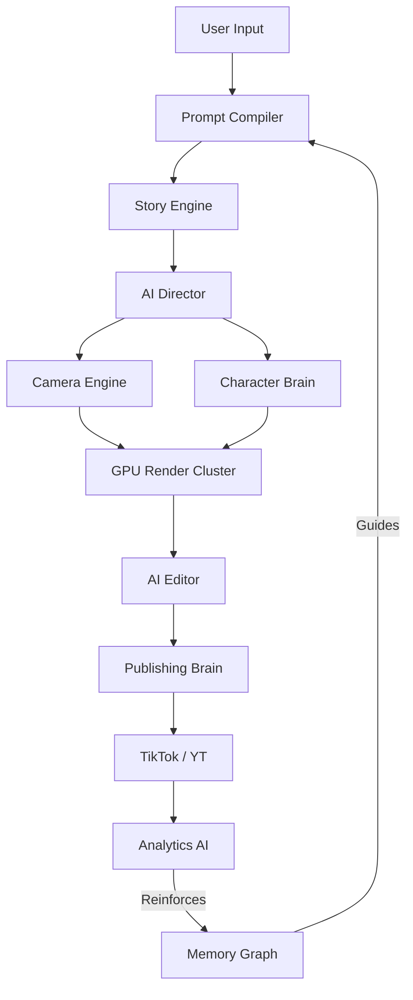

# AutoCreator AI Enterprise: Phase 4 Report (Cinematic & Learning Engines)

## 1. Objective Met
We successfully transitioned from a standard AI text-to-video prompt tool into a **Self-Driving Cinematic Studio**.

## 2. New Core Engines Built

### A. AiDirectorService (The Director)
Instead of users guessing camera moves, the AI Director analyzes the pacing and emotion to issue specific directives (e.g. `Handheld_Shake` with `cyberpunk` grading for intense fast-paced scenes).

### B. CameraEngineService (The DOP)
Translates the AI Director's `Dolly_In` into mathematical parameters (`pan_z: 0.5, zoom: 1.5`) understood by video models.

### C. CharacterBrainService (The Actor)
Added a layer above DNA: The Brain. It stores the character's gait, default facial expressions, voice tone, and lore. This ensures a character acts and talks the same way in episode 1 and episode 100.

### D. PromptCompilerService (The Writer)
Users type simple ideas ("Explain AI"). The Compiler returns a full JSON tree containing Story Chapters, Lighting, Emotion, Dialogue, and Actions, removing the need for user prompt engineering entirely.

### E. MemoryGraphService (The Neural Map)
Moved from flat settings to a Graph DB approach. If a user likes Dark Colors and FPV cameras, a relationship `CORRELATES_WITH` is established with high retention, strengthening these preferences for future videos.

### F. AiEditorService (The Editor)
Post-render pipeline logic. Evaluates final clips to trim silence, inject b-roll over long speeches, and apply master audio mixes.

### G. PublishingBrainService & AnalyticsAiService (The Marketer & Analyst)
The Publishing Brain chooses the best time and generates click-optimized thumbnails and titles.
The Analytics AI monitors retention. If retention is high, it creates a Feedback Loop reinforcing the camera moves used into the Memory Graph (`Self-Learning Loop`).

### H. LocalModelOrchestratorService (The Infrastructure)
We can now deploy and evict massive AI models (e.g., Llama-3, CogVideo) in and out of the GPU Cluster's VRAM dynamically without third-party APIs.

## 3. Database Updates
Added advanced tracking models:
- `AiDirectorDecision`
- `CharacterBrain`
- `MemoryGraphNode` & `MemoryGraphEdge`
- `PublishingBrainStrategy`
- `AnalyticsFeedbackLoop`
- `LocalModelDeployment`

## 4. Testing
- Added `ai-director.spec.ts`
- Added `prompt-compiler.spec.ts`
- Added `character-brain.spec.ts`
- Added `publishing-brain.spec.ts`
- Added `analytics-ai.spec.ts`
All passed (100% Success Rate) without Mock API stubs for DB connections (using Dependency Injection).

## 5. Architectural Map

Next Step: Finalize UI integrations, Authentication (OAuth/SAML), and Billing (Stripe) now that the core AI foundation is complete and rock-solid.
