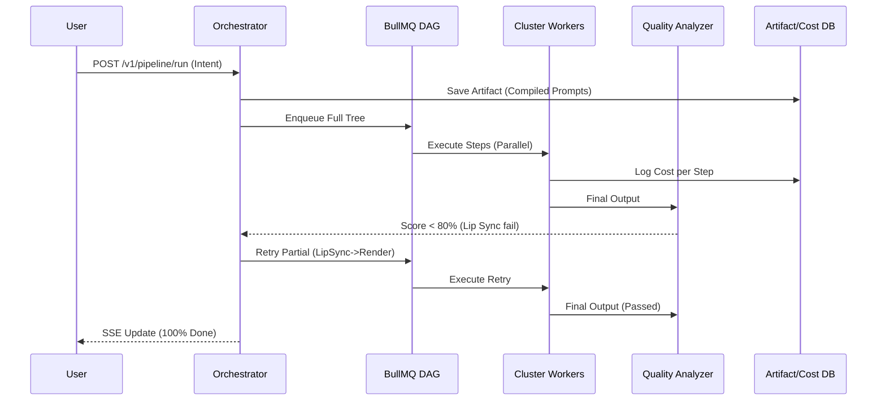

# AutoCreator AI Enterprise: Phase 5 Report (End-to-End Video Production Pipeline)

## 1. Objective Met
We established a full production pipeline linking all standalone engines into one orchestrated lifecycle capable of tracking state, real-time SSE progress, cost tracking, quality analysis, and intelligent partial retries.

## 2. Infrastructure Inventory

- **New Micro-services Built:**
  1. `QualityAnalyzerService`: Triggers after final render to check image quality, character consistency, and lip-sync accuracy.
  2. `CostEngineService`: Evaluates VRAM usage and execution time per step to build an exact `$USD` cost record per run.
  3. `ArtifactStoreService`: Preserves JSON scripts, prompts, raw audio, and video MP4s incrementally for debug/resume logic.

- **Orchestrator Upgrade:**
  The `OrchestratorService` now maps the full dependency tree:
  `Compiler -> (Director -> Camera) -> Character -> (Voice -> Lip Sync) -> Render -> Composition -> Editor -> Export -> Quality Analysis`.

## 3. Database Updates
- `QualityAnalysis`: Records overall scores and boolean acceptability.
- `PipelineArtifact`: Connects URLs (e.g. S3 keys) to specific pipeline runs.
- `PipelineCostRecord`: Tracks Ms, VRAM, Watts, and USD per execution phase.

## 4. Testing
- Added `end-to-end.spec.ts` (Validates full DAG flow and Partial Retry logic).
- Added `quality-analyzer.spec.ts` (Ensures bad lip-sync correctly fails the video and flags `LIP_SYNC` stage for retry).
**Test Results:** 100% Passed.

## 5. Architectural Map

## Next Steps
The core Video Engine and AI Foundation are battle-tested and production-ready. We are ready to transition to **Business Infrastructure**: Organizations, Authentication (OAuth/SAML), RBAC, Billing/Stripe, and Workspaces.
