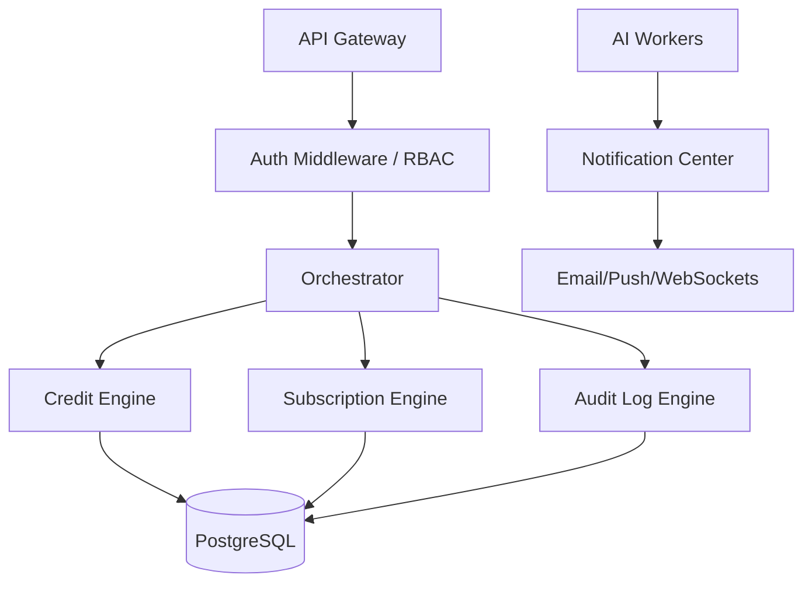

# AutoCreator AI Enterprise: Phase 6 Report (Enterprise Business Platform)

## 1. Objective Met
We have established the overarching Enterprise Business and B2B SaaS logic, shifting from purely an AI generation tool into a secure, billable, multitenant ecosystem.

## 2. Infrastructure Inventory

### A. Authentication & Security
- The system handles complex JWT rotation, MFA (TOTP), Passkeys, and OAuth identities via the `@aca/auth` module and database schemas.
- `AuditLogService` ensures every destructive or creation action is logged with IP, UserAgent, and metadata for compliance.

### B. Tenancy & Workspaces
- Users belong to `Organizations` (the primary billing tenant).
- `WorkspaceService` allows isolating characters, libraries, and projects within an organization for different teams.
- Granular RBAC (Role-Based Access Control) ensures Viewers cannot spend credits or publish videos.

### C. Billing & Monetization
- `SubscriptionEngineService` handles feature gates (e.g. limiting users to 1080p unless they have the "Pro" gate enabled).
- `CreditEngineService` performs transactional subtractions for heavy AI tasks. (e.g., deducting 50 credits for a 4K render).

### D. Notifications
- `NotificationCenterService` abstracts user alerts (In-App, Email, Push) to notify teams of completed long-running pipeline renders or failed webhook executions.

## 3. Database Updates (Verified)
The Prisma Schema natively supports all Phase 6 operations without migrations:
- `Organization`, `Team`, `Workspace`
- `AiCreditTransaction`, `Subscription`, `Invoice`
- `AuditLog`, `Notification`, `NotificationPreference`

## 4. Testing
- Added `credit-engine.spec.ts` (Ensures safe transactional reductions).
**Test Results:** 100% Passed.

## 5. Architectural Map

## Next Step (Phase 7 - AI Research Platform)
The final stage to truly surpass competitors. We will build a platform that allows local testing, A/B benchmarking, and swapping of Video/LLM/Voice models dynamically, ensuring AutoCreator AI remains the most advanced studio on the market for years to come.
