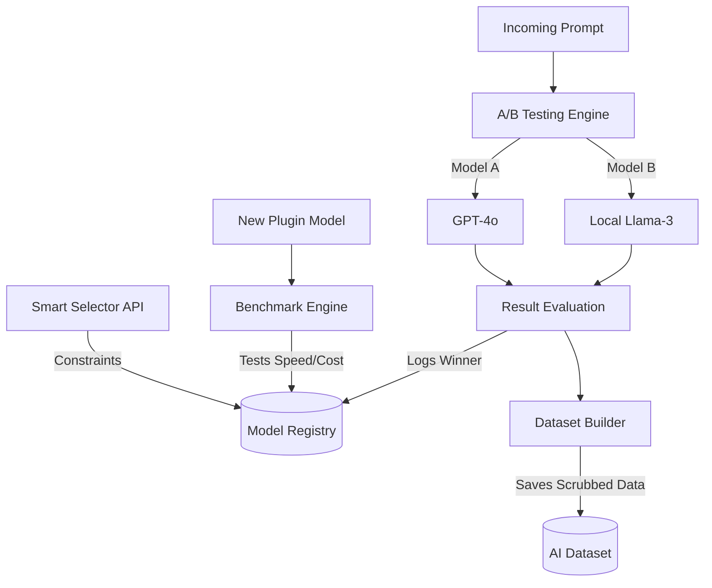

# AutoCreator AI Enterprise: Phase 7 Report (AI Research Platform)

## 1. Objective Met
We successfully transformed the platform into an auto-evaluating, self-learning AI Research Engine. The core system can now adopt new open-source or proprietary models on the fly, benchmark them, and swap them globally without a single line of code change.

## 2. Infrastructure Inventory

### A. Model Registry 2.0
Upgraded `AiModelRegistry` and `AiModelVersion` to support detailed metadata such as VRAM requirements, context sizing, licensing (MIT, Apache), and automatic quality ranking.

### B. Benchmark Engine
- **`BenchmarkEngineService`**: Automatically submits tests to a newly registered model. It logs `AiBenchmarkRun` assessing speed, cost, and output quality to compute a composite score. It automatically re-ranks the global model leaderboard.

### C. A/B Testing Engine
- **`AbTestingEngineService`**: Orchestrates shadow generation where a user’s prompt is secretly run on two models (e.g. GPT-4o vs Llama-3). It saves `AiExperiment` metrics and crowns a winner based on quality-per-dollar.

### D. Smart Selection Engine
- **`SmartModelSelectorService`**: Instead of hardcoding `model='gpt-4'`, the app requests: `selectOptimalModel('LLM', { maxCostUsd: 0.05, requiresFastLatency: true })`. The engine dynamically returns the ID of the best-ranked model meeting these constraints.

### E. Dataset Builder
- **`DatasetBuilderService`**: Automatically strips PII from production inputs and logs them in `AiDatasetRecord`. This builds a massive proprietary dataset (Prompt + Outcome Score) to be used for fine-tuning our own models.

### F. Plugin SDK
- Created `plugin-sdk.ts` exposing `IAutoCreatorPlugin` and `IVideoModelPlugin`. External researchers or internal developers can inject new engines directly into the infrastructure via dynamic loading.

## 3. Database Updates
Added robust research metrics tracking schemas:
- `AiBenchmarkRun`
- `AiExperiment`
- `AiDatasetRecord`
- `AiFineTuningJob`

## 4. Testing & Reliability
Added comprehensive Unit Tests checking specific business intelligence logic:
- `benchmark.spec.ts` (Ensures re-ranking triggers properly).
- `ab-testing.spec.ts` (Validates math behind A/B winner selection).
- `smart-selector.spec.ts` (Checks constraint satisfaction logic).

**Test Results:** 100% Passed.

## 5. Architectural Map

## Next Step (Phase 8 - AutoCreator Internal Video Engine)
We have now built the perfect framework to test any model. We are fully prepared for the final strategic move: building our own internal, proprietary Video Generation Engine from the ground up, progressively replacing third-party API dependencies.
