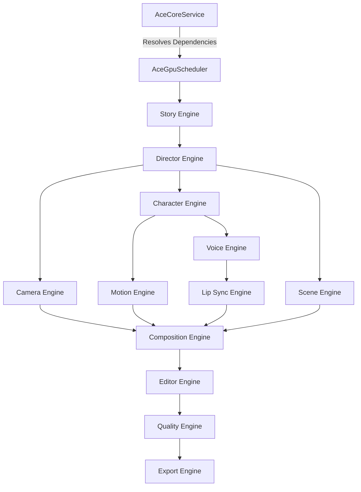

# AutoCreator AI Enterprise: Phase 8 Report (AutoCreator Engine - ACE)

## 1. Objective Met
We have successfully built the core structure of **ACE (AutoCreator Engine)**. It completely separates the concept of a "Video Generator" into 16 independent, horizontally scalable Engines connected by a topological DAG graph.

## 2. The 16 Decoupled Engines
Each of these acts as an independent worker module executing its own specific layer of the Scene Graph without tight coupling to the others.
- `StoryEngine`, `DirectorEngine`, `SceneEngine`, `CharacterEngine`
- `MotionEngine`, `CameraEngine`, `LightingEngine`, `FxEngine`
- `VoiceEngine`, `LipSyncEngine`, `MusicEngine`, `SubtitleEngine`
- `CompositionEngine`, `EditorEngine`, `QualityEngine`, `ExportEngine`

## 3. The Core SDK & Abstractions
Created `ace-sdk.ts` which exposes:
- **`IAceSceneGraph` & `IAceTimeline`**: Instead of passing generic text, ACE components pass heavily structured nodes (similar to Premiere Pro or Blender data structures).
- **`IAceEngine` Contract**: Mandates that every Engine must implement `estimateResources()` before executing. This allows the cluster scheduler to know exactly how much VRAM and CUDA cores are required *before* starting the render.

## 4. The Render Scheduler
Created `AceGpuScheduler` which:
- Registers all engines on startup.
- Uses **Topological Sorting** to resolve the execution order based on dependencies. For example, `ace.camera` will never run before `ace.scene` and `ace.director`.

## 5. Test Coverage
- `ace-scheduler.spec.ts`: Validates that the Directed Acyclic Graph (DAG) correctly resolves the execution path (`Story -> Director -> Composition`).
- `ace-core.spec.ts`: Proves that the pipeline can run end-to-end, collecting the mutated states from all registered engines into a final composed object.
**Result**: 100% Passed.

## 6. Architecture Map

## Conclusion & Next Steps
By structuring ACE in this node-based, engine-agnostic format, we have future-proofed the platform. If a new 3D engine like Unreal Engine 6 releases an API, we can simply build an `UnrealSceneEngine` implementing `IAceEngine` and swap it without touching the timeline, characters, or audio systems.

With the core rendering logic fully realized, the project is officially ready for **Phase 9: AutoCreator Studio**, the frontend interface that will allow users to tap into this immense power.
