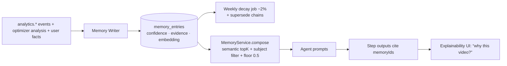

# AutoCreator AI — AI Pipeline & Workflow Engine Specification

**Status:** Approved v2.0 · **Applies to:** `apps/worker`, `packages/ai`, `packages/video-engine`, `packages/workflows`, `packages/plugin-kit`

**v2.0 changes:** fixed 15-step pipeline → **versioned Workflow Engine** (ADR-011), agents keep their specs but are now *workflow nodes*; added **AI Employees** persona/coordination layer, **AI Memory** read/write points, and **cost-optimizing routing objectives**. The original 15-step flow still ships as the system template **`autopilot-v1`** — everything in v1 §§4–5 remains normative for node internals.

---

## 1. Concept Stack

```text
WORKFLOW (versioned DAG of nodes, data not code)
   │  nodes: agent.<built-in> | plugin.<slug> | gate.review | gate.condition
   ▼
AI EMPLOYEES (persona identities executing/coordinating nodes)
   │
   ▼
CAPABILITIES (providers bound via Plugin Registry → Router with objective)
   │
   ▼
AI MEMORY (per-channel knowledge injected into prompts + fed by results)
```

A run executes a **published workflow version**. The executor is the
generalized Orchestrator: it consumes BullMQ QueueEvents + domain events,
advances the DAG, records `pipeline_step_runs` per `nodeId`.

---

## 2. Workflow Definition Language (normative)

`workflow_versions.definition` validated by `WorkflowDefinitionSchema`
(`@aca/shared/schemas/workflow.ts`):

```typescript
type WorkflowDefinition = {
  schema: "aca.workflow/1";
  trigger: { kind: "manual" | "autopilot" | "api" | "event";
             inputs: Record<string, NodeInputDecl>; event?: string };
  nodes: Node[];                         // DAG, validated acyclic ≤ 24 nodes
  loopbacks?: { from: AgentKind; to: AgentKind; max: number }[];
  defaults: { routingObjective: RoutingObjective;  // per-node override allowed
              creditBudget: number;                // REQUIRED — cost guardrail
              language?: string; timezone?: string };
};

type Node =
  | { id: string; kind: `agent.${AgentKind}`; needs: string[];
      config?: Record<string, unknown>;           // validated per agent
      routingObjective?: RoutingObjective; onFail?: "abort" | "continue" | "skip-dependents" }
  | { id: string; kind: `plugin.${string}`; needs: string[];
      config?: Record<string, unknown>;           // validated vs plugin configSchema
      capabilityUse: string }                     // e.g. "stock.video.search"
  | { id: string; kind: "gate.review"; needs: string[];
      config: { artifact: "script" | "media" | "final" | string;
                timeoutHours: number; onTimeout: "HOLD" | "AUTO_APPROVE" | "CANCEL" } }
  | { id: string; kind: "gate.condition"; needs: string[];
      config: { when: JsonLogic; thenInclude: string[] } };  // branch pruning
```

**Validation at publish:** acyclicity, ≤ 24 nodes, loopback caps ≤ 2 per pair,
required `creditBudget` ≤ plan ceiling, all `plugin.*` nodes resolve to
installed+enabled plugins, step configs pass per-capability schemas, **dry-run
cost estimate** returned to the UI (`POST /workflows/{id}/validate`).

**Review modes ⇒ gates compilation:** when autopilot/launcher starts a run, it
materializes gate nodes per `reviewMode` (FULL_AUTO: none; REVIEW_SCRIPT: after
`agent.seo-optimizer`; REVIEW_MEDIA: + after `agent.video-generator`;
REVIEW_FINAL: + after `agent.quality-checker`). Users with custom workflows
plant gates explicitly; mode only translates for the system template.

---

## 3. AI Employees (persona & coordination layer)

### 3.1 Roster → capability mapping

| Employee (EmployeeRole) | Executes / owns nodes | Background capabilities |
|---|---|---|
| Content Manager | run brief; gate comms; handoffs | — (orchestrator persona) |
| Researcher | `agent.trend-analyzer`, `agent.fact-checker` | web search, trend sources |
| Script Writer | `agent.script-writer` (+ fact loopback) | llm.json |
| SEO Expert | `agent.seo-optimizer` | llm.json |
| Thumbnail Designer | `agent.thumbnail-generator` | image, vision |
| Voice Director | `agent.voice-generator` | tts |
| Video Editor | `agent.scene-planner`, `agent.asset-collector`, `agent.video-generator` | stock, image, video-engine |
| Publisher | `agent.publisher` | platform write clients |
| Analyst | `agent.analytics-collector` | platform read clients |
| Growth Manager | `agent.ai-optimizer` + memory writer | llm.vision/chat, embeddings |

Personas are identity + prompt preamble + responsibility — **not** separate
services (cost sanity). Per-org customization (`ai_employees.personaNotes`)
shapes tone/decisions; disabled personas cause their gate-relevant outputs to
skip notification steps (execution stays).

### 3.2 Message protocol (`ai_messages`)

```text
kinds: BRIEF | HANDOFF | FEEDBACK | APPROVAL_REQUEST | REPORT | NOTE
threading: threadId = runId (per run) or project-week thread (digests)
```

Lifecycle of one autopilot run:

1. **Content Manager** writes `BRIEF` (idea, thesis, audience, constraints:
   budget, deadline window, memory highlights used) → stored on
   `pipeline_runs.brief` + message row.
2. Each employee appends structured `HANDOFF`s at node completion
   (e.g. Script Writer → Voice Director: voice casting suggestion; Video
   Editor → Thumbnail Designer: strongest frames timestamps).
3. `GATE` reached → Content Manager emits `APPROVAL_REQUEST` (deep link) —
   user decision arrives via API and posts a `NOTE` recording the rationale.
4. Publisher posts delivery receipts; Analyst appends metric digests to the
   video thread at +24h/+7d; Growth Manager posts weekly `REPORT` on the
   project thread with memory deltas.

Retention/explainability: messages are durable (24 mo) and surface in: team
room UI, video detail "crew notes", review emails, audit exports.

---

## 4. Agent Contracts (unchanged core + v2 deltas)

The `PipelineAgent` contract from v1 stands (Zod in/out, idempotency by
content-hash, cost metering, progress, AbortSignal, moderation pre-hook) with
these additions:

1. **Context gains:** `ctx.memory.compose(scope…)` → injected facts + `memoryIds`
   citations recorded on the step row; `ctx.route(capability, objective)` →
   router resolution (no direct provider construction); `ctx.workflow` (def +
   nodeConfig); `ctx.team.say(kind, toRole, content, structured)` → AI messages.
2. **AgentKind is a string** (`agent.script-writer`, `plugin.veo-broll`) —
   step rows store it; core kinds enumerated in `@aca/shared` for UI/docs.
3. Node `config` (from workflow) is merged over project `stylePreset` (config
   wins) and validated before enqueue.
4. Every agent declares `qualityFloor` — router may never route below it
   (below = the router falls back upward, costlier, not downward).

Node specs: see v1 sections (trend-analyzer, idea-generator, script-writer,
fact-checker, seo-optimizer, voice-generator, scene-planner, asset-collector,
video-generator, subtitle-generator, thumbnail-generator, quality-checker,
publisher, analytics-collector, ai-optimizer) — unchanged budgets/timeouts/QA
— plus three deltas:

- **idea-generator, script-writer, seo-optimizer, thumbnail-generator** now
  receive a mandatory *memory context* block (topK=8, ~400 tokens) assembled
  by `MemoryService` (channel → project → org scope merge, subject-filtered
  per agent: e.g. thumbnail → `THUMBNAIL_STYLE`+`HOOK_STYLE`).
- **publisher** consults `POST_TIME` memories when the task lacks an explicit
  `scheduledAt` (per-platform best slots learned for the channel; blended with
  the project's posting windows — memory adjusts weights, never overrides a
  hard user schedule).
- **ai-optimizer** is the primary **memory writer**: it emits/updates
  `memory_entries` with evidence links, superseding conflicts, and annotates
  its `OptimizationReport.memoryDelta`. Analyst contributes `POST_TIME`
  entries from time-bucketed performance regressions.

---

## 5. AI Memory System (ADR-016 — full lifecycle)



- **Write paths:** optimizer reports (patterns), analyst regressions
  (post-time), user manual facts (source USER — floor 0.8, no auto-decay, but
  supersede-able), NL onboarding ("my channel is dry humor, 40–50s, no music
  lyrics" → structured during project setup wizard).
- **Conflict handling:** new evidence contradicting an active entry creates a
  new entry with `supersedesId` pointing to the old (never edit history);
  Mathlib: effectiveness deltas re-computed monthly reinforce/decay confidence ±0.1.
- **Read paths:** every prompt injection (budgeted), UI "memory panel" per
  channel (view/edit/archive), API (`/channels/{id}/memory`), optimizer diffs.
- **Privacy/tenancy:** memories never cross orgs. "Niche baselines" (global
  learning) are computed as **aggregate anonymized stats** (k-anonymity ≥ 50
  orgs) — a separate read model, not shared memory rows.

---

## 6. Cost-Optimizing Router (runtime detail)

```text
resolve(capability, { objective, qualityFloor, language, planCeiling, byok, pinned? })
  candidates = registry.enabled(capability)               // built-ins + installed plugins
  drop: circuit-open | healthPenalty>0.8 | below qualityFloor | exceeds ceiling/byok scope
  score  = wQ·Q̂ + wC·(1−Ĉ) + wL·(1−L̂) − healthPenalty   // weights per objective
  choice = argmax(score); ties → cheaper; log router.decision {candidates, scores, winner}
```

Weights: QUALITY_FIRST(0.7,0.15,0.15) · BALANCED(0.45,0.35,0.20) ·
CHEAPEST(0.2,0.7,0.1) · FASTEST(0.25,0.15,0.6) · PINNED bypass.
**Q̂ learning:** per (provider, model, capability, language) Beta-smoothed from
QC outcomes and downstream `avgPercentWatched` deltas (optimizer job) — the
router compounding-improves; cold starts use curated priors from eval harness.
Auto-escalation: run drops below budget 20% → objective flips to CHEAPEST for
remaining nodes (logged, reversible next run). All decisions metered → step
cost rows; nightly cost report per org/router decisions (Deployment workflows).

---

## 7. Quality Gates (unchanged list, v2 placement)

Spell / grammar / factuality / audio (LUFS/TP/clip/silence) / subtitle sync /
render integrity / originality (pHash + script cosine) / policy tier / brand
safety — the full table of v1 §4.12 stands, executed by
`agent.quality-checker` wherever a workflow plants it (system template: once,
pre-publish, with policy-tier forcing of REVIEW_FINAL regardless of mode).
Workflows without a QC node get a **publish-time safety floor** automatically
injected by the launcher (policy scan + render probes only) — compliance is
non-negotiable, custom workflows cannot remove it.

## 8. Failure & Retry Semantics (v2)

v1 matrix stands; executor adds per-node `onFail` policy and event-driven
resumption. Node-level loopbacks are DAG-declared and counted per run.
`gate.condition` pruning marks skipped dependents `SKIPPED` (ledger ignores).

## 9. Trace example (v2, autopilot, custom workflow "short+teaser")

```text
10:00 Content Manager brief posted (memory: 3 facts cited)
10:00:02 researcher/trend-analyzer ok (cached)          $0.001
10:00:10 idea-generator ok (balanced→deepseek-r1)       $0.009
10:00:21 script-writer ok (cheapest? no — balanced gpt-4o-mini) $0.028
10:00:41 fact-checker 0.86 pass                         $0.041
10:00:46 seo-optimizer ok                               $0.009
10:00:58 voice-generator (fastest lane? quality_first → google-journey) $0.055
10:01:03 scene-planner 7 scenes                         $0.007
10:01:48 asset-collector 7/7 (plugin: pexels + gen×2)   $0.062
10:03:20 video-generator ok (9:16 master)               $0.028
10:03:24 subtitle-generator ok                          $0.001
10:03:44 thumbnail-designer 3 variants (memory: high-contrast wins) $0.055
10:04:10 quality-checker 94/100 pass                    $0.037
10:04:11 gate (REVIEW_FINAL) → APPROVAL_REQUEST → user approves 11:52 (NOTE logged)
11:52:30 publisher ok youtube+tiktok (post-time memory: shifted to 19:30 slot)
+24h analyst digest; Friday: growth-manager report updates 2 memories
        (conf: hook-question 0.71→0.78; new: “45s outperforms 60s” 0.58)
```

Ledger invariants unchanged (CI asserts equality between Σ step costs, ledger
delta, credits charged).

---

## 10. Extensibility Recipes (what plugins unlock — examples, normative contracts)

- **New publisher (e.g. Pinterest):** plugin exposes `publisher` capability; users
  add `plugin.pinterest-publisher` after quality-checker; channel connect flow gains
  Pinterest OAuth via plugin's declared `oauthConfig`.
- **New video engine (cloud render):** binding `video-engine` capability; node
  `agent.video-generator` routes to it when the org enables the plugin (binding
  precedence: installed plugin marked `preferred` in project config → else default).
- **Vertical agents (e.g. "podcast-clip-finder"):** plugin declares its own agent
  kind; workflows insert it anywhere; node config schema from plugin manifest.
- **Replacement trend source:** plugin binds `search.web`/custom producer feeding
  the Researcher; memory/QC paths unchanged.

All four recipes require **zero core changes** — the acceptance test for
requirement #2.
