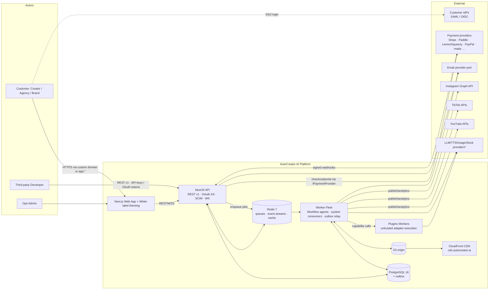
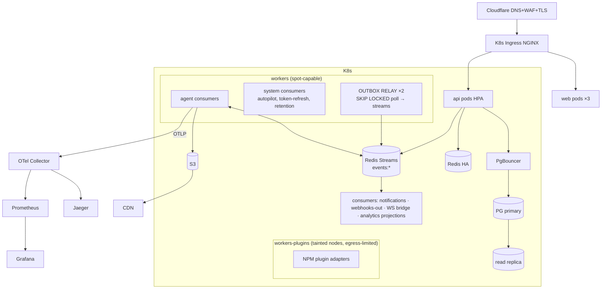

# AutoCreator AI — System Architecture

**Status:** Approved v2.0 (Phase 0.5 — Final Architecture Review applied) · **Owner:** Principal Architect
**Supersedes:** v1.0. Changes in v2.0 are traceable via §2 (Requirements Traceability) and new ADRs 009–021.

---

## 1. Overview

AutoCreator AI is a multi-tenant SaaS that autonomously operates YouTube /
TikTok / Instagram channels end-to-end: research, creation, quality gates,
scheduling, publishing, analytics, and a learning loop that compounds channel
knowledge over time. The platform is **event-driven at its core**, **plugin-extensible
in every capability**, and designed from day one as a **public API product**
with first-party web (and future mobile/desktop) clients.

### 1.1 Architectural Goals

| Goal | Target | Mechanism |
|------|--------|-----------|
| Scale | 10k orgs now — **architected to 1M users without rewrite** (§15) | Org-rooted tenancy key, cells path, ports & adapters, OLAP read port |
| Tenancy | Total org isolation + Teams + custom branding/domains | §6 tenanted data plane, branding resolution middleware |
| Extensibility | New AI/video/publisher/voice/storage/analytics providers **without touching Core** | Plugin system (§8, ADR-010) |
| Flexibility | User-editable pipelines | Workflow Engine (§9, ADR-011) — no fixed pipeline |
| Communication | **Events only** between services/modules for side effects | Event backbone + transactional outbox/inbox (§7, ADR-009) |
| API | Versioned public API + OAuth + SDK + webhooks, mobile-ready | §13 (ADR-013) |
| Learning | Per-channel AI memory that agents use automatically | §10.2 (ADR-016) |
| Cost | Optimal model per task automatically | Routing objectives (§10.3) |
| Governance | Feature flags per feature/customer/plan | §14 (ADR-015) |
| Enterprise | SSO/SAML/SCIM/IP allowlist/SOC2/GDPR | Security.md §14 |
| Vendor independence | Zero lock-in across 10 vendor categories | §16 port matrix |

### 1.2 Non-goals (unchanged)

No native mobile apps in v1 (API is mobile-ready by design, §13.4). No NLE-style
editor. No on-prem year 1.

---

## 2. Requirements Traceability (Phase 0.5)

| # | Requirement | Addressed in | ADR |
|---|-------------|--------------|-----|
| 1 | Multi-tenant (Orgs/Teams/Roles/Permissions/Branding/Domains) | §6; Database.md (teams, custom_roles, organization_brands, custom_domains) | 012 |
| 2 | Plugin System | §8; packages/plugin-kit | 010 |
| 3 | Workflow Builder (no fixed pipeline) | §9; workflows/workflow_versions; AI-Pipeline.md v2 | 011 |
| 4 | Event-Driven Architecture | §7; packages/events; outbox/inbox | 009 |
| 5 | API Versioning | §13.1; per-version controllers | 013 |
| 6 | Public API (Keys/OAuth/Webhooks/SDK/OpenAPI) | §13; developer_apps, @autocreator/sdk | 013 |
| 7 | AI Memory | §10.2; memory_entries; AI-Pipeline.md §7 | 016 |
| 8 | AI Team (employees + messages) | §10.4; ai_employees, ai_messages; AI-Pipeline.md §6 | 017 |
| 9 | Cost Optimizer (best/cheapest/fastest per task) | §10.3; routing objectives | — |
| 10 | Feature Flags | §14; feature_flags/overrides; OpenFeature | 015 |
| 11 | Enterprise (SSO/SAML/SCIM/IP allowlist/SOC2/GDPR) | Security.md §14; new tables | — |
| 12 | Observability (OTel/Prometheus/Grafana/Jaeger/logs) | §12; Deployment.md §7 | 021 |
| 13 | CDN for all media | §11; CloudFront + signed URLs | 019 |
| 14 | Secrets manager only | Security.md §8 (strengthened) | — |
| 15 | Marketplace (templates/voices/prompts/agents/plugins/workflows) | §8.5 + Database.md marketplace_*; Business-Model.md §11 | — |
| 16 | Mobile-ready API | §13.4; ETag/delta-sync conventions | — |
| 17 | White Label | §6.3; organization_brands + custom_domains | 012 |
| 18 | Billing Engine independent of Stripe | §13.5 + Database.md v2 billing refactor | 014 |
| 19 | Zero Vendor Lock-in | §16 port matrix; boundaries lint | 018 |
| 20 | 1M users without rewrite | §15 scale path | 018 |

---

## 3. Architecture Style

**Event-driven modular monolith** for the control plane + **independent worker fleets**
for the data plane, with a **hexagonal (ports & adapters) rule across every package**:

```
Core domain logic ──depends on──▶ Port interfaces (pure TS) ──implemented by──▶ Vendor adapters
```

- Side-effect communication between modules/services happens **only via domain
  events** on the backbone. Synchronous calls are permitted exclusively for
  *reads/queries* within one deployable and never cross deployable boundaries.
- Every vendor category (DB, storage, queue, email, payments, monitoring,
  search, AI, video engine, cache) is consumed through a port; vendor SDKs are
  confined to adapter folders (enforced by boundaries lint, §16).

Deployable units (unchanged count, new responsibilities):

| Unit | Responsibility v2 |
|------|-------------------|
| `apps/web` | UI + white-label theming by host; zero business logic |
| `apps/api` | REST /v1, **OAuth authorization server**, SCIM, WS gateway, admin |
| `apps/worker` | All workflow agents, system queues, **outbox relay**, event consumers |
| `apps/worker-plugins` | Isolated execution pool for third-party NPM plugins (§8.3) |
| Data plane | PostgreSQL (system of record + outbox), Redis (queues + **event streams** + cache + flags), S3 behind **CDN**, Jaeger/Prometheus/Grafana/Loki |

---

## 4. C4 — Level 1: System Context



\* All third-party AI/media access terminates in adapter plugins (first- or
third-party) — core never imports vendor SDKs.

---

## 5. C4 — Level 2: Container Topology (production)



---

## 6. Multi-Tenancy (from day one)

### 6.1 Hierarchy & access

```text
Organization (tenant root, sharding key)
 ├── Teams ── members are Users via team_members
 │     └── Projects can be TEAM_ONLY (owned by a team) or ORG_WIDE
 ├── Members (organization_members) with system role (OWNER/ADMIN/EDITOR/VIEWER)
 │     └── optional Custom Role → capability grants (RBAC v2)
 ├── Channels (platform connections)
 ├── Brand (white label) + Custom Domains + SSO + IP allowlist
 └── Data: every row in every tenant table carries organization_id
```

**RBAC v2 (capability-based):** permission catalog lives in `packages/shared`
(`permissions.ts`, e.g. `video.create`, `publish.execute`, `billing.manage`,
`automation.configure`, `sso.manage`). System roles map to capability sets;
`custom_roles` (per org) hold explicit capability lists. Effective permissions
= system-role set ∪ custom-role set. Guards evaluate capabilities, not role
names — so Enterprise custom roles need zero code changes. The matrix in
Security.md §6 defines the system-role baseline (unchanged behaviors).

Project visibility: `ORG_WIDE` (any org member ≥ VIEWER sees it) or
`TEAM_ONLY` (members of owning team + ADMIN/OWNER). Team scoping enforced by
the same tenant Prisma extension (adds team predicate when actor is
EDITOR/VIEWER).

### 6.2 Isolation guarantees

1. **Application layer:** tenant-scoped Prisma client factory — no query path
   exists without org predicate (cross-org leakage suite in CI).
2. **Database layer:** RLS on high-blast-radius tables (Database.md §8).
3. **Event layer:** every envelope carries `orgId`; consumers set tenant context
   from it (workers) — worker-side Prisma factory requires `ctx.orgId`.
4. **Storage layer:** object keys are namespaced `org/{orgId}/…`; bucket policy
   + CDN signing are org-aware.
5. **Queue layer:** job envelopes include `orgId`; fairness scheduler
   interleaves orgs; KEDA scales globally.
6. **Branding/domain layer:** host→org resolution is read-only + cache; a
   poisoned host header can never grant data access (auth remains JWT-bound).
7. **Cache layer (v2.1 addition):** every Redis cache key holding org-scoped data
   embeds the orgId segment (`aca:cache:{orgId}:…`) — a missing segment fails
   code-review lint `tenant-cache-key` in the shared cache helper; global caches
   (trend snapshots, brand-resolve, public plans) are an explicit allowlist.

### 6.3 White Label

`organization_brands` (1:1 with org): logo/logo-dark/favicon asset refs, color
tokens (`theme` JSON → CSS custom properties), brand name, support/terms/privacy
URLs, email sender name + template pack, `hidePoweredBy` (Business+).

`custom_domains`: `PORTAL` type — CNAME to `portal.autocreator.ai` → Cloudflare
for SaaS (SSL for SaaS automates certs) → web app resolves host→org→brand and
serves themed dashboard; auth cookies stay per-host. `EMAIL_FROM` type —
verified domain (DKIM/SPF records surfaced in UI) used by email port.
Resolution path: `Host` → `domain_cache (redis, 60s)` → org bootstrap payload
(brand + flags + locale) → themed UI. API itself is never re-branded (docs
portal is per-brand on portal domains).

### 6.4 Cost/quota isolation

Plan limits, credit ledger, rate limits, and usage meters are all org-keyed —
a tenant cannot consume beyond entitlement regardless of client or plugin.

---

## 7. Event-Driven Backbone (ADR-009)

### 7.1 Why events-only

Modules must not call each other for side effects (user's requirement #4):
decoupling lets us split deployables later, replay flows, add consumers
(audit, webhooks, notifications, marketplace metering) without touching
producers, and gives the AI Optimizer/memory a full observation stream.

### 7.2 Envelope (packages/events)

```json
{
  "id": "uuidv7",                       // unique, for inbox dedup
  "type": "aca.publishing.publish.completed",
  "version": 1,
  "orgId": "uuid", "aggregateType": "publishing_task", "aggregateId": "uuid",
  "occurredAt": "2026-08-01T09:30:00Z", "traceId": "w3c",
  "payload": { "…typed per event version…" }
}
```

Naming: `aca.<domain>.<entity>.<past-verb>`. Versioned payloads; breaking
payload change → `version: 2` emitted **alongside** v1 during overlap window.

### 7.3 Transport & delivery semantics

- **Transport:** Redis Streams (`events:{domain}` keys), consumer groups per
  consumer (`cg:notifications` on `events:publishing`…). Ordering guarantee:
  per-aggregate (producers route by `aggregateId` hash into N=64 stream shards).
  **Zero-lock-in port:** `IEventBus{ publish, subscribe }`; a Kafka adapter is
  the documented scale path (§15) with identical semantics (streams map to
  topics, consumer groups map 1:1).
- **Transactional outbox (reliability, my addition):** producers never publish
  directly; they insert `outbox_events` **in the same DB transaction** as the
  state change. The outbox relay (`apps/worker/system/outbox-relay.ts`, 2
  replicas, `SELECT … FOR UPDATE SKIP LOCKED` batches of 500 every 2 s) moves
  rows to streams and marks `published_at`. Crash anywhere → at-least-once on
  the floor, nothing lost ever.
- **Inbox dedup (the other half):** every consumer first inserts
  `(consumer, event_id)` into `processed_events`; on conflict it acks without
  side effects. At-least-once + inbox = **effectively-once processing**.
- **DLX:** after 10 redeliveries a message moves to `events:dlx:{domain}` with
  last error; admin UI replays.
- **Reads exception:** query calls inside one deployable are allowed (they
  cannot create coupling that blocks extraction because they share the deploy
  unit). Cross-deployable communication is events-only, no exceptions.

### 7.4 Event catalog (initial, full catalog generated into packages/events)

```text
auth.user.registered · billing.{checkout.completed,subscription.activated,
subscription.canceled,invoice.paid,invoice.failed,credits.granted,credits.depleted,credits.low}
channel.{connected,disconnected,token_expired,health_changed}
project.{created,automation.enabled,automation.disabled}
idea.{generated,approved} · video.{created,generated,deleted}
pipeline.{run.started,run.step_completed,run.step_failed,run.awaiting_review,
run.review_approved,run.review_rejected,run.completed,run.failed,run.canceled}
publishing.{task.scheduled,task.rescheduled,publish.started,publish.completed,
publish.failed} · analytics.{video.metrics_updated,channel.metrics_updated}
optimizer.{report.completed,actions.applied} · memory.{entry.created,entry.superseded}
plugin.{installed,enabled,disabled,failed}
marketplace.{listing.published,purchase.completed,install.completed}
workflow.{published,deprecated} · security.{session.reuse_detected,sso.enforced}
system.{quota.threshold} · webhook.endpoint.autodisabled
```

Outbox consumers already live for: notifications fan-out, WS bridge,
webhooks-out delivery, audit mirroring, analytics projections, memory writer.

---

## 8. Plugin System (ADR-010)

### 8.1 Model

A plugin provides one or more **capability adapters** — the same interfaces
first-party providers already implement (`ILLMProvider`, `ITTSProvider`,
`IPublisherClient`, `IVideoEngine`, `IStoragePort`, `IAnalyticsCollector`,
`ISearchProvider`, …). Core code is blind to whether an adapter came from
`packages/ai` (first-party) or a marketplace plugin: the **Plugin Registry is
the provider catalog**, and the Provider Router (§10.3) resolves across all
installed/enabled bindings.

```text
PluginManifest = {
  id, version, displayName, publisher: { name, orgId?, verified },
  capabilities: [{ capability: "llm.chat", entry: "./dist/openai-like.js",
                   models: [...], costClass, languages? }],
  configSchema: JSONSchema,            // validated at install/configure
  secrets: [{ key: "apiKey", required }],   // stored in token vault
  kind: "builtin" | "npm" | "remote",
  runtime: { timeout, maxMemoryMB },   // enforced in plugins pool
  pricing?: marketplace price ref
}
```

### 8.2 Plugin kinds

| Kind | Who | Execution model |
|------|-----|-----------------|
| `builtin` | AutoCreator first-party | In-process in `apps/worker` (Fastify-level trust), still behind the same interface + conformance tests — dogfooding proof |
| `npm` | Vetted third parties (verified publisher program) | **Separate `worker-plugins` pool**: tainted nodes, no VPC peering except Redis/PG via sidecar proxy, CPU/mem cgroup caps, egress allowlist; core↔plugin over queue-RPC with strict timeouts |
| `remote` | Any developer | No code execution: manifest declares HTTPS endpoints; core sends signed requests (payload + JSON-schema contract), 10 s SLA; perfect for niche publishers/languages |

### 8.3 Isolation & trust decisions

- Third-party **code never runs inside api/worker** (SSRF, cryptomining, token
  theft classes eliminated by construction) — plugins-worker pods have **no KMS
  decrypt rights and no vault access**; they receive per-call least-privilege
  parameters (e.g. presigned S3 PUT), never DB credentials.
- Remote plugins get HMAC-signed requests with org pseudonymization (orgId
  hashed per plugin) — plugins cannot enumerate tenants.
- **(v2.1) Plugin outputs are DATA-ONLY:** steps consume structured results and
  asset **ids**; media bytes move through short-lived presigned **staging keys**
  minted per call by core. A plugin can never hand a fetch URL to another worker
  (kills the URL-injection/exfil path found in Red-Team item RT-06).
- Every plugin passes the **conformance kit** (§8.4) before publish in
  marketplace; runtime health probes feed the router's circuit breaker —
  misbehaving plugins are automatically shadowed by fallback providers.
- Publisher plugins (platform clients) are special-cased: write-scope to a
  customer's channel requires plugin-specific OAuth scope that the channel
  connect flow displays explicitly.

### 8.4 Conformance Kit (`@aca/plugin-kit`)

My addition: a single test harness `plugin-kit test <pkg>` that runs
capability contract suites (schema conformance, error taxonomy, idempotency,
timeout behavior, cost reporting). First-party adapters must pass the same
suite in CI — the capability contract is real because we eat it ourselves.
Marketplace publish pipeline runs the kit + security scan + human review.

### 8.5 Marketplace linkage

Plugins (and workflows/prompts/voices/templates/agent personas) are
`marketplace_listings` rows whose `artifact` points at plugin registry records
or workflow versions etc. Install = `plugin_installations` (+ secret capture
into vault) or a copy of the artifact into the buyer org (workflows/templates).
Details: Business-Model.md §11, Database.md §3 (marketplace_*).

---

## 9. Workflow Engine (ADR-011)

### 9.1 The pipeline is data, not code

`workflow_versions.definition` (Zod-validated DAG):

```json
{
  "schema": "aca.workflow/1",
  "trigger": { "kind": "autopilot|manual|api", "inputs": ["niche","language"] },
  "nodes": [
    { "id": "n1", "kind": "agent.trend-analyzer", "config": { "region": "SA" } },
    { "id": "n2", "kind": "agent.idea-generator", "needs": ["n1"] },
    { "id": "n3", "kind": "agent.script-writer", "needs": ["n2"] },
    { "id": "gate-script", "kind": "gate.review", "config": { "artifact": "script",
         "timeoutHours": 24, "onTimeout": "HOLD" }, "needs": ["n3"] },
    { "id": "n4", "kind": "agent.voice-generator", "needs": ["gate-script"] },
    { "id": "n5", "kind": "agent.video-generator", "needs": ["n4"] },
    { "id": "n6", "kind": "plugin.veo-broll", "needs": ["n3"],
         "config": { "scenes": [2,3] } },
    { "id": "g-final", "kind": "gate.review", "needs": ["n5","n6"] },
    { "id": "n7", "kind": "agent.publisher", "needs": ["g-final"] }
  ],
  "loopbacks": [{ "from": "agent.quality-checker", "to": "agent.script-writer",
                 "max": 1 }],
  "defaults": { "routingObjective": "BALANCED", "creditBudget": 120 }
}
```

- Node kinds: `agent.<built-in>` (the 15 core agents — now **agent kind
  strings**, plugin-extensible), `plugin.<slug>` (any capability node supplied
  by an installed plugin), `gate.review`, `gate.condition` (branch on outputs:
  e.g. skip thumbnail node for 16:9 landscape), `parallel`/`fanout` sugar.
- Executor: the Orchestrator (unchanged concept, generalized) advances the DAG
  via events; `pipeline_step_runs.node_id` tracks graph position; `step` holds
  the agent-kind string (core values enumerated in `packages/shared`, plugins
  add their own).
- **(v2.1) Concurrency control (ADR-023):** run-state transitions are
  apply-only-if-`state_version` matches (update … where state_version = read
  value, then affect-check). Two near-simultaneous step completions on parallel
  branches can't double-advance the run; the loser re-reads state and re-plans.
  Multiple orchestrator replicas partition work by `runId` hash at subscription
  time (same ordering guarantees as single instance).
- **Default system workflow "autopilot-v1"** = the exact 15-step pipeline from
  AI-Pipeline.md — seeded as a template; existing docs/UX remain truthful.
  Users clone & edit; orgs own private workflows; marketplace sells them.
- Versioning: runs pin `workflow_version_id` — in-flight runs never see
  definition changes; UI diffs versions; "latest published" pointer on
  workflow row.
- Builder UI: JSON editor + validator in Phase 2; visual node editor
  (React Flow) Phase 3 (Roadmap updated).

### 9.2 Version-negotiation with gates & loopbacks — unchanged semantics

Review modes map onto gate nodes (FULL_AUTO plants zero gates; others plant
gate nodes at standard positions when autopilot compiles the run). Bounded
loopbacks declared in definition; executor enforces max counts.

---

## 10. AI Subsystem v2

### 10.1 Structure

```text
AI EMPLOYEES (persona layer, per-org identity)      ← ADR-017
   └─▶ write via ─▶ AI MESSAGES (coordination artifacts, auditable)
CAPABILITIES (plugin-bound providers behind Router) ← §8 + ADR-010
   └─▶ resolved by ─▶ COST-OPTIMIZING ROUTER (objectives)          ← §10.3
KNOWLEDGE ─▶ AI MEMORY (per-channel durable learning)               ← ADR-016
   └─▶ fed by ─▶ events (analytics.*) + Optimizer + user facts
EXECUTION ─▶ WORKFLOW RUNS (§9) with gates, budgets, idempotency
```

### 10.2 AI Memory (ADR-016)

Per-channel (and per-project/org fallback scope) durable knowledge:
`memory_entries { scope, subject, content, structured, confidence, evidence, embedding, status }`
— subjects: `HOOK_STYLE WRITING_STYLE DURATION POST_TIME THUMBNAIL_STYLE TOPIC
MUSIC VOICE HASHTAG FORMAT FREQUENCY AUDIENCE`.

- **Writers:** AI Optimizer (patterns from analytics correlations → evidence-linked
  entries), Publisher/Analyst (best-time-to-publish learner), USER (manual
  facts: "never mention competitors"), Growth Manager weekly reports.
- **Lifecycle:** confidence starts at prior (0.55), updated Bayesian-style per
  new evidence; weekly decay job (−2%) prevents stale truths; conflicting new
  evidence creates `SUPERSEDED` chain (`supersedesId`) — never silent edits.
- **Readers (automatic):** every agent prompt assembles a *memory context* via
  `MemoryService.compose(scope, subjects, topK=8, tokenBudget≈400)` — semantic
  (pgvector) + subject filtering + confidence floor 0.5. Agents must cite used
  memory ids in step output → **explainability UI** ("why this hook?" shows the
  memory). Budget discipline keeps prompt costs flat.
- **Guarantee:** memories are advisory, never hard constraints; QC gates remain
  the enforcement layer (a bad memory cannot bypass policy checks).

### 10.3 Cost-Optimizing Router (requirement #9)

Every capability call resolves with an objective:

| Objective | When | Behavior |
|-----------|------|----------|
| `QUALITY_FIRST` | Pro+ default for creative nodes; REVIEW modes | max quality score subject to credit ceiling |
| `BALANCED` | default everywhere | weighted score below |
| `CHEAPEST` | creditLow (<20% budget) automatically; Free/Starter autopilot | min cost at quality floor (never below agent's floor, e.g. factuality) |
| `FASTEST` | interactive AI Studio previews, WS-pending users | min EWMA latency at quality floor |
| `PINNED` | user/workflow node picks provider-model exactly | honor (compliance/BYOK cases) |

Score per candidate: `S = wQ·Q̂ + wC·(1−Ĉ) + wL·(1−L̂) − healthPenalty`
where **Q̂ is learned** — Bayesian-smoothed regression of past QC scores and
down-stream metrics per (provider, model, capability, language) — the router
literally improves with platform usage; Ĉ from versioned pricelist; L̂ from
Prometheus EWMA. Health penalty from circuit breaker state. Ties broken by
cost. Candidates failing the node's quality floor are excluded *before* scoring
— cheap never wins a job it can't do.

### 10.4 AI Team / AI Employees (ADR-017)

Ten personas map onto capabilities (no new compute silos — personas are
identity + prompt + responsibility), all auditable in a per-org "team room":

| Employee | Backing capabilities / workflow nodes | Distinct artifacts |
|----------|----------------------------------------|---------------------|
| Content Manager | orchestrator persona (+ gate comms) | **Run brief** (`ai_messages` BRIEF), handoffs |
| Researcher | trend-analyzer + fact-checker | trend digest, claims report |
| Script Writer | script-writer (+fact loopback) | script versions |
| SEO Expert | seo-optimizer | metadata packs |
| Thumbnail Designer | thumbnail-generator | variants + rationale |
| Voice Director | voice-generator | casting choice + direction notes |
| Video Editor | scene-planner, asset-collector, video-generator | edit decision list (EDL = RenderJobSpec) |
| Publisher | publisher | publish receipts, reschedule notices |
| Analyst | analytics-collector | metric digests (daily) |
| Growth Manager | ai-optimizer (+ memory writer) | weekly growth report + memory deltas |

`ai_employees` rows give each org its own named team (renamable, avatars,
per-persona style notes) — white-label & marketplace sell *persona packs*.
`ai_messages` (BRIEF/HANDOFF/FEEDBACK/APPROVAL_REQUEST/REPORT/NOTE, threaded
per run/project) make internal coordination first-class data: the UI team room,
review-gate emails, and audit can all render *who decided what, why*. Technically:
agents append structured messages at checkpoints; the Content Manager brief
kickstarts each run and is embedded in `pipeline_runs` context.

---

## 11. CDN-First Media Delivery (ADR-019)

- Origin: S3 buckets (`assets`, `renders`, `logs`). In front: **CloudFront**
  distributions `cdn.autocreator.ai` (public-cacheable with signed query
  params) and `media.autocreator.ai` (signed cookies for plan-private
  renditions). Origin access via OAC; buckets never public.
- `AssetService.cdnUrl(asset, { variant, ttl })` is the **only** URL producer —
  presigned origin URLs are restricted to the upload flow; API responses never
  leak origin hostnames (mobile clients stay CDN-only).
- Keys are content/version addressed (`org/{id}/assets/{uuidv7}/{type}/{hash}`)
  → immutable caching `max-age=31536000, immutable`; invalidation only for
  policy takedowns (scripted, audited).
- Rendition variants (thumb sizes, preview 540p proxies) generated at upload/
  render time (pre-computed, not on-the-fly — simpler security surface).
- Cache rules: assets/immutable 1y; brand logos 1h + fast purge webhook on
  brand update; video masters signed 15 min.

---

## 12. Observability v2 (ADR-021)

Change from v1: tracing backend **Jaeger** (was Tempo) — per requirement #12.
Instrumentation stays **OpenTelemetry end-to-end** (vendor-neutral; backend is
an env var — zero lock-in, requirement #19).

| Layer | Tooling |
|-------|---------|
| Traces | OTel SDK (api, worker, plugins-RPC bridge, web RUM) → OTLP → Collector → **Jaeger**; trace context flows through job envelopes **and event envelopes** (outbox relay re-injects it) — one trace spans HTTP → DB → queue → agent → provider → publish |
| Metrics | Prometheus + recording rules; new v2 series: `eventbus_publish_lag_seconds`, `outbox_backlog`, `plugin_invocation_duration{plugin}`, `flag_evaluations`, `router_decisions{objective,winner}` |
| Logs | Pino JSON, redacted, trace-bound, Loki + S3 archive |
| Dashboards | Grafana: API SLO, Event Backbone Health (lag/DLX), Workflow Health, Router/Cost, Plugin SLIs, Business |
| Errors | Sentry (sourcemaps via CI) |

---

## 13. Public API Platform (ADR-013)

### 13.1 Versioning contract

- URI major versions (`/v1`, `/v2`); NestJS versioning with per-version
  controllers mapping to shared services — v2 can change wire shape without
  touching v1 code paths.
- New versions only for breaking changes (field removal/rename/semantic
  change). Additive changes ship in-place. Overlap ≥ 12 months, `Sunset`/
  `Deprecation` headers + developer emails + dashboard notices. Version policy
  is part of the API ToS.

### 13.2 Three authentication modes

| Mode | Audience | Mechanism |
|------|----------|-----------|
| Session JWT | first-party web/mobile | §Security 3 (15-min access + rotating refresh) |
| API keys | server-to-server | `aca_live_*`, hashed, scoped, per-org |
| **OAuth 2.0 Authorization Code + PKCE** | third-party apps acting on behalf of customer orgs | platform is now an **OAuth AS**: `developer_apps` (client_id/secret, redirect URIs, scopes) + consent screen + code/refresh tables; access tokens JWT `aud=aca-public-api` with app+org+scopes; `/oauth/revoke` + org-side "connected apps" revocation UI |

Scope catalog v1: `videos.read videos.write projects.read channels.read
analytics.read workflows.run webhooks.manage billing.read` (granular read/write
per resource). App review required for: publishing scopes (platform ToS
protection) + >2 scopes; unverified apps rate-limited & badge-marked.

### 13.3 SDK & docs

`@autocreator/sdk` (TypeScript): thin wrapper generated from OpenAPI
(operationId-aligned methods, typed errors, auto-pagination async iterators),
auth helpers for both keys and OAuth, ESM+CJS dual build, semver-synced to API
minor versions. Python SDK Phase 4. Public docs portal (OpenAPI-rendered +
guides) Phase 4; until then OpenAPI JSON + README serve.

### 13.4 Mobile & desktop readiness

Same REST API; conventions guaranteeing no backend changes later:
refresh tokens usable via request body (non-cookie clients); **absolute URLs**
in every media/link field; ETag + `If-None-Match` on heavy GETs; `updatedAfter`
delta filters on library/notifications/calendar; `GET /v1/meta/capabilities`
(feature flags + versions) for client gating; deep-link-shaped notification
payloads; idempotency keys honored on all mutations; Windows/desktop = same
OAuth loopback flow.

### 13.5 Billing engine (ADR-014)

Port `IPaymentProvider`: `createCheckout, createPortal, syncSubscription,
listInvoices, refund, verifyWebhook, normalizeEvent, (payout for Connect-style
marketplace)`. Adapters: **stripe (v1 complete)** · lemon-squeezy (Phase 4) ·
paddle MoR (Phase 5) · paypal (eval) · mada/STC Pay via regional PSP adapter
(Phase 4) · IAP (only for mobile credit top-ups, later). Data model is
provider-agnostic: `subscriptions.provider + external_*`, org holds
`billing_customer_refs {provider→customerId}`; inbound webhooks route by
provider signature → normalized domain events (`billing.*`) — **core billing
logic never sees provider payloads**. Entitlements (plan limits) are computed
from subscription state + plan JSON, not from provider objects.

---

## 14. Feature Flags (ADR-015)

OpenFeature-standard evaluation (`@openfeature/server-sdk`) with our provider
backed by `feature_flags` + `feature_flag_overrides` (cascade: user → org →
plan → global default; percentage rollouts seeded by orgId hash for
stickiness). Cached in Redis (30 s) + in-proc; invalidation via
`flags.changed` event. Every new capability ships behind a flag (release
policy); overrides are audited; worker/API/web evaluate through the same
packages. Kill-switch flags reserved: `publisher.youtube`, `plugins.{slug}`,
`router.provider.{name}`.

---

## 15. Scale Path to 1,000,000 Users (ADR-018)

Principle: **shard key = orgId everywhere** (all tenant tables, events,
queues, storage prefixes) — sharding/シells never require schema surgery.

| Stage | Org scale (guidance) | **Measured trigger (v2.1 — stages flip on metrics, not vanity counts)** | Changes (purely operational — no domain rewrites) |
|-------|-----------|------------------------------------------------------------|---------------------------------------------------|
| A (now) | ≤ 10k orgs | — | single PG primary + replica; Redis HA; worker autoscaling (KEDA) |
| B | 10k–100k | PG primary CPU > 65% sustained 14d · eventbus publish lag p95 > 2s · analytics p95 > 1.5s on overview rollups | PgBouncer everywhere + **Prisma read/write splitting** (replica router); event streams → **Kafka** via bus port; analytics reads via **OLAP read port → ClickHouse** (nightly CDC from PG, domain reads untouched); render fleet spot + scale-to-zero lanes; WS gateway split into a dedicated tier (HPA on open connections) |
| C | 100k–1M (**cells**) | any single PG write TPS > 20k · Redis streams commands > 150k/s · failover RTO at risk per GameDay | partition orgs into **cells** (each: PG cluster + Redis + workers + queue), global thin control plane keeps auth/org→cell routing/marketplace; async cross-cell replication for global entities (marketplace catalog, trend cache); read-only multi-region replicas; back-pressure via credit budgets + fairness scheduler already in place |
| D | multi-year | cross-region latency complaints > 5% of MAU | optional Citus/Yugabyte evaluation for the control plane; archival lakehouse for analytics history; active-active reads per region |

Capacity targets per cell: 50k orgs, 2k videos/day steady (burst 10k), ≤ 3
render pods steady. Why no rewrite: tenants never span cells; global entities
were designed read-mostly; ports absorb infra swaps; events make consumers
replayable when topology changes.

---

## 16. Zero Vendor Lock-in (port matrix)

| Category | Port (package) | Current adapter | Swap path |
|----------|----------------|-----------------|-----------|
| Database | `packages/database` ops layer | PostgreSQL 16 + Prisma | No PG-only SQL outside migrations/partitions module; adapter = new migrations + ops impl |
| Object storage | `IStoragePort` (`packages/storage`) | S3 / MinIO / R2 | GCS, Azure Blob |
| Queue/jobs | `IQueuePort` (`packages/queue`) | BullMQ(redis) | SQS, Kafka-tasks |
| Event bus | `IEventBus` (`packages/events`) | Redis Streams | **Kafka** (stage B) |
| Email | `IEmailPort` (`packages/email`) | Resend | SES, SendGrid, Postmark |
| Payments | `IPaymentProvider` (`packages/billing`) | Stripe | Paddle, LemonSqueezy, PayPal, regional PSPs |
| Monitoring/tracing | OTel + Prometheus exposition | Jaeger/Grafana/Loki/Sentry | Any OTLP backend (env switch); Sentry self-host/GlitchTip |
| Search | `ISearchPort` (`packages/search`) | PG FTS (`tsvector` columns) | MeiliSearch, Typesense, Elasticsearch |
| AI capabilities | Plugin-bound capability interfaces | 15+ first-party adapters | Any provider via plugin kit |
| Video engine | `IVideoEngine` | FFmpeg 7 | Cloud render services |
| Cache/ratelimit | Redis-protocol constraint | Redis 7 | Valkey, Dragonfly |
| Notification push | `IPushPort` (phase 4 mobile) | — | FCM/APNs |

CI guardrail: ESLint boundaries forbid vendor SDK imports outside
`**/adapters/**` — lock-in regressions fail the build.

---

## 17. Module Map (apps/api v2 additions in **bold**)

auth (login sessions mfa) · organizations · **teams** · **roles** · **branding**
· **domains** · **sso (SAML/OIDC)** · **scim** · **security-policy (IP allowlist,
session policy)** · billing · credits · channels · projects · ideas · trends ·
videos · scripts · assets · voices · **workflows** · pipeline · publishing ·
analytics · **memory** · **ai-team** · **plugins** · **marketplace** ·
**developer (apps+oauth)** · **flags** · notifications · audit · apikeys ·
webhooks · admin · health

Worker fleets: agents (15 core), system consumers (outbox relay, autopilot
scheduler, token refresh, retention, grants, partitions, digest), event
consumers (notifications, ws-bridge, webhooks-out, audit-mirror, projections,
memory-writer), plugins pool.

---

## 18. Reliability & Security (delta from v1)

- All v1 mechanisms retained: idempotency keys, retries, circuit breakers,
  stalled-job recovery, fairness scheduling, credit reservations.
- **Additions:** outbox/inbox exactly-once (§7.3); event DLX + replay tooling;
  plugin isolation model (§8.3); SSO enforcement interplay with sessions
  (SSO-enforced orgs reject password sessions; Security.md §14); IP allowlist
  at guard level (cache-busted evaluate ≤ 60 s); SCIM token scope
  `scim.provision` only; secrets: nothing beyond `.env.example` *names* in the
  repo — CI gitleaks + boundary check `no-secret-literals`.
- **(v2.1) WebSocket session hygiene:** WS connections re-authenticate every
  12 h (server-issued `security.session.reauth`), hard cap 24 h, and membership
  is re-verified at join *and* on org-membership-revocation events (removed
  members are disconnected within seconds — a gap found in Red-Team RT-12).
- **(v2.1) Abuse scoring is identity-wide:** quotas/buckets are aggregated per
  org across all auth modes (session, API key, OAuth app) so rotating modes
  can't multiply effective rate limits (RT-11).
- Throttling adds per-developer-app buckets; OAuth tokens get per-app quotas.

---

## 19. ADR Index

| ADR | Decision | Status |
|-----|----------|--------|
| 001–008 | v1 decisions (NestJS, monorepo, BullMQ, REST+OpenAPI, FFmpeg port, modular monolith, token vault, Stripe default) | Accepted (Stripe → default adapter within port, not sole option) |
| 009 | Event backbone: Redis Streams + transactional outbox + inbox dedup; Kafka path reserved | Accepted |
| 010 | Plugin system; untrusted code executes only in isolated pool or remote-HTTP | Accepted |
| 011 | Workflow engine (versioned DAG definitions) replaces fixed pipeline; 15-step flow ships as system template | Accepted |
| 012 | Tenancy v2: org root + teams + capability RBAC + brand/domains | Accepted |
| 013 | Public API platform: URI versioning, OAuth AS, SDK, developer tiers | Accepted |
| 014 | Billing via `IPaymentProvider` port; provider-agnostic schema | Accepted |
| 015 | Feature flags via OpenFeature, DB provider, cascade resolution | Accepted |
| 016 | AI Memory subsystem (durable per-channel knowledge with decay/supersede) | Accepted |
| 017 | AI Employees as persona layer + `ai_messages` coordination artifacts | Accepted |
| 018 | Cells-based scale path; orgId shard key invariant | Accepted |
| 019 | CDN-first media; origin never client-visible | Accepted |
| 020 | Analytics OLAP read port (ClickHouse path at scale) | Accepted |
| 021 | Observability on OTel → Jaeger backend, vendor-neutral | Accepted |
| 022 | **Platform ids are registry-driven Strings, not a PG enum** — publisher plugins must be able to add platforms without schema/core changes (found during plugin simulation, Validation-Report §5) | Accepted (v2.1) |
| 023 | **Workflow executor advances state via optimistic concurrency** (`pipeline_runs.state_version` compare-and-set) so parallel-branch completions can never double-advance a run; orchestrator replicas shard by run-id hash (found during workflow scale review, Validation-Report §4) | Accepted (v2.1) |

---

## 20. Risks introduced/changed by v2 (top adds)

| Risk | Mitigation |
|------|-----------|
| Events-only discipline adds latency/complexity to simple flows | Reads stay synchronous (documented exception); outbox relay SLO alert (`publish lag p95 < 2 s`) |
| Workflow definitions could create inefficient/costly runs | Validation rules (max nodes/loopbacks/credit budget required), dry-run cost estimator at publish |
| Plugin ecosystem abuse | Verification tiers, conformance gate, isolation pool, shadow-on-anomaly (router demotes), revenue-share KYC via Stripe Connect |
| Memory system "teaching" wrong patterns | Confidence floor + decay + supersede chain + manual override UI + QC gates are enforcement, not memory |
| OAuth AS expands attack surface | App review flow, scope minimization, consent screen, token aud + per-app rate limits, replay-safe PKCE |
