# AutoCreator AI — Database Design

**Engine:** PostgreSQL 16.4 (+ **pgvector 0.8**) · **ORM:** Prisma 5.22 · **Status:** Approved v2.0 (Phase 0.5)

**v2.1 validation amendments** (from `docs/Validation-Report.md` adversarial review):
- Removed invalid `@map` on a relation field (would have failed `prisma validate`).
- Removed stray never-referenced enum.
- `Platform` demoted from PG enum to **registry-driven String** (ADR-022) — plugin publishers add platforms with zero schema changes.
- Added FK relations on previously dangling `@db.Uuid` pointers: project.defaultVoice/workflow, workflow.currentVersion, aiMessage.project, experimentVariant.thumbnail, webhook.developerApp, brand assets (×3), voice.previewAsset, providerCredential.pluginInstall — all `onDelete: SetNull`.
- `pipeline_runs.stateVersion` added (OCC token for the workflow executor, ADR-023).
- Raw-SQL CHECK tier now normative (0006_checks.sql: rating 1–5, confidence 0–1, ctr/avgPercentWatched 0–100, postsPerDay 1–20, timeoutHours > 0, non-negative money/share/invoice fields, `platform_share_pct` 0–100).
- System-template slug uniqueness: partial unique index `WHERE organization_id IS NULL` (PG treats NULLs as distinct — plain unique was insufficient).
- `trend_snapshots.capturedAt` uniqueness normalized: writers truncate to the minute before upsert (documented in Trend Analyzer spec).

**v2.0 evolution notes** (design-level; no code exists yet):
- Billing de-Stripe-ified (`provider` + `external_*`, org `billing_customer_refs` JSON).
- `pipeline_step_runs.step` is now a **plugin-extensible agent-kind string** (+ `node_id`), not a fixed enum — required by the Workflow Engine.
- New families: tenancy v2 (teams/custom roles/brands/domains/SSO/SCIM/IP allowlist), workflow engine, events (outbox/inbox), AI memory, AI team, plugins, marketplace, developer platform, feature flags, MFA.
- Embedding columns use pgvector (`vector(1536)`), created via migration; extension install in baseline migration `0002_extensions.sql`.

---

## 1. Conventions (unchanged, plus 4 additions)

| Rule | Value |
|------|-------|
| Primary keys | UUIDv7, app-generated |
| Column names | `snake_case` via `@map`/`@@map` |
| Timestamps | `timestamptz` UTC; `@db.Date` for analytics day rows |
| Money | `Int` minor units; unit costs `BigInt` micro-USD |
| Enums | native PG enums, `SCREAMING_SNAKE_CASE` |
| Tenant key | **every tenant table carries `organization_id`** (shard key invariant, ADR-018). Only global/system tables are exempt (plans, trend_snapshots, plugin_registry, feature_flags, marketplace_listings, memory system defaults) |
| Soft delete | `users`, `channels` only |
| JSONB payloads | every `Json` column has a Zod schema in `@aca/shared` (documented per column) |
| **Vector columns** | `Unsupported("vector(1536)")`, ivfflat indexes in raw SQL |
| **Event tables** | `outbox_events`/`processed_events` are infra tables — no tenant rules, but org carried for routing |
| **Secrets columns** | envelope-encrypted strings (`ciphertext` + `key_id`) wherever a secret must persist (vault pattern, Security.md §4) |
| **Marketplace money** | platform fee & creator share stored per purchase (auditable split) |

---

## 2. ERD (v2 — condensed; relations implied by names match §3 exactly)

```mermaid
erDiagram
    ORGANIZATIONS ||--o{ TEAMS : has
    TEAMS ||--o{ TEAM_MEMBERS : has
    USERS ||--o{ TEAM_MEMBERS : joins
    ORGANIZATIONS ||--o{ CUSTOM_ROLES : defines
    ORGANIZATION_MEMBERS }o--o| CUSTOM_ROLES : granted
    ORGANIZATIONS ||--o| ORGANIZATION_BRANDS : branded
    ORGANIZATIONS ||--o{ CUSTOM_DOMAINS : serves
    ORGANIZATIONS ||--o| SSO_CONNECTIONS : secures
    ORGANIZATIONS ||--o{ SCIM_TOKENS : provisions
    ORGANIZATIONS ||--o{ IP_ALLOWLIST_ENTRIES : restricts
    ORGANIZATIONS ||--o{ WORKFLOWS : owns
    WORKFLOWS ||--o{ WORKFLOW_VERSIONS : versions
    WORKFLOW_VERSIONS ||--o{ PIPELINE_RUNS : executes
    PIPELINE_RUNS ||--o{ PIPELINE_STEP_RUNS : nodes
    ORGANIZATIONS ||--o{ MEMORY_ENTRIES : remembers
    CHANNELS ||--o{ MEMORY_ENTRIES : specializes
    ORGANIZATIONS ||--o{ AI_EMPLOYEES : employs
    ORGANIZATIONS ||--o{ AI_MESSAGES : converses
    PLUGIN_REGISTRY ||--o{ PLUGIN_INSTALLATIONS : installed_as
    ORGANIZATIONS ||--o{ PLUGIN_INSTALLATIONS : installs
    MARKETPLACE_LISTINGS ||--o{ MARKETPLACE_PURCHASES : sells
    MARKETPLACE_LISTINGS ||--o{ MARKETPLACE_REVIEWS : rated
    ORGANIZATIONS ||--o{ DEVELOPER_APPS : builds
    DEVELOPER_APPS ||--o{ OAUTH_CODES : authorizes
    DEVELOPER_APPS ||--o{ OAUTH_GRANTS : maintains
    FEATURE_FLAGS ||--o{ FEATURE_FLAG_OVERRIDES : resolves
    ORGANIZATIONS ||--o{ OUTBOX_EVENTS : emits
```



*(The full canonical truth is the schema below; v1 entity families — users/sessions, billing/metering, channels/projects/ideas/trends, videos/scripts/scenes/assets/renditions/thumbnails/subtitles, publishing/analytics/experiments, API keys/webhooks/audit/notifications — are retained with the deltas noted.)*

---

## 3. Complete Prisma Schema (v2)

> Repo location: `packages/database/prisma/schema.prisma`

```prisma
// ─────────────────────────────────────────────────────────────
// AutoCreator AI — schema.prisma (v2.0 — Phase 0.5 applied)
// ─────────────────────────────────────────────────────────────

generator client {
  provider        = "prisma-client-js"
  previewFeatures = ["postgresqlExtensions"] // clientExtensions is GA in 5.x — no flag needed
}

datasource db {
  provider   = "postgresql"
  url        = env("DATABASE_URL")
  extensions = [vector]
}

// ═══════════════ ENUMS ═══════════════

enum AuthProvider {
  GOOGLE
  EMAIL
  OIDC
  SSO_SAML
}
enum UserStatus {
  ACTIVE
  SUSPENDED
  DELETED
}
enum MemberRole {
  OWNER
  ADMIN
  EDITOR
  VIEWER
}
enum MemberStatus {
  INVITED
  ACTIVE
  REMOVED
}
enum OrgStatus {
  ACTIVE
  SUSPENDED
}
enum ProjectVisibility {
  ORG_WIDE
  TEAM_ONLY
}
// Platform is intentionally NOT a PG enum (ADR-022): platform ids are registry-driven
// Strings so publisher plugins can add platforms (e.g. pinterest) with zero schema/core
// changes. Core ids: youtube · tiktok · instagram · facebook · x · linkedin · snapchat.
// App-layer validation via the @aca/shared platform registry; raw-SQL CHECK allowlists
// apply only to core-only tables (trend_snapshots core sources) — migration 0006_checks.sql.
enum ChannelStatus {
  CONNECTED
  TOKEN_EXPIRED
  REVOKED
  SYNC_ERROR
  DISCONNECTED
}
enum AssetType {
  VIDEO_CLIP
  IMAGE
  AUDIO
  MUSIC
  VOICEOVER
  THUMBNAIL
  SUBTITLE
  RENDER_LOG
  BRAND
}
enum AssetSource {
  UPLOADED
  GENERATED
  STOCK
  SYSTEM
  MARKETPLACE
}
enum VideoStatus {
  DRAFT
  QUEUED
  GENERATING
  AWAITING_REVIEW
  READY
  SCHEDULED
  PUBLISHING
  PUBLISHED
  FAILED
  ARCHIVED
}
enum AspectRatio {
  RATIO_9_16
  RATIO_16_9
  RATIO_1_1
  RATIO_4_5
}
enum ReviewMode {
  FULL_AUTO
  REVIEW_SCRIPT
  REVIEW_MEDIA
  REVIEW_FINAL
}
enum RunStatus {
  PENDING
  RUNNING
  AWAITING_REVIEW
  PAUSED
  COMPLETED
  FAILED
  CANCELLED
}
enum StepRunStatus {
  PENDING
  ACTIVE
  COMPLETED
  FAILED
  SKIPPED
  CANCELLED
}
enum RunTrigger {
  MANUAL
  AUTOPILOT
  RETRY
  API
  OPTIMIZER
  WORKFLOW
}
enum PublishTaskStatus {
  SCHEDULED
  QUEUED
  UPLOADING
  PUBLISHED
  FAILED
  CANCELLED
}
enum JobStatus {
  QUEUED
  ACTIVE
  COMPLETED
  FAILED
  DELAYED
  CANCELLED
}
enum IdeaSource {
  TREND
  MANUAL
  OPTIMIZER
  API
  WORKFLOW
}
enum IdeaStatus {
  NEW
  APPROVED
  REJECTED
  USED
}
enum SubscriptionStatus {
  ACTIVE
  TRIALING
  PAST_DUE
  CANCELED
  UNPAID
}
enum InvoiceStatus {
  DRAFT
  OPEN
  PAID
  VOID
  UNCOLLECTIBLE
}
enum CreditReason {
  MONTHLY_GRANT
  PURCHASE
  PIPELINE_CONSUMPTION
  STORAGE_CONSUMPTION
  ADJUSTMENT
  REFUND
  MARKETPLACE_FEE
}
enum RenderStatus {
  PENDING
  RENDERING
  COMPLETED
  FAILED
}
enum NotificationType {
  PIPELINE
  PUBLISHING
  BILLING
  SECURITY
  SYSTEM
  MARKETPLACE
  TEAM
}
enum AuditActorType {
  USER
  API_KEY
  SYSTEM
  OAUTH_APP
  SCIM
}
enum ApiKeyStatus {
  ACTIVE
  REVOKED
}
enum ExperimentType {
  THUMBNAIL_AB
  METADATA_AB
}
enum ExperimentStatus {
  RUNNING
  CONCLUDED
  CANCELLED
}
enum ProviderCapability {
  LLM
  TTS
  IMAGE
  STOCK_VIDEO
  STOCK_IMAGE
  MUSIC
  TRANSCRIPTION
  SEARCH
  PUBLISHER
  VIDEO_ENGINE
  STORAGE
  ANALYTICS
}
// v2 enums
enum DomainType {
  PORTAL
  EMAIL_FROM
}
enum DomainStatus {
  PENDING_DNS
  VERIFYING
  ACTIVE
  FAILED
  SUSPENDED
}
enum SsoProtocol {
  SAML
  OIDC
}
enum SsoStatus {
  ACTIVE
  DISABLED
}
enum FlagType {
  BOOLEAN
  PERCENTAGE
  VARIANT
}
enum WorkflowStatus {
  DRAFT
  PUBLISHED
  ARCHIVED
}
enum PluginKind {
  BUILTIN
  NPM
  REMOTE
}
enum PluginStatus {
  ACTIVE
  DEPRECATED
  SUSPENDED
}
enum ListingKind {
  TEMPLATE
  VOICE
  PROMPT
  AGENT
  PLUGIN
  WORKFLOW
  BRAND_PACK
}
enum ListingStatus {
  DRAFT
  IN_REVIEW
  PUBLISHED
  SUSPENDED
  REJECTED
}
enum PriceType {
  FREE
  ONE_TIME
  SUBSCRIPTION
  REVENUE_SHARE
}
enum PurchaseStatus {
  COMPLETED
  REFUNDED
  DISPUTED
}
enum MemoryScope {
  CHANNEL
  PROJECT
  ORG
}
enum MemorySubject {
  HOOK_STYLE
  WRITING_STYLE
  DURATION
  POST_TIME
  THUMBNAIL_STYLE
  TOPIC
  MUSIC
  VOICE
  HASHTAG
  FORMAT
  FREQUENCY
  AUDIENCE
}
enum MemoryStatus {
  ACTIVE
  DECAYED
  SUPERSEDED
  ARCHIVED
}
enum MemorySource {
  OPTIMIZER
  ANALYST
  USER
  SYSTEM
}
enum EmployeeRole {
  CONTENT_MANAGER
  RESEARCHER
  SCRIPT_WRITER
  SEO_EXPERT
  THUMBNAIL_DESIGNER
  VOICE_DIRECTOR
  VIDEO_EDITOR
  PUBLISHER
  ANALYST
  GROWTH_MANAGER
}
enum MessageKind {
  BRIEF
  HANDOFF
  FEEDBACK
  APPROVAL_REQUEST
  REPORT
  NOTE
}
enum DeveloperAppStatus {
  ACTIVE
  SUSPENDED
}
enum RoutingObjective {
  QUALITY_FIRST
  BALANCED
  CHEAPEST
  FASTEST
  PINNED
}
// ═══════════════ IDENTITY ═══════════════

model User {
  id                  String     @id @db.Uuid
  email               String     @unique
  emailVerifiedAt     DateTime?  @map("email_verified_at")
  passwordHash        String?    @map("password_hash")
  displayName         String     @map("display_name")
  avatarUrl           String?    @map("avatar_url")
  locale              String     @default("en")
  timezone            String     @default("UTC")
  status              UserStatus @default(ACTIVE)
  anonymizedAt        DateTime?  @map("anonymized_at")
  lastLoginAt         DateTime?  @map("last_login_at")
  totpSecretEnc       String?    @map("totp_secret_enc")   // vault envelope (Security §4)
  totpSecretKeyId     String?    @map("totp_secret_key_id")
  mfaEnabledAt        DateTime?  @map("mfa_enabled_at")
  createdAt           DateTime   @default(now()) @map("created_at")
  updatedAt           DateTime   @updatedAt @map("updated_at")

  sessions            UserSession[]
  oauthIdentities     OAuthIdentity[]
  memberships         OrganizationMember[]
  teamMemberships     TeamMember[]
  sentInvitations     OrganizationInvitation[] @relation("Inviter")
  notifications       Notification[]
  notificationPreference NotificationPreference?
  auditLogs           AuditLog[]
  createdVideos       Video[]                @relation("VideoCreator")
  triggeredRuns       PipelineRun[]
  marketplaceReviews  MarketplaceReview[]
  oauthCodes          OauthAuthorizationCode[]
  oauthGrants         OauthGrant[]

  @@map("users")
}

model OAuthIdentity {
  id                String       @id @db.Uuid
  userId            String       @map("user_id") @db.Uuid
  provider          AuthProvider
  providerAccountId String       @map("provider_account_id")
  ssoConnectionId   String?      @map("sso_connection_id") @db.Uuid // when identity via org SSO
  createdAt         DateTime     @default(now()) @map("created_at")

  user User @relation(fields: [userId], references: [id], onDelete: Cascade)

  @@unique([provider, providerAccountId])
  @@index([userId])
  @@map("oauth_identities")
}

model UserSession {
  id               String    @id @db.Uuid
  userId           String    @map("user_id") @db.Uuid
  refreshTokenHash String    @unique @map("refresh_token_hash")
  deviceName       String?   @map("device_name")
  ip               String?
  userAgent        String?   @map("user_agent")
  authMethod       String    @default("password") @map("auth_method") // password | google | sso
  expiresAt        DateTime  @map("expires_at")
  revokedAt        DateTime? @map("revoked_at")
  createdAt        DateTime  @default(now()) @map("created_at")

  user User @relation(fields: [userId], references: [id], onDelete: Cascade)

  @@index([userId, revokedAt])
  @@map("user_sessions")
}

// ═══════════════ TENANCY V2 ═══════════════

model Organization {
  id                  String    @id @db.Uuid
  name                String
  slug                String    @unique
  status              OrgStatus @default(ACTIVE)
  billingCustomerRefs Json      @default("{}") @map("billing_customer_refs") // { stripe: "cus_…", paddle: "ctm_…" }
  billingProvider     String    @default("stripe") @map("billing_provider")
  timezone            String    @default("UTC")
  defaultLocale       String    @default("en")
  securityPolicy      Json      @default("{}") @map("security_policy") // { enforceSso, enforceMfa, sessionMaxHours, ipAllowListEnabled }
  createdAt           DateTime  @default(now()) @map("created_at")
  updatedAt           DateTime  @updatedAt @map("updated_at")

  members             OrganizationMember[]
  invitations         OrganizationInvitation[]
  teams               Team[]
  customRoles         CustomRole[]
  brand               OrganizationBrand?
  customDomains       CustomDomain[]
  ssoConnection       SsoConnection?
  scimTokens          ScimToken[]
  ipAllowList         IpAllowListEntry[]
  subscription        Subscription?
  invoices            Invoice[]
  creditTransactions  AiCreditTransaction[]
  usageRecords        UsageRecord[]
  providerCredentials ProviderCredential[]
  channels            Channel[]
  projects            Project[]
  assets              Asset[]
  apiKeys             ApiKey[]
  webhookEndpoints    WebhookEndpoint[]
  auditLogs           AuditLog[]
  workflows           Workflow[]
  memoryEntries       MemoryEntry[]
  aiEmployees         AiEmployee[]
  aiMessages          AiMessage[]
  pluginInstallations PluginInstallation[]
  marketplacePurchases MarketplacePurchase[]
  developerApps       DeveloperApp[]
  flagOverrides       FeatureFlagOverride[]
  publishedListings   MarketplaceListing[]

  @@map("organizations")
}

model OrganizationMember {
  id           String       @id @db.Uuid
  orgId        String       @map("organization_id") @db.Uuid
  userId       String       @map("user_id") @db.Uuid
  role         MemberRole                       // system role → baseline capability set
  customRoleId String?      @map("custom_role_id") @db.Uuid // additional capability grants
  status       MemberStatus @default(ACTIVE)
  createdAt    DateTime     @default(now()) @map("created_at")
  updatedAt    DateTime     @updatedAt @map("updated_at")

  organization Organization @relation(fields: [orgId], references: [id], onDelete: Cascade)
  user         User         @relation(fields: [userId], references: [id], onDelete: Cascade)
  customRole   CustomRole?  @relation(fields: [customRoleId], references: [id], onDelete: SetNull)

  @@unique([orgId, userId])
  @@index([userId])
  @@map("organization_members")
}

model OrganizationInvitation {
  id          String       @id @db.Uuid
  orgId       String       @map("organization_id") @db.Uuid
  email       String
  role        MemberRole
  customRoleId String?     @map("custom_role_id") @db.Uuid
  teamIds     String[]     @db.Uuid @map("team_ids") // auto-join teams on accept
  tokenHash   String       @unique @map("token_hash")
  invitedById String       @map("invited_by_id") @db.Uuid
  expiresAt   DateTime     @map("expires_at")
  acceptedAt  DateTime?    @map("accepted_at")
  createdAt   DateTime     @default(now()) @map("created_at")

  organization Organization @relation(fields: [orgId], references: [id], onDelete: Cascade)
  invitedBy    User         @relation("Inviter", fields: [invitedById], references: [id])

  @@unique([orgId, email])
  @@map("organization_invitations")
}

model Team {
  id          String   @id @db.Uuid
  orgId       String   @map("organization_id") @db.Uuid
  name        String
  description String?
  createdAt   DateTime @default(now()) @map("created_at")
  updatedAt   DateTime @updatedAt @map("updated_at")

  organization Organization @relation(fields: [orgId], references: [id], onDelete: Cascade)
  members      TeamMember[]
  projects     Project[]

  @@unique([orgId, name])
  @@map("teams")
}

model TeamMember {
  id        String   @id @db.Uuid
  teamId    String   @map("team_id") @db.Uuid
  userId    String   @map("user_id") @db.Uuid
  createdAt DateTime @default(now()) @map("created_at")

  team Team @relation(fields: [teamId], references: [id], onDelete: Cascade)
  user User @relation(fields: [userId], references: [id], onDelete: Cascade)

  @@unique([teamId, userId])
  @@index([userId])
  @@map("team_members")
}

model CustomRole {
  id          String   @id @db.Uuid
  orgId       String   @map("organization_id") @db.Uuid
  name        String
  description String?
  permissions String[] // capability strings from @aca/shared permissions catalog
  createdAt   DateTime @default(now()) @map("created_at")
  updatedAt   DateTime @updatedAt @map("updated_at")

  organization Organization          @relation(fields: [orgId], references: [id], onDelete: Cascade)
  members      OrganizationMember[]

  @@unique([orgId, name])
  @@map("custom_roles")
}

// ── White label ──

model OrganizationBrand {
  id                 String   @id @db.Uuid
  orgId              String   @unique @map("organization_id") @db.Uuid
  brandName          String?  @map("brand_name")
  logoAssetId        String?  @map("logo_asset_id") @db.Uuid
  logoDarkAssetId    String?  @map("logo_dark_asset_id") @db.Uuid
  faviconAssetId     String?  @map("favicon_asset_id") @db.Uuid
  primaryColor       String   @default("#7c3aed") @map("primary_color")
  theme              Json     @default("{}")             // CSS token overrides (BrandThemeSchema)
  emailFromName      String?  @map("email_from_name")
  emailTemplatePack  String   @default("default") @map("email_template_pack")
  supportUrl         String?  @map("support_url")
  termsUrl           String?  @map("terms_url")
  privacyUrl         String?  @map("privacy_url")
  hidePoweredBy      Boolean  @default(false) @map("hide_powered_by")
  createdAt          DateTime @default(now()) @map("created_at")
  updatedAt          DateTime @updatedAt @map("updated_at")

  organization Organization @relation(fields: [orgId], references: [id], onDelete: Cascade)
  logoAsset    Asset? @relation("BrandLogo", fields: [logoAssetId], references: [id], onDelete: SetNull)
  logoDarkAsset Asset? @relation("BrandLogoDark", fields: [logoDarkAssetId], references: [id], onDelete: SetNull)
  faviconAsset Asset? @relation("BrandFavicon", fields: [faviconAssetId], references: [id], onDelete: SetNull)

  @@map("organization_brands")
}

model CustomDomain {
  id                String       @id @db.Uuid
  orgId             String       @map("organization_id") @db.Uuid
  domain            String       @unique
  type              DomainType   @default(PORTAL)
  status            DomainStatus @default(PENDING_DNS)
  verificationToken String       @map("verification_token") // TXT record challenge
  dkimSelectors     Json?        @map("dkim_selectors")     // EMAIL_FROM provider records
  lastCheckedAt     DateTime?    @map("last_checked_at")
  activatedAt       DateTime?    @map("activated_at")
  createdAt         DateTime     @default(now()) @map("created_at")

  organization Organization @relation(fields: [orgId], references: [id], onDelete: Cascade)

  @@index([orgId, type])
  @@map("custom_domains")
}

// ── Enterprise security ──

model SsoConnection {
  id                String      @id @db.Uuid
  orgId             String      @unique @map("organization_id") @db.Uuid
  protocol          SsoProtocol
  domains           String[]                                       // email domains claimed by this IdP
  idpMetadataUrl    String?     @map("idp_metadata_url")
  idpMetadataXml    String?     @map("idp_metadata_xml")           // SAML
  oidcIssuer        String?     @map("oidc_issuer")
  oidcClientId      String?     @map("oidc_client_id")
  oidcSecretEnc     String?     @map("oidc_secret_enc")            // vault envelope
  oidcSecretKeyId   String?     @map("oidc_secret_key_id")
  enforced          Boolean     @default(false)                    // password logins rejected for claimed domains
  jitProvisioning   Boolean     @default(true) @map("jit_provisioning")
  defaultRoleId     String?     @map("default_role_id") @db.Uuid
  attributeMapping  Json?       @map("attribute_mapping")          // SAML attr / OIDC claim → role/team mapping
  status            SsoStatus   @default(ACTIVE)
  createdAt         DateTime    @default(now()) @map("created_at")
  updatedAt         DateTime    @updatedAt @map("updated_at")

  organization Organization @relation(fields: [orgId], references: [id], onDelete: Cascade)

  @@map("sso_connections")
}

model ScimToken {
  id          String       @id @db.Uuid
  orgId       String       @map("organization_id") @db.Uuid
  label       String
  tokenHash   String       @unique @map("token_hash")
  status      ApiKeyStatus @default(ACTIVE)
  lastUsedAt  DateTime?    @map("last_used_at")
  createdAt   DateTime     @default(now()) @map("created_at")

  organization Organization @relation(fields: [orgId], references: [id], onDelete: Cascade)

  @@map("scim_tokens")
}

model IpAllowListEntry {
  id        String   @id @db.Uuid
  orgId     String   @map("organization_id") @db.Uuid
  cidr      String                                  // "203.0.113.0/24"
  label     String?
  createdAt DateTime @default(now()) @map("created_at")

  organization Organization @relation(fields: [orgId], references: [id], onDelete: Cascade)

  @@unique([orgId, cidr])
  @@map("ip_allowlist_entries")
}

// ═══════════════ BILLING (provider-agnostic, ADR-014) ═══════════════

model Plan {
  id                   String   @id @db.Uuid
  code                 String   @unique
  name                 String
  monthlyPriceCents    Int      @map("monthly_price_cents")
  yearlyPriceCents     Int      @map("yearly_price_cents")
  currency             String   @default("USD")
  providerPriceRefs    Json     @default("{}") @map("provider_price_refs") // { stripe: {m,y}, paddle: {…} }
  aiCreditsMonthly     Int      @map("ai_credits_monthly")
  maxChannels          Int      @map("max_channels")
  maxProjects          Int      @map("max_projects")
  maxVideosPerMonth    Int      @map("max_videos_per_month")
  maxTeamMembers       Int      @map("max_team_members")
  maxStorageGb         Int      @map("max_storage_gb")
  renderQuality        String   @default("standard")
  features             Json                                            // PlanFeaturesSchema (whiteLabel, sso, apiAccess…)
  isPublic             Boolean  @default(true) @map("is_public")
  createdAt            DateTime @default(now()) @map("created_at")

  subscriptions Subscription[]

  @@map("plans")
}

model Subscription {
  id                     String             @id @db.Uuid
  orgId                  String             @unique @map("organization_id") @db.Uuid
  planId                 String             @map("plan_id") @db.Uuid
  provider               String             @default("stripe")           // IPaymentProvider id
  externalSubscriptionId String?            @unique @map("external_subscription_id")
  status                 SubscriptionStatus
  currentPeriodStart     DateTime           @map("current_period_start")
  currentPeriodEnd       DateTime           @map("current_period_end")
  cancelAtPeriodEnd      Boolean            @default(false) @map("cancel_at_period_end")
  trialEndsAt            DateTime?          @map("trial_ends_at")
  createdAt              DateTime           @default(now()) @map("created_at")
  updatedAt              DateTime           @updatedAt @map("updated_at")

  organization Organization @relation(fields: [orgId], references: [id], onDelete: Cascade)
  plan         Plan         @relation(fields: [planId], references: [id])

  @@map("subscriptions")
}

model Invoice {
  id                String        @id @db.Uuid
  orgId             String        @map("organization_id") @db.Uuid
  provider          String        @default("stripe")
  externalInvoiceId String?       @unique @map("external_invoice_id")
  number            String?
  amountDueCents    Int           @map("amount_due_cents")
  amountPaidCents   Int           @map("amount_paid_cents")
  currency          String        @default("USD")
  status            InvoiceStatus
  periodStart       DateTime      @map("period_start")
  periodEnd         DateTime      @map("period_end")
  pdfStorageKey     String?       @map("pdf_storage_key") // generated PDF in S3 → CDN (no provider URL dependency)
  issuedAt          DateTime?     @map("issued_at")
  paidAt            DateTime?     @map("paid_at")
  createdAt         DateTime      @default(now()) @map("created_at")

  organization Organization @relation(fields: [orgId], references: [id], onDelete: Cascade)

  @@index([orgId, createdAt])
  @@map("invoices")
}

model AiCreditTransaction {
  id                String       @id @db.Uuid
  orgId             String       @map("organization_id") @db.Uuid
  delta             Int
  balanceAfter      Int          @map("balance_after")
  reason            CreditReason
  pipelineStepRunId String?      @map("pipeline_step_run_id") @db.Uuid
  note              String?
  createdAt         DateTime     @default(now()) @map("created_at")

  organization Organization @relation(fields: [orgId], references: [id], onDelete: Cascade)

  @@index([orgId, createdAt])
  @@map("ai_credit_transactions")
}

model UsageRecord {
  id              String   @id @db.Uuid
  orgId           String   @map("organization_id") @db.Uuid
  periodMonth     String   @map("period_month")
  videosGenerated Int      @default(0) @map("videos_generated")
  videosPublished Int      @default(0) @map("videos_published")
  renderSeconds   Int      @default(0) @map("render_seconds")
  aiCreditsUsed   Int      @default(0) @map("ai_credits_used")
  storageBytes    BigInt   @default(0) @map("storage_bytes")
  updatedAt       DateTime @updatedAt @map("updated_at")

  organization Organization @relation(fields: [orgId], references: [id], onDelete: Cascade)

  @@unique([orgId, periodMonth])
  @@map("usage_records")
}

model ProviderCredential {
  id           String             @id @db.Uuid
  orgId        String             @map("organization_id") @db.Uuid
  capability   ProviderCapability
  provider     String                          // adapter/plugin id
  label        String
  ciphertext   String
  keyId        String             @map("key_id")
  pluginInstallId String?         @map("plugin_installation_id") @db.Uuid
  status       ApiKeyStatus       @default(ACTIVE)
  createdAt    DateTime           @default(now()) @map("created_at")
  revokedAt    DateTime?          @map("revoked_at")

  organization  Organization @relation(fields: [orgId], references: [id], onDelete: Cascade)
  pluginInstall PluginInstallation? @relation(fields: [pluginInstallId], references: [id], onDelete: SetNull)

  @@unique([orgId, capability, provider, label])
  @@map("provider_credentials")
}

// ═══════════════ CHANNELS ═══════════════

model Channel {
  id                String        @id @db.Uuid
  orgId             String        @map("organization_id") @db.Uuid
  platform          String        // platform-registry id (ADR-022), e.g. "youtube" or plugin-provided
  platformChannelId String        @map("platform_channel_id")
  displayName       String        @map("display_name")
  handle            String?
  avatarUrl         String?       @map("avatar_url")
  status            ChannelStatus @default(CONNECTED)
  scopes            String[]
  followers         BigInt?
  lastSyncAt        DateTime?     @map("last_sync_at")
  lastError         String?       @map("last_error")
  connectedAt       DateTime      @default(now()) @map("connected_at")
  disconnectedAt    DateTime?     @map("disconnected_at")
  createdAt         DateTime      @default(now()) @map("created_at")
  updatedAt         DateTime      @updatedAt @map("updated_at")

  organization      Organization           @relation(fields: [orgId], references: [id], onDelete: Cascade)
  credential        ChannelCredential?
  publishingTasks   PublishingTask[]
  analytics         ChannelAnalyticsDaily[]
  autopilotConfigs  AutomationConfig[]
  memories          MemoryEntry[]

  @@unique([orgId, platform, platformChannelId])
  @@index([orgId, status])
  @@map("channels")
}

model ChannelCredential {
  id                    String    @id @db.Uuid
  channelId             String    @unique @map("channel_id") @db.Uuid
  ciphertext            String
  keyId                 String    @map("key_id")
  accessTokenExpiresAt  DateTime? @map("access_token_expires_at")
  refreshTokenExpiresAt DateTime? @map("refresh_token_expires_at")
  rotatedAt             DateTime? @map("rotated_at")
  createdAt             DateTime  @default(now()) @map("created_at")
  updatedAt             DateTime  @updatedAt @map("updated_at")

  channel Channel @relation(fields: [channelId], references: [id], onDelete: Cascade)

  @@map("channel_credentials")
}

// ═══════════════ PROJECTS / AUTOMATION / IDEAS / TRENDS ═══════════════

model Project {
  id              String            @id @db.Uuid
  orgId           String            @map("organization_id") @db.Uuid
  teamId          String?           @map("team_id") @db.Uuid // owning team when TEAM_ONLY
  visibility      ProjectVisibility @default(ORG_WIDE)
  name            String
  description     String?
  niche           String?
  language        String            @default("en")
  targetPlatforms String[]   @map("target_platforms") // registry ids
  aspectRatio     AspectRatio       @default(RATIO_9_16)
  stylePreset     Json
  defaultVoiceId  String?           @map("default_voice_id") @db.Uuid
  workflowId      String?           @map("workflow_id") @db.Uuid // project's chosen workflow (null → system autopilot-v1)
  routingObjective RoutingObjective @default(BALANCED) @map("routing_objective")
  isArchived      Boolean           @default(false) @map("is_archived")
  createdAt       DateTime          @default(now()) @map("created_at")
  updatedAt       DateTime          @updatedAt @map("updated_at")

  organization        Organization         @relation(fields: [orgId], references: [id], onDelete: Cascade)
  team                Team?                @relation(fields: [teamId], references: [id], onDelete: SetNull)
  defaultVoice        Voice?               @relation("ProjectDefaultVoice", fields: [defaultVoiceId], references: [id], onDelete: SetNull)
  workflow            Workflow?            @relation(fields: [workflowId], references: [id], onDelete: SetNull)
  automationConfig    AutomationConfig?
  ideas               Idea[]
  videos              Video[]
  optimizationReports OptimizationReport[]
  memories            MemoryEntry[]
  aiMessages          AiMessage[]

  @@index([orgId, isArchived])
  @@index([teamId])
  @@map("projects")
}

model AutomationConfig {
  id               String     @id @db.Uuid
  projectId        String     @unique @map("project_id") @db.Uuid
  enabled          Boolean    @default(false)
  reviewMode       ReviewMode @default(REVIEW_FINAL) @map("review_mode")
  postsPerDay      Int        @default(1) @map("posts_per_day")
  postingWindows   Json                          // PostingWindowsSchema
  topicKeywords    String[]   @map("topic_keywords")
  negativeKeywords String[]   @default([]) @map("negative_keywords")
  cronExpression   String?    @map("cron_expression")
  lastRunAt        DateTime?  @map("last_run_at")
  createdAt        DateTime   @default(now()) @map("created_at")
  updatedAt        DateTime   @updatedAt @map("updated_at")

  project  Project   @relation(fields: [projectId], references: [id], onDelete: Cascade)
  channels Channel[]

  @@map("automation_configs")
}

model TrendSnapshot {
  id         String   @id @db.Uuid
  platform   String   // registry id; core-only sources (see 0006_checks.sql)
  region     String
  keyword    String
  category   String?
  score      Float
  velocity   Float
  volume     Int?
  metadata   Json?
  capturedAt DateTime @default(now()) @map("captured_at")

  @@unique([platform, region, keyword, capturedAt])
  @@index([platform, category, capturedAt])
  @@index([score(sort: Desc), capturedAt])
  @@map("trend_snapshots")
}

model Idea {
  id           String     @id @db.Uuid
  projectId    String     @map("project_id") @db.Uuid
  source       IdeaSource
  title        String
  angle        String?
  outline      Json?
  score        Float?
  status       IdeaStatus @default(NEW)
  trendKeyword String?    @map("trend_keyword")
  evidence     Json?
  embedding    Unsupported("vector(1536)")?
  selectedAt   DateTime?  @map("selected_at")
  createdAt    DateTime   @default(now()) @map("created_at")

  project Project @relation(fields: [projectId], references: [id], onDelete: Cascade)
  videos  Video[]

  @@index([projectId, status, score(sort: Desc)])
  @@map("ideas")
}

// ═══════════════ VIDEOS & CREATIVE OBJECTS ═══════════════

model Video {
  id               String       @id @db.Uuid
  orgId            String       @map("organization_id") @db.Uuid
  projectId        String       @map("project_id") @db.Uuid
  ideaId           String?      @map("idea_id") @db.Uuid
  title            String
  description      String?
  language         String       @default("en")
  aspectRatio      AspectRatio  @default(RATIO_9_16)
  targetPlatforms  String[]    @map("target_platforms") // registry ids
  status           VideoStatus  @default(DRAFT)
  durationMs       Int?         @map("duration_ms")
  seo              Json?
  hook             String?
  cta              String?
  tags             String[]
  visibilityDefault String      @default("public") @map("visibility_default")
  aiDisclosure     Boolean      @default(true) @map("ai_disclosure")
  qualityScore     Float?       @map("quality_score")
  scheduledAt      DateTime?    @map("scheduled_at")
  publishedAt      DateTime?    @map("published_at")
  failureReason    String?      @map("failure_reason")
  createdById      String?      @map("created_by_id") @db.Uuid
  createdAt        DateTime     @default(now()) @map("created_at")
  updatedAt        DateTime     @updatedAt @map("updated_at")

  project         Project          @relation(fields: [projectId], references: [id], onDelete: Cascade)
  idea            Idea?            @relation(fields: [ideaId], references: [id], onDelete: SetNull)
  createdBy       User?            @relation("VideoCreator", fields: [createdById], references: [id], onDelete: SetNull)
  scripts         Script[]
  scenes          Scene[]
  renditions      VideoRendition[]
  subtitleTracks  SubtitleTrack[]
  thumbnails      Thumbnail[]
  pipelineRuns    PipelineRun[]
  publishingTasks PublishingTask[]
  analytics       VideoAnalyticsDaily[]
  assetUsage      AssetUsage[]
  experiments     Experiment[]
  aiMessages      AiMessage[]

  @@index([orgId, status, createdAt(sort: Desc)])
  @@index([projectId, status])
  @@index([scheduledAt])
  @@map("videos")
}

model Script {
  id              String   @id @db.Uuid
  videoId         String   @map("video_id") @db.Uuid
  version         Int
  content         String
  beats           Json
  wordCount       Int      @map("word_count")
  readingSeconds  Int      @map("reading_seconds")
  factualityScore Float?   @map("factuality_score")
  seoScore        Float?   @map("seo_score")
  claims          Json?
  isActive        Boolean  @default(true) @map("is_active")
  createdAt       DateTime @default(now()) @map("created_at")

  video      Video       @relation(fields: [videoId], references: [id], onDelete: Cascade)
  voiceovers Voiceover[]

  @@unique([videoId, version])
  @@map("scripts")
}

model Voiceover {
  id           String   @id @db.Uuid
  scriptId     String   @map("script_id") @db.Uuid
  voiceId      String   @map("voice_id") @db.Uuid
  audioAssetId String   @map("audio_asset_id") @db.Uuid
  durationMs   Int      @map("duration_ms")
  wordTimings  Json?    @map("word_timings")
  createdAt    DateTime @default(now()) @map("created_at")

  script     Script @relation(fields: [scriptId], references: [id], onDelete: Cascade)
  voice      Voice  @relation(fields: [voiceId], references: [id])
  audioAsset Asset  @relation(fields: [audioAssetId], references: [id])

  @@index([scriptId])
  @@map("voiceovers")
}

model Voice {
  id              String   @id @db.Uuid
  provider        String   // adapter/plugin id or "marketplace:{listingId}"
  providerVoiceId String   @map("provider_voice_id")
  name            String
  gender          String?
  languages       String[]
  style           String?
  isPremium       Boolean  @default(false) @map("is_premium")
  previewAssetId  String?  @map("preview_asset_id") @db.Uuid
  createdAt       DateTime @default(now()) @map("created_at")

  previewAsset    Asset?   @relation("VoicePreview", fields: [previewAssetId], references: [id], onDelete: SetNull)
  voiceovers      Voiceover[]
  projectDefaults Project[]  @relation("ProjectDefaultVoice")

  @@unique([provider, providerVoiceId])
  @@map("voices")
}

model Scene {
  id            String   @id @db.Uuid
  videoId       String   @map("video_id") @db.Uuid
  index         Int
  narrationText String   @map("narration_text")
  visualPrompt  String?  @map("visual_prompt")
  assetId       String?  @map("asset_id") @db.Uuid
  startMs       Int      @map("start_ms")
  endMs         Int      @map("end_ms")
  transition    String?
  overlay       Json?
  createdAt     DateTime @default(now()) @map("created_at")

  video Video  @relation(fields: [videoId], references: [id], onDelete: Cascade)
  asset Asset? @relation(fields: [assetId], references: [id], onDelete: SetNull)

  @@unique([videoId, index])
  @@map("scenes")
}

model Asset {
  id          String      @id @db.Uuid
  orgId       String      @map("organization_id") @db.Uuid
  type        AssetType
  source      AssetSource
  storageKey  String      @map("storage_key")
  cdnPath     String      @map("cdn_path")      // immutable CDN object path (ADR-019)
  mimeType    String      @map("mime_type")
  bytes       BigInt
  checksum    String?
  durationMs  Int?        @map("duration_ms")
  width       Int?
  height      Int?
  license     String?
  sourceUrl   String?     @map("source_url")
  metadata    Json?
  expiresAt   DateTime?   @map("expires_at")
  embedding   Unsupported("vector(1536)")?      // semantic library match (Asset Collector)
  createdAt   DateTime    @default(now()) @map("created_at")

  organization   Organization @relation(fields: [orgId], references: [id], onDelete: Cascade)
  usage          AssetUsage[]
  scenes         Scene[]
  voiceovers     Voiceover[]
  voicePreviews  Voice[]      @relation("VoicePreview")
  brandLogoUses      OrganizationBrand[] @relation("BrandLogo")
  brandLogoDarkUses  OrganizationBrand[] @relation("BrandLogoDark")
  brandFaviconUses   OrganizationBrand[] @relation("BrandFavicon")

  @@index([orgId, type, createdAt(sort: Desc)])
  @@index([checksum])
  @@map("assets")
}

model AssetUsage {
  id      String @id @db.Uuid
  videoId String @map("video_id") @db.Uuid
  assetId String @map("asset_id") @db.Uuid
  context String

  video Video @relation(fields: [videoId], references: [id], onDelete: Cascade)
  asset Asset @relation(fields: [assetId], references: [id], onDelete: Cascade)

  @@unique([videoId, assetId, context])
  @@map("asset_usage")
}

model VideoRendition {
  id            String       @id @db.Uuid
  videoId       String       @map("video_id") @db.Uuid
  profile       String
  storageKey    String?      @map("storage_key")
  bytes         BigInt?
  durationMs    Int?         @map("duration_ms")
  status        RenderStatus @default(PENDING)
  renderLogsKey String?      @map("render_logs_key")
  specHash      String?      @map("spec_hash")
  createdAt     DateTime     @default(now()) @map("created_at")
  completedAt   DateTime?    @map("completed_at")

  video Video @relation(fields: [videoId], references: [id], onDelete: Cascade)

  @@unique([videoId, profile])
  @@map("video_renditions")
}

model SubtitleTrack {
  id         String   @id @db.Uuid
  videoId    String   @map("video_id") @db.Uuid
  language   String
  format     String
  storageKey String   @map("storage_key")
  wordLevel  Boolean  @default(true) @map("word_level")
  createdAt  DateTime @default(now()) @map("created_at")

  video Video @relation(fields: [videoId], references: [id], onDelete: Cascade)

  @@unique([videoId, language, format])
  @@map("subtitle_tracks")
}

model Thumbnail {
  id         String   @id @db.Uuid
  videoId    String   @map("video_id") @db.Uuid
  variant    Int
  storageKey String   @map("storage_key")
  width      Int
  height     Int
  layout     Json?
  selected   Boolean  @default(false)
  ctr        Float?
  createdAt  DateTime @default(now()) @map("created_at")

  video              Video @relation(fields: [videoId], references: [id], onDelete: Cascade)
  experimentVariants ExperimentVariant[]

  @@unique([videoId, variant])
  @@map("thumbnails")
}

// ═══════════════ WORKFLOW ENGINE + PIPELINE (ADR-011) ═══════════════

model Workflow {
  id               String         @id @db.Uuid
  orgId            String?        @map("organization_id") @db.Uuid // null = system template
  slug             String
  name             String
  description      String?
  isTemplate       Boolean        @default(false) @map("is_template")
  status           WorkflowStatus @default(DRAFT)
  currentVersionId String?        @map("current_version_id") @db.Uuid
  originListingId  String?        @map("origin_listing_id") @db.Uuid // provenance when installed from marketplace
  createdById      String?        @map("created_by_id") @db.Uuid
  createdAt        DateTime       @default(now()) @map("created_at")
  updatedAt        DateTime       @updatedAt @map("updated_at")

  organization    Organization?   @relation(fields: [orgId], references: [id], onDelete: Cascade)
  versions        WorkflowVersion[]
  currentVersion  WorkflowVersion? @relation("WorkflowCurrent", fields: [currentVersionId], references: [id], onDelete: SetNull)
  projects        Project[]

  @@unique([orgId, slug])
  @@index([isTemplate, status])
  @@map("workflows")
}

model WorkflowVersion {
  id           String         @id @db.Uuid
  workflowId   String         @map("workflow_id") @db.Uuid
  version      Int
  definition   Json                                    // WorkflowDefinitionSchema — validated DAG
  changelog    String?
  publishedAt  DateTime?      @map("published_at")
  createdById  String?        @map("created_by_id") @db.Uuid
  createdAt    DateTime       @default(now()) @map("created_at")

  workflow     Workflow       @relation(fields: [workflowId], references: [id], onDelete: Cascade)
  runs         PipelineRun[]
  currentOf    Workflow[]     @relation("WorkflowCurrent")

  @@unique([workflowId, version])
  @@map("workflow_versions")
}

model PipelineRun {
  id                String      @id @db.Uuid
  orgId             String      @map("organization_id") @db.Uuid
  videoId           String      @map("video_id") @db.Uuid
  workflowVersionId String      @map("workflow_version_id") @db.Uuid
  triggerSource     RunTrigger  @map("trigger_source")
  triggeredById     String?     @map("triggered_by_id") @db.Uuid
  status            RunStatus   @default(PENDING)
  stateVersion      Int         @default(0) @map("state_version") // OCC token — executor advance is compare-and-set (ADR-023)
  currentNodeId     String?     @map("current_node_id")
  reviewMode        ReviewMode  @map("review_mode")
  routingObjective  RoutingObjective @default(BALANCED) @map("routing_objective") // snapshot
  creditBudget      Int?        @map("credit_budget")
  creditsUsed       Int         @default(0) @map("credits_used")
  brief             Json?                                   // Content Manager BRIEF snapshot
  error             String?
  startedAt         DateTime?   @map("started_at")
  completedAt       DateTime?   @map("completed_at")
  createdAt         DateTime    @default(now()) @map("created_at")

  video           Video           @relation(fields: [videoId], references: [id], onDelete: Cascade)
  workflowVersion WorkflowVersion @relation(fields: [workflowVersionId], references: [id])
  triggeredBy     User?           @relation(fields: [triggeredById], references: [id], onDelete: SetNull)
  stepRuns        PipelineStepRun[]

  @@index([orgId, status, createdAt(sort: Desc)])
  @@index([videoId, status])
  @@map("pipeline_runs")
}

model PipelineStepRun {
  id               String        @id @db.Uuid
  runId            String        @map("pipeline_run_id") @db.Uuid
  nodeId           String        @map("node_id")          // position in workflow DAG
  step             String                                    // agent kind: "agent.script-writer" | "plugin.<slug>" (plugin-extensible)
  status           StepRunStatus @default(PENDING)
  attempt          Int           @default(0)
  input            Json?
  output           Json?
  provider         String?
  model            String?
  promptVersion    String?       @map("prompt_version")
  memoryIds        String[]      @db.Uuid @map("memory_ids") // explainability: memories cited by this step
  tokensPrompt     Int?          @map("tokens_prompt")
  tokensCompletion Int?          @map("tokens_completion")
  costMicros       BigInt?       @map("cost_micros")
  startedAt        DateTime?     @map("started_at")
  finishedAt       DateTime?     @map("finished_at")
  error            String?
  bullJobId        String?       @map("bull_job_id")

  run PipelineRun @relation(fields: [runId], references: [id], onDelete: Cascade)

  @@unique([runId, nodeId])
  @@index([status])
  @@map("pipeline_step_runs")
}

model JobRecord {
  id           String    @id @db.Uuid
  bullJobId    String    @unique @map("bull_job_id")
  queue        String
  name         String
  payload      Json
  status       JobStatus @default(QUEUED)
  attemptsMade Int       @default(0) @map("attempts_made")
  failedReason String?   @map("failed_reason")
  processedAt  DateTime? @map("processed_at")
  finishedAt   DateTime? @map("finished_at")
  createdAt    DateTime  @default(now()) @map("created_at")

  @@index([queue, status])
  @@index([createdAt])
  @@map("job_records")
}

// ═══════════════ EVENTS INFRA (ADR-009) ═══════════════

model OutboxEvent {
  id            String    @id @db.Uuid
  orgId         String?   @map("organization_id") @db.Uuid
  aggregateType String    @map("aggregate_type")
  aggregateId   String    @map("aggregate_id")
  type          String                                  // aca.<domain>.<entity>.<verb>
  version       Int       @default(1)
  payload       Json
  traceId       String?   @map("trace_id")
  occurredAt    DateTime  @default(now()) @map("occurred_at")
  publishedAt   DateTime? @map("published_at")
  attempts      Int       @default(0)
  lastError     String?   @map("last_error")

  @@index([publishedAt, occurredAt]) // relay scans WHERE published_at IS NULL
  @@index([aggregateType, aggregateId])
  @@map("outbox_events")
}

model ProcessedEvent {
  id          String   @id @db.Uuid
  consumer    String                                      // consumer group name
  eventId     String   @map("event_id") @db.Uuid
  processedAt DateTime @default(now()) @map("processed_at")

  @@unique([consumer, eventId])
  @@map("processed_events")
}

// ── ADR-024 (v2.2): durable DLQ + consumer cursors — Redis stays transport ──

enum DeadLetterStatus {
  OPEN
  REPLAYED
  DISCARDED
}

model DeadLetterEvent {
  id            String           @id @db.Uuid
  consumer      String                                              // consumer group that exhausted retries
  eventId       String           @map("event_id") @db.Uuid          // original envelope id (uuidv7)
  stream        String                                              // events:<domain> transport key
  streamEntryId String           @map("stream_entry_id")            // redis stream entry id at failure
  type          String                                              // aca.<domain>.<entity>.<verb>
  version       Int              @default(1)
  orgId         String?          @map("organization_id") @db.Uuid   // mirrored from envelope (infra table — not tenant-scoped)
  envelope      Json                                                // full original envelope (payload incl.) for replay
  error         String                                              // last failure message (truncated 4k)
  attemptsTotal Int              @map("attempts_total")
  firstFailedAt DateTime         @map("first_failed_at")
  lastFailedAt  DateTime         @map("last_failed_at")
  status        DeadLetterStatus @default(OPEN)
  replayedAt    DateTime?        @map("replayed_at")
  createdAt     DateTime         @default(now()) @map("created_at")

  @@index([status, consumer, createdAt])
  @@index([orgId, createdAt])
  @@map("dead_letter_events")
}

model ConsumerCursor {
  consumer         String                              // consumer group identity
  stream           String                              // events:<domain>
  lastCommittedId  String   @map("last_committed_id")  // last XACKed stream entry id
  updatedAt        DateTime @updatedAt @map("updated_at")

  @@id([consumer, stream])
  @@map("consumer_cursors")
}

// ═══════════════ PUBLISHING & ANALYTICS ═══════════════

model PublishingTask {
  id                  String            @id @db.Uuid
  orgId               String            @map("organization_id") @db.Uuid
  videoId             String            @map("video_id") @db.Uuid
  channelId           String            @map("channel_id") @db.Uuid
  renditionProfile    String            @map("rendition_profile")
  platform            String            // registry id (publisher plugin may own it)
  scheduledAt         DateTime?         @map("scheduled_at")
  status              PublishTaskStatus @default(SCHEDULED)
  platformVideoId     String?           @map("platform_video_id")
  platformUrl         String?           @map("platform_url")
  platformPostId      String?           @map("platform_post_id")
  titleOverride       String?           @map("title_override")
  descriptionOverride String?           @map("description_override")
  hashtags            String[]
  attemptsMade        Int               @default(0) @map("attempts_made")
  lastError           String?           @map("last_error")
  publishedAt         DateTime?         @map("published_at")
  createdAt           DateTime          @default(now()) @map("created_at")
  updatedAt           DateTime          @updatedAt @map("updated_at")

  video   Video   @relation(fields: [videoId], references: [id], onDelete: Cascade)
  channel Channel @relation(fields: [channelId], references: [id], onDelete: Cascade)

  @@unique([videoId, channelId])
  @@index([status, scheduledAt])
  @@index([orgId, scheduledAt])
  @@map("publishing_tasks")
}

model ChannelAnalyticsDaily {
  id              String   @id @db.Uuid
  channelId       String   @map("channel_id") @db.Uuid
  platform        String   // registry id
  date            DateTime @db.Date
  views           BigInt   @default(0)
  followers       BigInt?
  followersDelta  Int?     @map("followers_delta")
  videosPublished Int      @default(0) @map("videos_published")
  watchSeconds    BigInt   @default(0) @map("watch_seconds")
  capturedAt      DateTime @default(now()) @map("captured_at")

  channel Channel @relation(fields: [channelId], references: [id], onDelete: Cascade)

  @@unique([channelId, date])
  @@index([platform, date])
  @@map("channel_analytics_daily")
}

model VideoAnalyticsDaily {
  id                 String   @id @db.Uuid
  videoId            String   @map("video_id") @db.Uuid
  publishingTaskId   String?  @map("publishing_task_id") @db.Uuid
  platform           String // registry id
  date               DateTime @db.Date
  views              BigInt   @default(0)
  likes              Int      @default(0)
  comments           Int      @default(0)
  shares             Int      @default(0)
  saves              Int      @default(0)
  watchSeconds       BigInt   @default(0) @map("watch_seconds")
  avgViewDurationSec Float?   @map("avg_view_duration_sec")
  avgPercentWatched  Float?   @map("avg_percent_watched")
  impressions        BigInt?
  ctr                Float?
  followersGained    Int?     @map("followers_gained")
  capturedAt         DateTime @default(now()) @map("captured_at")

  video Video @relation(fields: [videoId], references: [id], onDelete: Cascade)

  @@unique([videoId, platform, date])
  @@index([date])
  @@index([avgPercentWatched(sort: Desc)])
  @@map("video_analytics_daily")
}

model OptimizationReport {
  id          String   @id @db.Uuid
  orgId       String   @map("organization_id") @db.Uuid
  projectId   String   @map("project_id") @db.Uuid
  periodStart DateTime @map("period_start")
  periodEnd   DateTime @map("period_end")
  insights    Json
  actions     Json
  memoryDelta Json?    @map("memory_delta") // memory ids created/superseded by this report
  status      String   @default("COMPLETED")
  createdAt   DateTime @default(now()) @map("created_at")

  project Project @relation(fields: [projectId], references: [id], onDelete: Cascade)

  @@index([projectId, createdAt(sort: Desc)])
  @@map("optimization_reports")
}

model Experiment {
  id        String           @id @db.Uuid
  orgId     String           @map("organization_id") @db.Uuid
  videoId   String           @map("video_id") @db.Uuid
  type      ExperimentType
  status    ExperimentStatus @default(RUNNING)
  startedAt DateTime         @default(now()) @map("started_at")
  endedAt   DateTime?        @map("ended_at")

  video    Video               @relation(fields: [videoId], references: [id], onDelete: Cascade)
  variants ExperimentVariant[]

  @@map("experiments")
}

model ExperimentVariant {
  id           String  @id @db.Uuid
  experimentId String  @map("experiment_id") @db.Uuid
  label        String
  thumbnailId  String? @map("thumbnail_id") @db.Uuid
  metadata     Json?
  impressions  BigInt?
  ctr          Float?
  watchSeconds BigInt? @map("watch_seconds")

  experiment Experiment @relation(fields: [experimentId], references: [id], onDelete: Cascade)
  thumbnail  Thumbnail? @relation(fields: [thumbnailId], references: [id], onDelete: SetNull)

  @@unique([experimentId, label])
  @@map("experiment_variants")
}

// ═══════════════ AI MEMORY (ADR-016) ═══════════════

model MemoryEntry {
  id           String        @id @db.Uuid
  orgId        String        @map("organization_id") @db.Uuid
  scope        MemoryScope
  channelId    String?       @map("channel_id") @db.Uuid
  projectId    String?       @map("project_id") @db.Uuid
  subject      MemorySubject
  content      String                                                 // human-readable fact ("Question hooks outperform by 32%")
  structured   Json?                                                  // machine payload (thresholds, exemplar ids)
  confidence   Float         @default(0.55)
  evidence     Json?                                                  // [{videoId, metricWindow, delta…}]
  source       MemorySource  @default(SYSTEM)
  status       MemoryStatus  @default(ACTIVE)
  supersedesId String?       @map("supersedes_id") @db.Uuid           // chain: new truth replaces old
  embedding    Unsupported("vector(1536)")?
  useCount     Int           @default(0) @map("use_count")
  lastUsedAt   DateTime?     @map("last_used_at")
  createdAt    DateTime      @default(now()) @map("created_at")
  updatedAt    DateTime      @updatedAt @map("updated_at")

  organization Organization @relation(fields: [orgId], references: [id], onDelete: Cascade)
  channel      Channel?     @relation(fields: [channelId], references: [id], onDelete: Cascade)
  project      Project?     @relation(fields: [projectId], references: [id], onDelete: Cascade)

  @@index([orgId, scope, subject, status, confidence(sort: Desc)])
  @@index([channelId, subject])
  @@map("memory_entries")
}

// ═══════════════ AI TEAM (ADR-017) ═══════════════

model AiEmployee {
  id            String       @id @db.Uuid
  orgId         String?      @map("organization_id") @db.Uuid // null = system default persona
  key           String                                       // stable key e.g. "content-manager"
  role          EmployeeRole
  displayName   String       @map("display_name")
  avatarUrl     String?      @map("avatar_url")
  personaNotes  Json?        @map("persona_notes")           // per-org style/behavior notes for this persona
  enabled       Boolean      @default(true)
  originListingId String?    @map("origin_listing_id") @db.Uuid
  createdAt     DateTime     @default(now()) @map("created_at")

  organization Organization? @relation(fields: [orgId], references: [id], onDelete: Cascade)

  @@unique([orgId, key])
  @@map("ai_employees")
}

model AiMessage {
  id             String      @id @db.Uuid
  orgId          String      @map("organization_id") @db.Uuid
  threadId       String      @map("thread_id") @db.Uuid
  runId          String?     @map("pipeline_run_id") @db.Uuid
  videoId        String?     @map("video_id") @db.Uuid
  projectId      String?     @map("project_id") @db.Uuid
  fromEmployeeId String?     @map("from_employee_id") @db.Uuid
  fromRole       EmployeeRole @map("from_role")
  toRole         EmployeeRole? @map("to_role")
  kind           MessageKind
  content        String
  structured     Json?                                        // links: scriptId, thumbnailIds, reportId…
  createdAt      DateTime    @default(now()) @map("created_at")

  organization Organization @relation(fields: [orgId], references: [id], onDelete: Cascade)
  video        Video?       @relation(fields: [videoId], references: [id], onDelete: SetNull)
  project      Project?     @relation(fields: [projectId], references: [id], onDelete: SetNull)

  @@index([orgId, threadId, createdAt])
  @@index([orgId, videoId])
  @@map("ai_messages")
}

// ═══════════════ PLUGINS (ADR-010) ═══════════════

model PluginRecord {
  id                 String       @id @db.Uuid
  slug               String
  version            String
  kind               PluginKind
  displayName        String       @map("display_name")
  publisherName      String       @map("publisher_name")
  publisherOrgId     String?      @map("publisher_org_id") @db.Uuid
  publisherVerified  Boolean      @default(false) @map("publisher_verified")
  capabilityBindings Json         @map("capability_bindings") // capabilities → entry/routing meta
  configSchema       Json         @map("config_schema")       // JSON Schema for org config
  secretKeys         String[]     @map("secret_keys")          // keys expected in vault at configure time
  artifactRef        String?      @map("artifact_ref")         // npm spec / remote base URL / builtin id
  status             PluginStatus @default(ACTIVE)
  createdAt          DateTime     @default(now()) @map("created_at")

  installations PluginInstallation[]

  @@unique([slug, version])
  @@map("plugin_registry")
}

model PluginInstallation {
  id            String   @id @db.Uuid
  orgId         String   @map("organization_id") @db.Uuid
  pluginId      String   @map("plugin_id") @db.Uuid
  enabled       Boolean  @default(false)    // enabled only after config validate + healthcheck
  config        Json     @default("{}")
  installedById String?  @map("installed_by_id") @db.Uuid
  createdAt     DateTime @default(now()) @map("created_at")
  updatedAt     DateTime @updatedAt @map("updated_at")

  organization Organization @relation(fields: [orgId], references: [id], onDelete: Cascade)
  plugin       PluginRecord @relation(fields: [pluginId], references: [id])
  credentials  ProviderCredential[]

  @@unique([orgId, pluginId])
  @@map("plugin_installations")
}

// ═══════════════ MARKETPLACE ═══════════════

model MarketplaceListing {
  id             String        @id @db.Uuid
  publisherOrgId String?       @map("publisher_org_id") @db.Uuid // null = AutoCreator first-party
  kind           ListingKind
  slug           String        @unique
  title          String
  description    String
  version        String        @default("1.0.0")
  artifact       Json                                        // {workflowVersionId | pluginId | voiceSpec | promptPack | stylePreset | personaPack | brandPack}
  priceType      PriceType     @default(FREE) @map("price_type")
  priceCents     Int           @default(0) @map("price_cents")
  currency       String        @default("USD")
  platformSharePct Int         @default(30) @map("platform_share_pct") // 70/30 creator/platform default
  status         ListingStatus @default(DRAFT)
  installsCount  Int           @default(0) @map("installs_count")
  ratingAvg      Float?        @map("rating_avg")
  ratingCount    Int           @default(0) @map("rating_count")
  featured       Boolean       @default(false)
  createdAt      DateTime      @default(now()) @map("created_at")
  updatedAt      DateTime      @updatedAt @map("updated_at")

  publisherOrganization Organization? @relation(fields: [publisherOrgId], references: [id], onDelete: SetNull)
  purchases               MarketplacePurchase[]
  reviews                 MarketplaceReview[]

  @@index([kind, status, featured])
  @@map("marketplace_listings")
}

model MarketplacePurchase {
  id                String         @id @db.Uuid
  listingId         String         @map("listing_id") @db.Uuid
  buyerOrgId        String         @map("buyer_org_id") @db.Uuid
  amountCents       Int            @map("amount_cents")
  platformFeeCents  Int            @map("platform_fee_cents")
  creatorShareCents Int            @map("creator_share_cents")
  currency          String         @default("USD")
  status            PurchaseStatus @default(COMPLETED)
  providerRef       String?        @map("provider_ref") // normalized payment reference (port-agnostic)
  createdAt         DateTime       @default(now()) @map("created_at")

  listing     MarketplaceListing @relation(fields: [listingId], references: [id])
  buyerOrg    Organization       @relation(fields: [buyerOrgId], references: [id])

  @@unique([listingId, buyerOrgId])
  @@map("marketplace_purchases")
}

model MarketplaceReview {
  id        String   @id @db.Uuid
  listingId String   @map("listing_id") @db.Uuid
  userId    String   @map("user_id") @db.Uuid
  rating    Int      // 1–5
  comment   String?
  createdAt DateTime @default(now()) @map("created_at")

  listing MarketplaceListing @relation(fields: [listingId], references: [id], onDelete: Cascade)
  user    User               @relation(fields: [userId], references: [id], onDelete: Cascade)

  @@unique([listingId, userId])
  @@map("marketplace_reviews")
}

// ═══════════════ DEVELOPER PLATFORM (ADR-013) ═══════════════

model DeveloperApp {
  id               String            @id @db.Uuid
  ownerOrgId       String            @map("owner_org_id") @db.Uuid
  name             String
  clientId         String            @unique @map("client_id") // "app_<base62>"
  clientSecretHash String            @map("client_secret_hash")
  redirectUris     String[]          @map("redirect_uris")
  scopes           String[]
  status           DeveloperAppStatus @default(ACTIVE)
  verifiedAt       DateTime?         @map("verified_at")       // passed app review
  createdAt        DateTime          @default(now()) @map("created_at")
  updatedAt        DateTime          @updatedAt @map("updated_at")

  ownerOrg         Organization           @relation(fields: [ownerOrgId], references: [id], onDelete: Cascade)
  codes            OauthAuthorizationCode[]
  grants           OauthGrant[]
  webhookEndpoints WebhookEndpoint[]

  @@map("developer_apps")
}

model OauthAuthorizationCode {
  id           String    @id @db.Uuid
  appId        String    @map("app_id") @db.Uuid
  orgId        String    @map("organization_id") @db.Uuid // resource-owner org (consenting tenant)
  userId       String    @map("user_id") @db.Uuid
  codeHash     String    @unique @map("code_hash")
  scopes       String[]
  redirectUri  String    @map("redirect_uri")
  codeChallenge String   @map("code_challenge") // S256
  expiresAt    DateTime  @map("expires_at")
  usedAt       DateTime? @map("used_at")
  createdAt    DateTime  @default(now()) @map("created_at")

  app  DeveloperApp @relation(fields: [appId], references: [id], onDelete: Cascade)
  user User         @relation(fields: [userId], references: [id], onDelete: Cascade)

  @@map("oauth_authorization_codes")
}

model OauthGrant {
  id               String    @id @db.Uuid
  appId            String    @map("app_id") @db.Uuid
  orgId            String    @map("organization_id") @db.Uuid
  userId           String    @map("user_id") @db.Uuid
  scopes           String[]
  refreshTokenHash String    @unique @map("refresh_token_hash")
  expiresAt        DateTime  @map("expires_at")
  revokedAt        DateTime? @map("revoked_at")
  createdAt        DateTime  @default(now()) @map("created_at")

  app  DeveloperApp @relation(fields: [appId], references: [id], onDelete: Cascade)
  user User         @relation(fields: [userId], references: [id], onDelete: Cascade)

  @@index([orgId, appId])
  @@map("oauth_grants")
}

// ═══════════════ FEATURE FLAGS (ADR-015) ═══════════════

model FeatureFlag {
  id           String   @id @db.Uuid
  key          String   @unique
  description  String?
  flagType     FlagType @default(BOOLEAN) @map("flag_type")
  defaultValue Json     @map("default_value") // bool | pct int | {variant}
  archivedAt   DateTime? @map("archived_at")
  createdAt    DateTime @default(now()) @map("created_at")

  overrides FeatureFlagOverride[]

  @@map("feature_flags")
}

model FeatureFlagOverride {
  id          String   @id @db.Uuid
  flagId      String   @map("flag_id") @db.Uuid
  orgId       String?  @map("organization_id") @db.Uuid
  planCode    String?  @map("plan_code")
  userId      String?  @map("user_id") @db.Uuid
  value       Json
  note        String?
  createdById String?  @map("created_by_id") @db.Uuid
  createdAt   DateTime @default(now()) @map("created_at")

  flag         FeatureFlag   @relation(fields: [flagId], references: [id], onDelete: Cascade)
  organization Organization? @relation(fields: [orgId], references: [id], onDelete: Cascade)

  @@index([flagId, orgId, planCode, userId])
  @@map("feature_flag_overrides")
}

// ═══════════════ PLATFORM: API KEYS / WEBHOOKS / AUDIT / NOTIFICATIONS ═══════════════

model ApiKey {
  id         String       @id @db.Uuid
  orgId      String       @map("organization_id") @db.Uuid
  name       String
  prefix     String
  keyHash    String       @unique @map("key_hash")
  scopes     String[]
  status     ApiKeyStatus @default(ACTIVE)
  lastUsedAt DateTime?    @map("last_used_at")
  expiresAt  DateTime?    @map("expires_at")
  createdAt  DateTime     @default(now()) @map("created_at")
  revokedAt  DateTime?    @map("revoked_at")

  organization Organization @relation(fields: [orgId], references: [id], onDelete: Cascade)

  @@index([orgId, status])
  @@map("api_keys")
}

model WebhookEndpoint {
  id             String       @id @db.Uuid
  orgId          String       @map("organization_id") @db.Uuid
  developerAppId String?      @map("developer_app_id") @db.Uuid // app-managed subscriptions
  url            String
  secretHash     String       @map("secret_hash")
  events         String[]
  status         ApiKeyStatus @default(ACTIVE)
  createdAt      DateTime     @default(now()) @map("created_at")

  organization  Organization   @relation(fields: [orgId], references: [id], onDelete: Cascade)
  developerApp  DeveloperApp?  @relation(fields: [developerAppId], references: [id], onDelete: SetNull)
  deliveries    WebhookDelivery[]

  @@map("webhook_endpoints")
}

model WebhookDelivery {
  id          String    @id @db.Uuid
  endpointId  String    @map("endpoint_id") @db.Uuid
  event       String
  payload     Json
  statusCode  Int?      @map("status_code")
  attempts    Int       @default(0)
  nextRetryAt DateTime? @map("next_retry_at")
  deliveredAt DateTime? @map("delivered_at")
  createdAt   DateTime  @default(now()) @map("created_at")

  endpoint WebhookEndpoint @relation(fields: [endpointId], references: [id], onDelete: Cascade)

  @@index([endpointId, createdAt(sort: Desc)])
  @@index([nextRetryAt])
  @@map("webhook_deliveries")
}

model ProcessedWebhookEvent {
  id              String   @id @db.Uuid
  source          String   // payment provider id | platform id
  externalEventId String   @map("external_event_id")
  processedAt     DateTime @default(now()) @map("processed_at")

  @@unique([source, externalEventId])
  @@map("processed_webhook_events")
}

model AuditLog {
  id         String         @id @db.Uuid
  orgId      String?        @map("organization_id") @db.Uuid
  actorId    String?        @map("actor_id") @db.Uuid
  actorType  AuditActorType @map("actor_type")
  action     String
  entityType String         @map("entity_type")
  entityId   String?        @map("entity_id")
  metadata   Json?
  ip         String?
  userAgent  String?        @map("user_agent")
  createdAt  DateTime       @default(now()) @map("created_at")

  organization Organization? @relation(fields: [orgId], references: [id], onDelete: SetNull)
  actor        User?         @relation(fields: [actorId], references: [id], onDelete: SetNull)

  @@index([orgId, createdAt(sort: Desc)])
  @@index([action, createdAt])
  @@map("audit_logs")
}

model Notification {
  id        String           @id @db.Uuid
  userId    String           @map("user_id") @db.Uuid
  type      NotificationType
  title     String
  body      String?
  data      Json?
  readAt    DateTime?        @map("read_at")
  createdAt DateTime         @default(now()) @map("created_at")

  user User @relation(fields: [userId], references: [id], onDelete: Cascade)

  @@index([userId, readAt, createdAt(sort: Desc)])
  @@map("notifications")
}

model NotificationPreference {
  id            String  @id @db.Uuid
  userId        String  @unique @map("user_id") @db.Uuid
  emailPipeline Boolean @default(true) @map("email_pipeline")
  emailPublish  Boolean @default(true) @map("email_publish")
  emailBilling  Boolean @default(true) @map("email_billing")
  inAppPipeline Boolean @default(true) @map("in_app_pipeline")
  inAppPublish  Boolean @default(true) @map("in_app_publish")
  weeklyDigest  Boolean @default(true) @map("weekly_digest")

  user User @relation(fields: [userId], references: [id], onDelete: Cascade)

  @@map("notification_preferences")
}
```

---

## 4. Indexing (v2 additions to the v1 baseline)

| New query pattern | Index |
|-------------------|-------|
| Outbox relay scan | `outbox_events(published_at, occurred_at)` partial |
| Inbox dedup | unique `(consumer, event_id)` |
| Workflow template browse | `workflows(is_template, status)` |
| Memory retrieval | `(org_id, scope, subject, status, confidence DESC)` + **ivfflat** on `embedding` (lists=100) in raw SQL; same on `ideas.embedding`, `assets.embedding` |
| Marketplace browse | `marketplace_listings(kind, status, featured)` and unique `slug` |
| OAuth grant lookup | unique `refresh_token_hash`; `(org_id, app_id)` for connected-apps UI |
| SCIM provisioning by token | unique `token_hash` |
| Domain resolution (hot path) | unique `domain` (Redis-cached 60 s) |
| Flags eval | `(flag_id, org_id, plan_code, user_id)` then cascade dedupe in app |
| System workflow templates | partial unique `UNIQUE (slug) WHERE organization_id IS NULL` (raw SQL — Prisma can't express) |

## 5. Partitioning (unchanged policy + one addition)

`video_analytics_daily`, `channel_analytics_daily`, `audit_logs` monthly RANGE
(as v1) + **`outbox_events` weekly RANGE** (high volume; published rows are
deleted after 72 h — table stays tiny, partition drop = instant GC).

## 6. Encryption & Secrets At Rest (v2 additions)

Same envelope scheme now also covers: `users.totp_secret_enc` (MFA),
`sso_connections.oidc_secret_enc`, developer app secrets (hashed, not
encrypted — they're server-side credentials), SCIM tokens (hashed). Everything
else per v1 (channel credentials, BYOK keys, session hashes, API key hashes,
webhook secret hashes).

## 7. Migrations & Seeding (v2)

Same expand-and-contract policy. Baseline structure: `0001_init.sql` (schema
above), `0002_extensions.sql` (`CREATE EXTENSION vector`), `0003_vector_indexes.sql`
(ivfflat, created CONCURRENTLY after data exists — idempotent guard), `0004_partitions.sql`,
`0005_rls.sql`, `0006_checks.sql` (CHECK constraints enumerated in the v2.1 amendment
note above), `0007_platform_registry_seed.sql`-equivalent handled by TypeScript seed
instead (registry lives in `@aca/shared`, not DDL).

**Seeds are data, not code** (my addition — white-label and marketplace reuse
the same artifact-loading mechanism):
- Plans (Business-Model §4 values).
- System workflow **"autopilot-v1"** — the 15-step DAG as a `workflow_versions` row.
- 10 system `ai_employees` personas (default names/avatars/persona prompts).
- System voice catalog baseline.
- First-party `plugin_registry` entries (openai, anthropic, google, openrouter,
  deepseek, elevenlabs, openai-tts, google-tts, openai-images, stability,
  flux-replicate, pexels, pixabay, whisper, groq-whisper, tavily, serpapi,
  publisher.youtube|tiktok|instagram, video-engine.ffmpeg, storage.s3) — proves
  the registry drives real routing from day one.
- Feature flags for all gated capabilities (Roadmap release policy).
- Staging-only demo org (`NODE_ENV!=production`).

## 8. Row-Level Security (expanded scope)

RLS policies (same `aca.current_org` GUC mechanism as v1) now additionally on:
`workflows` (org-scoped only; system templates exempt via `is_template`), `memory_entries`,
`ai_messages`, `plugin_installations`, `provider_credentials`, `custom_domains`,
`sso_connections`, `developer_apps` (owner org), plus the v1 set (channels,
channel_credentials, ai_credit_transactions).

## 9. Retention (v2 deltas)

| Data | Policy |
|------|--------|
| `outbox_events` published | delete after 72 h (weekly partitions) |
| `processed_events` | delete after 30 days (dedup horizon >> max redelivery window) |
| `dead_letter_events` OPEN | investigate window 90 days, then archive-export; REPLAYED/DISCARDED deleted after 90 days (ADR-024) |
| `consumer_cursors` | one row per (consumer, stream) — never expires (ADR-024) |
| `ai_messages` | 24 months (team-room history) then org-triggered purge option |
| `memory_entries` | indefinite while ACTIVE; SUPERSEDED/DECAYED purged after 12 months |
| `oauth_authorization_codes` | delete 24 h after expiry/use |
| `marketplace_purchases` | indefinite (financial record) |

## 10. Capacity Model (updated for v2 additions)

At 10k orgs / 100k videos-mo (v1 rows) plus:
`outbox_events` ~15 events/video + org traffic ≈ 2.5M rows/mo (tiny, 72 h TTL) ·
`ai_messages` ≈ 6/run → 600k/mo · `memory_entries` ≈ +40k/mo. Hot dataset
guidance unchanged (< 150 GB through Y2); OLAP read port onboarding target:
when `video_analytics_daily` working set exceeds ~25 GB (ADR-020 trigger).

## 11. Backup & DR

Unchanged from v1 policy (PITR 35 d, versioned+CRR S3, Redis AOF/RDB,
RPO ≤ 5 min / RTO ≤ 1 h, quarterly GameDay). Outbox durability note: because
outbox rows are committed with business state in the same PITR window, event
recovery after PITR restore is exact — replay resumes from `published_at IS NULL`.
