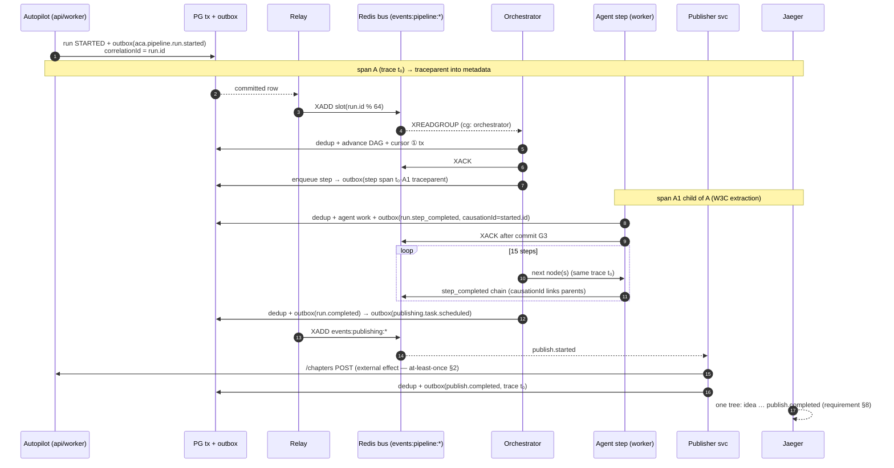

# Event Flows — Diagrams (ADR-024)

Authoritative diagrams for the events backbone. Rendered as Mermaid (editable
in-repo). Numbers in parentheses reference guarantees in
docs/Events-Guarantees.md.

## 1. Event flow (producer → truth → transport → consumers → DLQ)

```mermaid
flowchart LR
  subgraph PROD[Producer (apps/api · apps/worker)]
    S[Domain state change]
    W[OutboxWriter.write tx]
    S --> W
  end

  subgraph PG[(PostgreSQL — SOURCE OF TRUTH)]
    O[(outbox_events<br/>full v1.1 envelope JSON)]
    P[(processed_events<br/>consumer · eventId)]
    C[(consumer_cursors<br/>consumer · stream → slot ids)]
    D[(dead_letter_events<br/>OPEN / REPLAYED / DISCARDED)]
  end

  subgraph RELAY[Outbox Relay ×2]
    R1[claim batch<br/>FOR UPDATE SKIP LOCKED<br/>500 rows / 2 s]
  end

  subgraph REDIS[Redis Streams — transport only]
    S1[(events:&lt;domain&gt;:000..063<br/>64 slots by fnv1a aggregateId % N)]
    G1[consumer group: notifications]
    G2[consumer group: orchestrator]
  end

  subgraph CONS[Consumers]
    H1[handler ①]
    H2[handler ②]
    SW[sweeper: pending maturity<br/>idle ≥ backoff deliveries]
  end

  W -->|same-tx insert G1| O
  O --> R1 -->|XADD → mark published_at G2| S1
  S1 --> G1 --> H1
  S1 --> G2 --> H2
  H1 -->|dedup row + domain writes + cursor in ONE tx G3| P
  H1 --> C
  SW -->|fail ≤ maxAttempts| H1
  SW -->|budget exhausted G6| D
  D -.->|replay original id| R1
```

## 2. Sequence — one video, idea → publish (single trace via traceparent propagation)



## 3. Failure recovery — state machines

```mermaid
flowchart TB
  subgraph RelayCrash{Relay crash between XADD and mark-published}
    A1[row re-claimed next poll] --> A2[XADD DUPLICATE<br/>same envelope id] --> A3[consumer: dedup hit →<br/>XACK, no side effects G3]
  end

  subgraph ConsumerCrash{Consumer crash timeline}
    B1[crash BEFORE commit<br/>entry pending] --> B3
    B2[crash AFTER commit<br/>before XACK] --> B4[redelivery → dedup hit<br/>→ XACK only]
    B3[sweeper waits idle ≥<br/>backoff deliveries] --> B5{matured?}
    B5 -->|yes, deliveries < 10| B6[claim → reprocess]
    B5 -->|deliveries ≥ 10| B7[dead_letter_events OPEN<br/>+ XACK + metric]
  end

  subgraph RedisLoss{Redis flush / failover}
    C1[group state gone] --> C2[ConsumerRunner.start:<br/>recreate groups FROM<br/>consumer_cursors PG G5]
    C2 --> C3[streams dry? relay backlog<br/>(72 h retention) +<br/>replayFromOutbox filters]
  end

  subgraph DLQReplay{DLQ lifecycle}
    D1[OPEN row<br/>90 d window] --> D2{bug fixed?}
    D2 -->|replay tool| D3[re-append ORIGINAL id<br/>untouched consumers dedup]
    D2 -->|poison| D4[DISCARDED]
    D3 --> D5[REPLAYED + replayedAt]
  end
```

---

Reading notes:
- No arrow crosses PG↔Redis except through the relay — this is the physical
  encoding of "Redis is transport, never truth".
- The DLQ actuator replays **original envelope ids**; duplicate suppression is
  owned by inbox dedup, not by inventing new ids.
