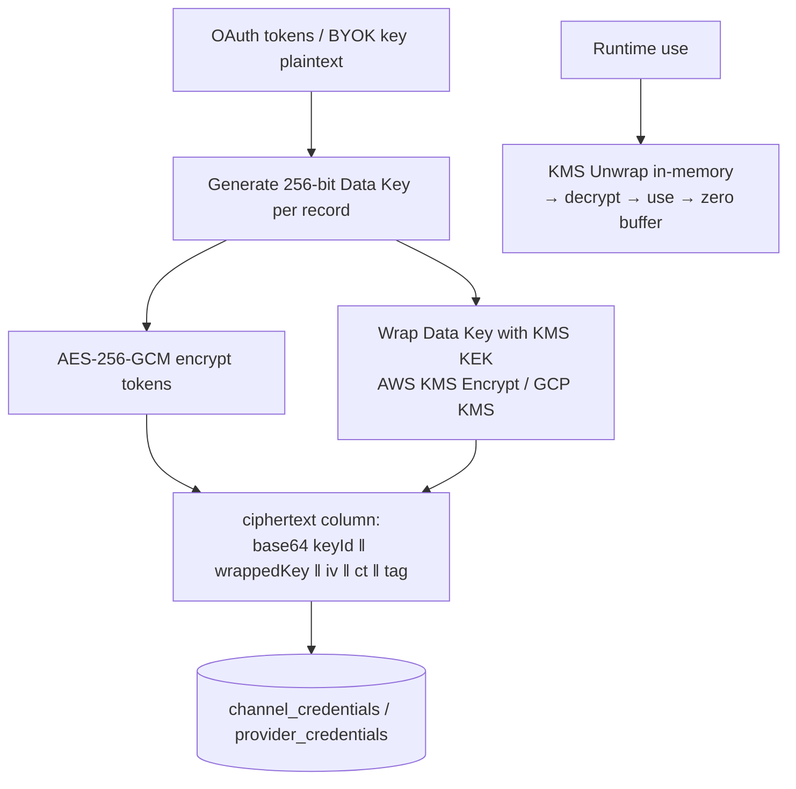

# AutoCreator AI — Security Architecture

**Status:** Approved-for-design · **Applies to:** apps/web, apps/api, apps/worker, all packages, all environments

---

## 1. Threat Model (STRIDE summary)

| Threat | Concrete scenario for AutoCreator | Primary mitigations |
|--------|-----------------------------------|---------------------|
| **Spoofing** | Stolen JWT; forged OAuth callback; fake Stripe webhook | Short-lived RS256 JWTs + refresh-rotation + reuse detection; OAuth `state`/nonce/PKCE; webhook signature verification |
| **Tampering** | Replay of idempotent requests; modified job payloads | Idempotency-key payload hashing; job envelopes trusted only after DB state check (workers re-read state, payload is hint not truth) |
| **Repudiation** | "I didn't connect that channel / delete that video" | Append-only `audit_logs` for every security- and money-relevant action (§9) |
| **Information disclosure** | OAuth token leak (worst case: attacker publishes to customer channels); cross-tenant data leak | Token vault (§4); tenant-scoped Prisma extension + RLS + leakage test-suite in CI; NOT_FOUND masks cross-tenant existence |
| **Denial of service** | Credit-drain via pipeline abuse; render-fork-bomb | Plan monthly caps + per-run `creditBudget`; queue concurrency caps; global rate limits; per-org fairness scheduler |
| **Elevation of privilege** | VIEWER → OWNER via crafted PATCH; API key scope bypass | Server-side RBAC guard on every route (§6); scope filter applied at guard layer, never controller |
| **SSRF** | Asset-collector fetching attacker URL → internal metadata service | Egress allowlist + RFC1918/ULA/cloud-metadata IP block + redirect re-resolution + forced DNS pinning (§7.2) |
| **Supply chain** | Malicious npm dep; poisoned base image | Lockfile pinning + CI scanners (§11) |

**Highest-value assets (protection order):** (1) platform OAuth tokens,
(2) org AI/BYOK keys, (3) Stripe webhook integrity, (4) user PII,
(5) credit ledger integrity.

---

## 2. Transport & Edge

- TLS 1.3 terminated at Cloudflare (proxied) → origin TLS (K8s ingress cert via cert-manager/Let's Encrypt). HTTP→HTTPS redirect; HSTS `max-age=63072000; includeSubDomains; preload`.
- Cloudflare WAF managed rules + bot fight mode on `/auth/*`.
- CORS: exact-origin allowlist (`app.autocreator.ai`, staging equivalent); `credentials: true`; no `*` anywhere. Non-browser clients (API keys) unaffected.
- Headers (helmet defaults hardened): `CSP: default-src 'self'; img-src 'self' https: data:; media-src 'self' https:; script-src 'self'; style-src 'self' 'unsafe-inline'` (Tailwind inline), `frame-ancestors 'none'`, `Referrer-Policy: strict-origin-when-cross-origin`, `X-Content-Type-Options: nosniff`, CSP **Report-Only → Enforce after 2 weeks of staging**.
- CSRF: cookie refresh flow is `SameSite=Lax` + `Origin`/`Referer` enforced on all `/auth` mutations; API-key/bearer traffic is CSRF-immune by construction (no ambient cookies honored when `Authorization` header present).

---

## 3. Authentication

### 3.1 User identity

- **JWT access:** RS256, 15 min, keypair rotated quarterly (kid header, JWKS at `/.well-known/jwks.json` for future third-party verification).
- **Refresh:** opaque 256-bit random, 30d, stored **SHA-256 hashed** in `user_sessions`; rotation on every use; **reuse detection** — presenting an already-rotated hash revokes the entire session family and emits `security.alert` audit + email ("was this you?").
- **Passwords:** Argon2id (m=64MiB, t=3, p=4), per-user salt; zxcvbn-strength ≥ 3 at registration; HaveIBeenPwned k-anonymity check.
- **MFA (phase 4, schema-ready):** TOTP + recovery codes; enforcement per-org policy flag.
- **Login throttling:** exponential lockout (5 fails → 5m, 10 → 30m, 20 → 24h + email alert).

### 3.2 OAuth login (Google)

Authorization Code + PKCE; `state` = short-lived signed JWT containing nonce +
returnUrl; nonce bound server-side. Email must be verified at Google or we run
our own verify flow.

### 3.3 API keys

`aca_live_<24 base62 chars>`; storage: SHA-256 hash; auth middleware does
`hash(provided)` lookup; scopes evaluated per request; optional expiry; usage
(`lastUsedAt`, IP) tracked and shown in Settings. Keys are org-scoped — a key
can never span organizations.

---

## 4. The Token Vault (channel & BYOK credentials)

The single most sensitive store in the platform. Design:

Rules:

1. Plaintext exists only in worker/API memory for the duration of one platform call; buffers zeroed after use; **never** logged (Pino `redact` on all `*token*`, `*secret*`, `authorization` paths — with a CI test asserting log sanitation).
2. KEK never leaves KMS; IAM-scoped to the API/worker service accounts; decrypt calls are CloudTrail-audited.
3. Access-token refresh runs **inside the worker**; DB sees only envelope ciphertext.
4. Key rotation: new KEK version → background job re-wraps data keys (no decrypt of tokens needed beyond re-wrap); emergency revocation = disable KEK key (platform-wide kill switch, tested quarterly).
5. Local dev: deterministic master key from docker secret (git-ignored), clearly namespaced `dev-key-1`; production KEKs cannot decrypt dev rows by construction (different keyIds).

---

## 5. Session-Adjacent: Channel OAuth Flows

- `state` JWT: 10-min TTL, contains `{ orgId, platform, nonce, returnUrl }`, nonce stored one-time-use in Redis → replay impossible.
- PKCE `S256` on all three platforms where supported (mandatory TikTok/Google; IG via Facebook Login uses state+nonce since PKCE unsupported — documented exception).
- Scopes are minimal per platform (API.md §6.1); scope drift detected at refresh (provider returns narrower scopes → channel flagged `SYNC_ERROR` + admin alert).
- Disconnect = certificate-of-deletion: vault row hard-deleted; best-effort token revocation call to provider (Google `revoke` endpoint; TikTok/IG per docs).

---

## 6. Authorization — RBAC

### 6.1 Roles → permissions matrix

| Capability | OWNER | ADMIN | EDITOR | VIEWER |
|------------|:-----:|:-----:|:------:|:------:|
| Billing: view invoices/usage | ✅ | ✅ | — | — |
| Billing: change plan, buy credits, portal | ✅ | — | — | — |
| Members: invite/remove/change roles | ✅ | ✅ (not OWNER role) | — | — |
| Channels: connect/disconnect/reconnect | ✅ | ✅ | — | — |
| Projects: create/edit/archive | ✅ | ✅ | ✅ | — |
| Automation: enable/disable/configure | ✅ | ✅ | ✅ | — |
| Videos: create/edit/delete | ✅ | ✅ | ✅ | — |
| Pipeline: start/approve/retry/cancel | ✅ | ✅ | ✅ | — |
| Publish & schedule | ✅ | ✅ | ✅ | — |
| Assets upload/delete | ✅ | ✅ | ✅ | — |
| Analytics & video library read | ✅ | ✅ | ✅ | ✅ |
| API keys & webhooks manage | ✅ | ✅ | — | — |
| Audit log read | ✅ | ✅ | — | — |
| Org settings | ✅ | ✅ | — | — |

### 6.2 Enforcement

- `RolesGuard` (global): resolves `orgId` (path param or entity lookup), loads membership, compares against `@Roles()` metadata. Denial → 403; unknown entity → 404 (no oracle).
- **Defense in depth:** Prisma tenant extension (Database.md §8) makes any query without org context throw in dev/staging.
- Unit tests: every controller has an RBAC matrix test (generated spec from the matrix table above — the doc *is* the test fixture).

---

## 7. Input, Output & Application Hardening

### 7.1 General

- **Validation:** every DTO is a Zod schema in `packages/shared` → `ZodValidationPipe` (global). Unknown keys rejected (`.strict()`).
- **Injection:** Prisma parameterized queries only; raw SQL confined to migrations/partition helpers with review-required label in CI. No string-built queries in app code (ESLint rule `no-raw-query` outside allowlist).
- **XSS:** React escaping + DOMPurify for any rich text render (descriptions); CSP blocks inline script.
- **Mass assignment:** PATCH DTOs are whitelisted field-by-field; Prisma `select` explicit on outbound reads (no `passwordHash`, `ciphertext` leakage possible).

### 7.2 SSRF & remote fetching (Asset Collector)

The pipeline fetches user- and AI-provided URLs. Fetcher (`packages/ai/src/utils/safe-fetch.ts`) enforces:

1. Scheme allowlist: `https` only.
2. DNS resolution → IP checked against denylist: RFC1918, loopback, link-local (`169.254.169.254`), ULA, multicast, and CGNAT ranges; **re-checked after every redirect** (max 3).
3. Response size cap 500MB, timeout 60s, `User-Agent: AutoCreator/1.0`, no cookies/redirect-credential forwarding.
4. Workers egress via dedicated NAT IP so network policy (K8s `NetworkPolicy` + cloud SG) can block pod→VPC-internal traffic entirely.

### 7.3 File uploads

Presigned PUT direct-to-S3 (`upload-intent` flow, API.md §9.1):
size-capped policy conditions per type (video 2GB, image 20MB, audio 200MB);
`Content-Type` pinned; on confirm: magic-byte sniff (no extension trust) →
ClamAV scan (dedicated sidecar) → `ffprobe` validation (declared container
must parse). Failures: S3 object deleted, asset row purged, 422 response.
SVG uploads rejected (script vector) — thumbnails are server-rendered to PNG.

### 7.4 Rate limiting & abuse

- Buckets per API.md §14 (Redis sliding window).
- **Economic abuse controls:** pipeline-start endpoints consume estimated credits *before* run (`creditBudget` reservation pattern: hold → settle actual on completion, release remainder); failure settles consumed steps only. Prevents credit-drain race via N parallel starts.
- Scheduler per-org fairness: autopilot jobs interleave organizations (weighted round-robin at enqueue) so one org can't flood queue capacity.
- Disposable-email domain blocklist at registration; optional email verification enforcement before first pipeline run.

---

## 8. Secrets Management

| Environment | Store | Notes |
|-------------|-------|-------|
| Local | `.env.local` (git-ignored) + `.env.example` with **names only** committed; docker-compose injects via vault-dev file | Pre-commit hook `gitleaks` blocks accidental commits |
| CI | GitHub Actions OIDC → no long-lived cloud creds; secrets in GH Environments with required reviewers for prod | E2E uses ephemeral per-run DB |
| Staging/Prod | Doppler projects `aca-stg` / `aca-prd` → synced to K8s Secrets (KMS-encrypted etcd) | Rotation in Doppler → rolling restart; quarterly auto-rotation for DB/Redis creds via managed-service APIs |
| KMS | AWS KMS `alias/aca-prod-vault` (multi-region) | See §4 |

Rules enforced in CI: (1) no `*.env*` outside allowlist in commits, (2)
trufflehog full-history scan nightly, (3) platform tokens detected in any log
sink page on-call.

---

## 9. Audit Logging

Writer: `AuditService.append()` called from service layer (never controllers)
inside the same DB transaction as the action — action and audit commit or fail
together.

Logged events (minimum): auth.{login,logout,refresh_reuse_detected,password_*} ·
member.{invite,role_change,remove} · channel.{connect,disconnect,reconnect,token_purged} ·
project.automation.{enable,disable} · video.{create,delete,publish} ·
pipeline.{start,cancel,approve,reject} · billing.{plan_change,credits_purchase}
· apikey.{create,revoke} · webhook.{create,delete,disabled} ·
admin.{org_s suspended,credits_adjusted}.

Each row: actor (user/api-key/system), ip, userAgent, entity, before/after
diff metadata (PII-scrubbed), requestId joined to traces. Read API:
`GET /organizations/{id}/audit-logs` (ADMIN) cursor-paginated in the **Logs**
dashboard module; retention per Database.md §9 (13 mo online / 7y archive).

---

## 10. Compliance & Platform Policies

### 10.1 GDPR/CCPA

- Lawful basis documentation; DPA available for Business tier; SCCs for US processors.
- DSAR flows: data export (self-serve Settings → "Export my data" generates full JSON archive async) and erasure (Database.md §10).
- PII minimization: platform analytics stored per-channel are aggregate metrics, not end-viewer data.
- EU data residency: single-region (EU-central) option evaluated at Enterprise demand; architecture (multi-AZ, single region) makes it a deploy-time decision.

### 10.2 Platform API Terms (continuous obligations — owned by Compliance calendar, reviewed quarterly)

- **YouTube API Services ToS:** stored channel analytics refreshed at least every 30 days (nightly sync satisfies) and deleted on user disconnect; `onBehalfOfContentOwner` unused; quota reporting accurate; **AI-content disclosure** — every publish passes `alteraedContent`/`containsSyntheticMedia` flags (we default `aiDisclosure: true`, user-overridable with informed-consent UX); watch YPP "inauthentic content" enforcement → QC step includes originality/duplication checks (AI-Pipeline §6.12).
- **TikTok:** Content Posting API app review + brand safety; honor per-user posting caps; label AI-generated content via `brand_content_toggle`/AI label fields.
- **Instagram:** Business/Creator accounts only (validated at connect); respect 25 posts/24h; Meta Platform Terms data-deletion callback endpoint implemented at `POST /webhooks/meta/data-deletion`.
- **Stripe PCI:** SAQ-A posture — card data never touches our servers (Checkout/Portal only).

Registration/consent records (what scopes were granted when) are derivable from
`audit_logs` + channel rows.

---

## 11. Supply Chain & CI Security (GitHub Actions)

| Control | Tool | Gate |
|---------|------|------|
| Dependency vulns | Dependabot alerts + `pnpm audit` + OSV-Scanner | PR blocked on high/critical |
| SAST | CodeQL (ts/js) weekly + per-PR | High findings block merge |
| Secrets | gitleaks (pre-commit + CI) + trufflehog nightly history scan | Commit rejected / page on-call |
| Container scan | Trivy on built images | High/critical blocks deploy |
| IaC scan | Checkov on Terraform/K8s manifests | Blocks deploy |
| License compliance | license-checker (deny GPL-family in distributables) | PR warning |
| Branch protection | main: PR + 1 review + status checks + linear history; tags signed | — |

Artifacts provenance: images built in CI are cosign-signed; K8s admission
verifies signature (phase-5 hardening).

---

## 12. Monitoring & Incident Response

**Security alerts (PagerDuty page):** refresh-token reuse; decryption failure
spike; impossible-travel login (geovelocity); new admin role grant outside
business hours; WAF block surge; audit-write failure (must never fail silently —
write failure = request failure by design).

**IR runbook:** Detect (alerts/Sentry) → Triage ≤ 15 min (on-call) → Contain
(kill switches: revoke session family, suspend org, disable KEK key, pause
queues) → Eradicate → Recover (from PITR/snapshots) → Postmortem ≤ 72h
(blameless, tracked actions). Breach notification path (GDPR 72h) documented
with legal contact tree.

**Pen-testing:** annual external test + continuous HackerOne private program
from Series A; scope/rules in `/.well-known/security.txt`.

---

## 14. Enterprise Controls (Phase 0.5)

### 14.1 SSO — SAML 2.0 & OIDC

- Per-org `sso_connections` (single active connection in v1; multi-IdP later without schema change).
- SAML: SP metadata at `GET /sso/saml/metadata/{orgSlug}`; ACS validates signature (SHA-256), conditions (`NotBefore/OnOrAfter` ±5 min skew), audience, and InResponseTo against a one-time request store (Redis, 10 min) — replay-proof. IdP cert rotation via metadata URL refresh (hourly) or manual XML.
- OIDC: authorization code + PKCE against org IdP; `id_token` signature vs IdP JWKS (cached 6h); `nonce` enforced.
- **Domain enforcement:** claimed `domains[]` verified by admin email challenge before `enforced=true` can be set; then password login & session creation for matching emails is rejected (403 SSO_ENFORCED). Existing sessions are honored until `sessionMaxHours` policy forces re-auth; enforced orgs cannot register API tokens for human users (service accounts via API keys only).
- **JIT provisioning:** first IdP login creates user + membership at `defaultRoleId` (or VIEWER); `attributeMapping` maps IdP groups → Teams/roles on every login (IdP is the source of truth; drift reconciles per login).
- Deprovisioning = SCIM DELETE or membership removal; sessions revoked instantly, IdP-initiated logout (SLO) supported for OIDC back-channel.

### 14.2 SCIM 2.0 provisioning

RFC 7644 mount at `/scim/v2` behind SCIM bearer tokens (hashed at rest).
`Users`: create/read/patch (`active:false` → revoke sessions + membership REMOVED)/delete(=deactivate). `Groups` ↔ Teams sync. Filter support: `userName eq`. Bulk operations disabled (rate-guard); IdP-sync traffic shaped by per-token limits. All mutations audit-logged with actorType=SCIM.

### 14.3 IP allow list & session policy

- `ip_allowlist_entries` enforced in `IpAllowlistGuard` for all org-scoped routes (web session, API key, OAuth app token) when org enables it. Evaluation uses cached CIDR set (≤ 60 s staleness, event-invalidated on change). Trusted-Proxy handling: client IP only from Cloudflare's authenticated edge header — XFF spoofing rejected.
- Org `securityPolicy`: `enforceMfa` (blocks non-MFA sessions), `sessionMaxHours` (1–720), `enforceSso`. Policy changes require OWNER and emit `security.policy_changed` audit + notification to all admins.

### 14.4 SOC 2 readiness map (Type I scope)

| TSC | Control implementation |
|-----|------------------------|
| CC6.1 logical access | RBAC capabilities, MFA, SSO enforcion, session policy, least-privilege service accounts (KMS/IAM) |
| CC6.2 provisioning | SCIM lifecycle + invitations with expiry + deprovisioning runbook |
| CC6.3 remove access | instant session/grant revocation, vault purge on disconnect |
| CC6.6 boundary | WAF, IP allowlists, NetworkPolicies, egress-limited plugin pool |
| CC6.7 transmission | TLS1.3, HSTS, message signing (webhooks HMAC), vault envelope |
| CC7.1 monitoring | OTel/Jaeger/Prometheus + security alerts (§12) + audit completeness checks |
| CC7.2 incident response | IR runbook §12, kill switches, GameDays |
| CC8.1 change mgmt | trunk-based + reviews + CI gates + canary + signed images |
| A1.2 availability | SLOs + multi-AZ + PITR backups + DR drills |
| C1.1 confidentiality | data classification (§1), retention schedule (Database §9), GDPR flows |

Evidence pipeline: CI outputs, audit exports (signed checksum), access-review
quarterly reports (auto-generated per org + platform admins) → compliance drive.

## 15. Plugin Sandbox & Marketplace Supply-Chain

- Third-party **NPM plugins** execute only in `worker-plugins` pool: no KMS decrypt scope, no DB credentials (receives per-call least-privilege payloads over queue-RPC; storage via single-use presigned URLs), capped CPU/mem, egress allowlist to declared hosts. NetworkPolicy enforced; violation attempts raise `plugin.quarantine`.
- **Remote plugins**: HMAC-signed requests, orgId pseudonymized per plugin, 10 s SLA, response JSON-schema validated both ways.
- Marketplace publish gate: publisher KYC (Stripe Connect), automated conformance suite (`@aca/plugin-kit`), security review for publish-scopes, version pinning (installations pin `slug+version`; upgrades are explicit user actions, changelogs required).
- Runtime protection: router health-scores plugin adapters; anomalies shadow them behind fallback providers automatically and alert the installing org; platform can `SUSPENDED`-flag a plugin globally (propagates ≤ 60 s via `plugin.suspended` event).
- Publisher plugins (channel-write) require the channel connect flow to display plugin-requested scopes explicitly; revoking the channel or the plugin instantly blocks all write paths (authorization evaluated per call, not cached).

## 16. White-Label & Domain Security

- Custom-domain verification via TXT token (128-bit) + CNAME target check before activation; SSL issuance via Cloudflare for SaaS (no manual certs); domain suspension on CNAME removal (hourly job) — prevents orphan-domain phishing on our IP space.
- Host→brand resolution exposes **brand fields only**; enumeration-resistant (`/branding/resolve` returns identical shape for unknown hosts with defaults).
- Email_FROM domains require SPF include + DKIM CNAMEs + DMARC ≥ `p=quarantine` before activation (protects customer + platform deliverability).

## 17. Secrets — “Nothing in the repo” guarantee (v2 hardening)

- `.env.example` contains **names only, zero value-shaped strings**; CI asserts the regex-emptiness.
- Any vendor key needed by CI (e2e cassettes) is stored GitHub-encrypted and injected at runtime only; cassettes store redacted headers.
- Developer onboarding: `pnpm dev:bootstrap` generates per-developer throwaway secrets locally (never committed, `.gitignore`d, git-crypt not required).
- Break-glass: two-person rule for Doppler prod changes; all reads/writes audit-trailed.

## 18. Secure SDLC Checkpoints (mapped to Roadmap)

| Phase | Gate |
|-------|------|
| 1 (API skeleton) | RBAC matrix tests green; auth e2e incl. reuse-detection |
| 2 (channels) | Vault penetration self-test; OAuth flow e2e with nonce replay test |
| 3 (pipeline) | SSRF kill-chain test; credit-race stress test |
| MVP launch | External security review light (2-day); CSP enforce; rate-limit load test |
| Phase 5 | SOC 2 Type I scope freeze; vendor register (subprocessor list published) |
