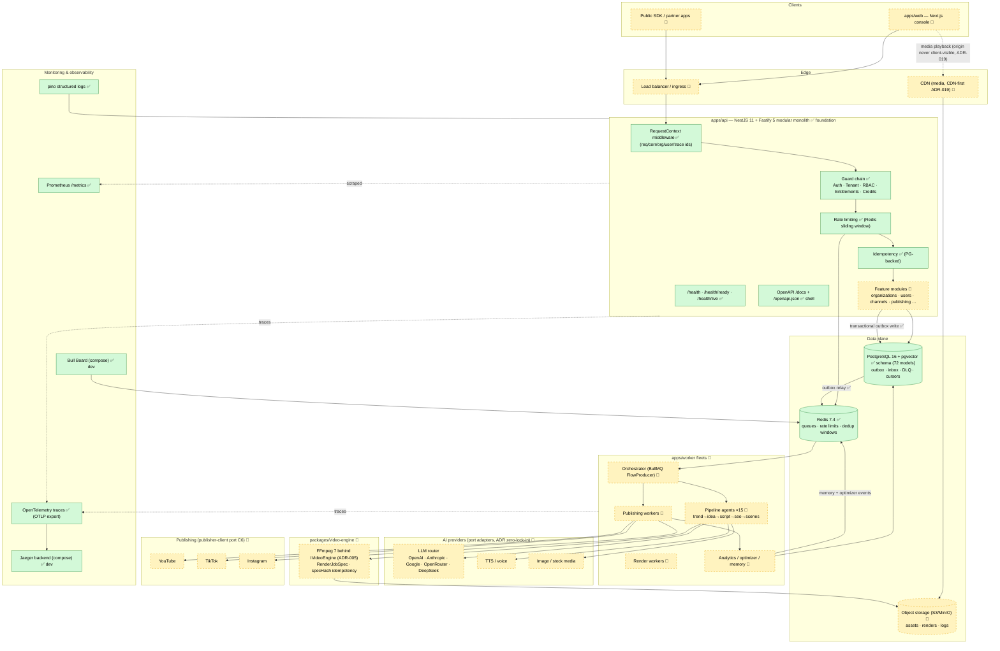

# System Architecture — v1.0-foundation (Final)

> Normative design view (docs/Architecture.md) annotated with **build status at tag
> `v1.0-foundation`**: ✅ built & CI-green · 🚧 designed, not scaffolded yet.
> Renders natively on GitHub (Mermaid).

## Reading the diagram

| Component | Status at v1.0 | Notes |
|---|---|---|
| **Web** (`apps/web`) | 🚧 planned | Next.js console; consumes `/v1` + OpenAPI SDK only |
| **API** (`apps/api`) | ✅ foundation | All cross-cutting layers built; zero business controllers yet |
| **Workers** (`apps/worker`) | 🚧 planned | Orchestrator + agent/render/publish/analytics fleets; consume events only |
| **Redis** | ✅ integrated | Rate limits + events backbone in use; BullMQ lands with worker app |
| **PostgreSQL** | ✅ schema complete | 72 models; outbox/inbox/DLQ tables already serving `@aca/events` |
| **Storage** | 🚧 planned | MinIO in local compose; `IStoragePort` frozen in Contracts C5 |
| **AI providers** | 🚧 planned | Contracts C3 frozen; adapters land in `@aca/ai` (layer 4) |
| **Video engine** | 🚧 planned | FFmpeg 7 behind `IVideoEngine` (ADR-005) |
| **Publishing** | 🚧 planned | Publisher port C6 (YouTube/TikTok/Instagram clients) |
| **Monitoring** | ✅ wired in API | OTel traces, Prometheus `/metrics`, pino logs; Jaeger/Bull Board in local stack |

**Invariants shown:** writes cross the API→PG boundary inside one transaction together
with their outbox rows (✅ implemented); workers never call the API — they consume
events; the media origin (S3) is never client-visible (ADR-019).
