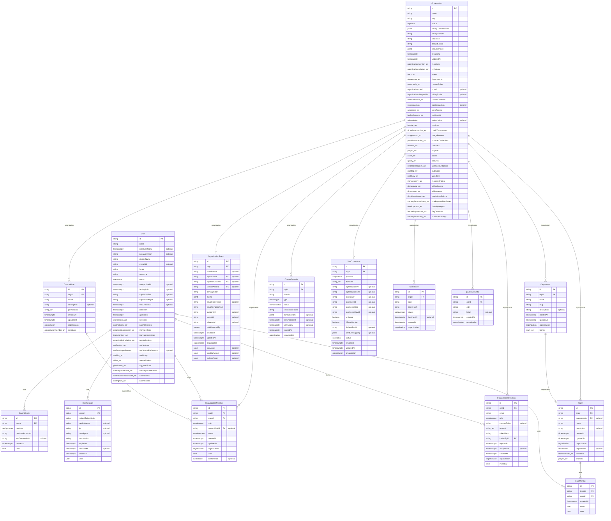
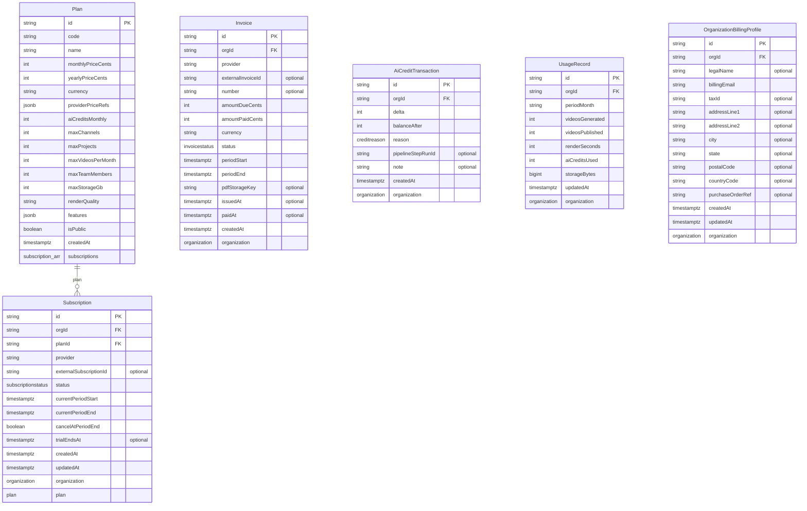
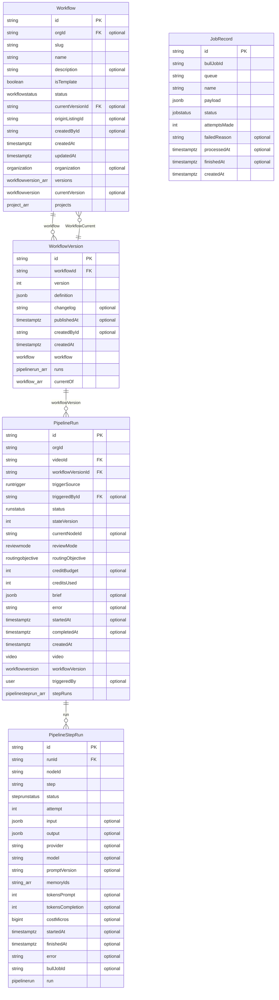
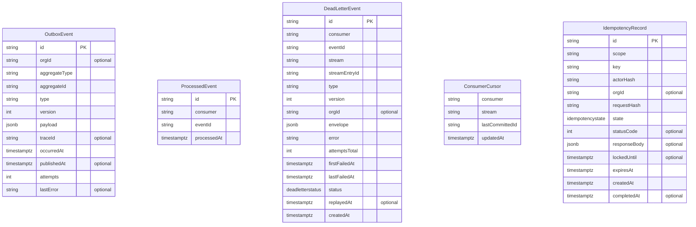
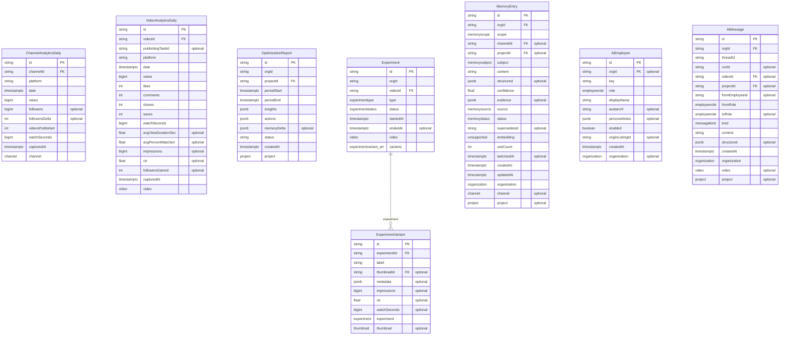
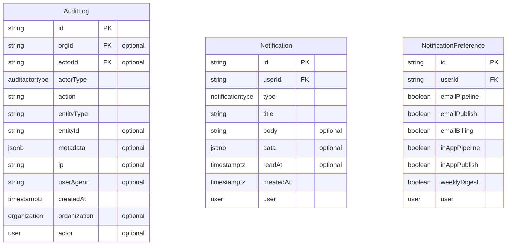

# Database ER Diagram — generated

> GENERATED by `infra/scripts/generate-er-diagram.mjs` from
> `packages/database/prisma/schema.prisma` (byte-identical to docs/Database.md §3)
> — DO NOT EDIT BY HAND. Drift fails CI (structural-gates job). Relationship
> labels are the Prisma relation/field names; `PK` = primary key, `FK` = part of
> a `@relation(fields:[…])` constraint. `optional` marks nullable fields.
> 74 models · 97 relationships.

## Overview — all 74 models (relations only)

```mermaid
erDiagram
  User {
    string id PK
  }
  OAuthIdentity {
    string id PK
  }
  UserSession {
    string id PK
  }
  Organization {
    string id PK
  }
  OrganizationMember {
    string id PK
  }
  OrganizationInvitation {
    string id PK
  }
  Department {
    string id PK
  }
  Team {
    string id PK
  }
  TeamMember {
    string id PK
  }
  CustomRole {
    string id PK
  }
  OrganizationBrand {
    string id PK
  }
  CustomDomain {
    string id PK
  }
  SsoConnection {
    string id PK
  }
  ScimToken {
    string id PK
  }
  IpAllowListEntry {
    string id PK
  }
  Plan {
    string id PK
  }
  Subscription {
    string id PK
  }
  OrganizationBillingProfile {
    string id PK
  }
  Invoice {
    string id PK
  }
  AiCreditTransaction {
    string id PK
  }
  UsageRecord {
    string id PK
  }
  ProviderCredential {
    string id PK
  }
  Channel {
    string id PK
  }
  ChannelCredential {
    string id PK
  }
  Project {
    string id PK
  }
  AutomationConfig {
    string id PK
  }
  TrendSnapshot {
    string id PK
  }
  Idea {
    string id PK
  }
  Video {
    string id PK
  }
  Script {
    string id PK
  }
  Voiceover {
    string id PK
  }
  Voice {
    string id PK
  }
  Scene {
    string id PK
  }
  Asset {
    string id PK
  }
  AssetUsage {
    string id PK
  }
  VideoRendition {
    string id PK
  }
  SubtitleTrack {
    string id PK
  }
  Thumbnail {
    string id PK
  }
  Workflow {
    string id PK
  }
  WorkflowVersion {
    string id PK
  }
  PipelineRun {
    string id PK
  }
  PipelineStepRun {
    string id PK
  }
  JobRecord {
    string id PK
  }
  OutboxEvent {
    string id PK
  }
  ProcessedEvent {
    string id PK
  }
  DeadLetterEvent {
    string id PK
  }
  ConsumerCursor {
    string id PK
  }
  IdempotencyRecord {
    string id PK
  }
  PublishingTask {
    string id PK
  }
  ChannelAnalyticsDaily {
    string id PK
  }
  VideoAnalyticsDaily {
    string id PK
  }
  OptimizationReport {
    string id PK
  }
  Experiment {
    string id PK
  }
  ExperimentVariant {
    string id PK
  }
  MemoryEntry {
    string id PK
  }
  AiEmployee {
    string id PK
  }
  AiMessage {
    string id PK
  }
  PluginRecord {
    string id PK
  }
  PluginInstallation {
    string id PK
  }
  MarketplaceListing {
    string id PK
  }
  MarketplacePurchase {
    string id PK
  }
  MarketplaceReview {
    string id PK
  }
  DeveloperApp {
    string id PK
  }
  OauthAuthorizationCode {
    string id PK
  }
  OauthGrant {
    string id PK
  }
  FeatureFlag {
    string id PK
  }
  FeatureFlagOverride {
    string id PK
  }
  ApiKey {
    string id PK
  }
  WebhookEndpoint {
    string id PK
  }
  WebhookDelivery {
    string id PK
  }
  ProcessedWebhookEvent {
    string id PK
  }
  AuditLog {
    string id PK
  }
  Notification {
    string id PK
  }
  NotificationPreference {
    string id PK
  }
  User ||--o{ OAuthIdentity : "user"
  User ||--o{ UserSession : "user"
  Organization ||--o{ OrganizationMember : "organization"
  User ||--o{ OrganizationMember : "user"
  CustomRole ||--o{ OrganizationMember : "customRole"
  Organization ||--o{ OrganizationInvitation : "organization"
  User ||--o{ OrganizationInvitation : "Inviter"
  Organization ||--o{ Department : "organization"
  Organization ||--o{ Team : "organization"
  Department ||--o{ Team : "department"
  Team ||--o{ TeamMember : "team"
  User ||--o{ TeamMember : "user"
  Organization ||--o{ CustomRole : "organization"
  Organization ||--o| OrganizationBrand : "organization"
  Asset ||--o{ OrganizationBrand : "BrandLogo"
  Asset ||--o{ OrganizationBrand : "BrandLogoDark"
  Asset ||--o{ OrganizationBrand : "BrandFavicon"
  Organization ||--o{ CustomDomain : "organization"
  Organization ||--o| SsoConnection : "organization"
  Organization ||--o{ ScimToken : "organization"
  Organization ||--o{ IpAllowListEntry : "organization"
  Organization ||--o| Subscription : "organization"
  Plan ||--o{ Subscription : "plan"
  Organization ||--o| OrganizationBillingProfile : "organization"
  Organization ||--o{ Invoice : "organization"
  Organization ||--o{ AiCreditTransaction : "organization"
  Organization ||--o{ UsageRecord : "organization"
  Organization ||--o{ ProviderCredential : "organization"
  PluginInstallation ||--o{ ProviderCredential : "pluginInstall"
  Organization ||--o{ Channel : "organization"
  Channel ||--o| ChannelCredential : "channel"
  Organization ||--o{ Project : "organization"
  Team ||--o{ Project : "team"
  Voice ||--o{ Project : "ProjectDefaultVoice"
  Workflow ||--o{ Project : "workflow"
  Project ||--o| AutomationConfig : "project"
  Project ||--o{ Idea : "project"
  Project ||--o{ Video : "project"
  Idea ||--o{ Video : "idea"
  User ||--o{ Video : "VideoCreator"
  Video ||--o{ Script : "video"
  Script ||--o{ Voiceover : "script"
  Voice ||--o{ Voiceover : "voice"
  Asset ||--o{ Voiceover : "audioAsset"
  Asset ||--o{ Voice : "VoicePreview"
  Video ||--o{ Scene : "video"
  Asset ||--o{ Scene : "asset"
  Organization ||--o{ Asset : "organization"
  Video ||--o{ AssetUsage : "video"
  Asset ||--o{ AssetUsage : "asset"
  Video ||--o{ VideoRendition : "video"
  Video ||--o{ SubtitleTrack : "video"
  Video ||--o{ Thumbnail : "video"
  Organization ||--o{ Workflow : "organization"
  WorkflowVersion ||--o{ Workflow : "WorkflowCurrent"
  Workflow ||--o{ WorkflowVersion : "workflow"
  Video ||--o{ PipelineRun : "video"
  WorkflowVersion ||--o{ PipelineRun : "workflowVersion"
  User ||--o{ PipelineRun : "triggeredBy"
  PipelineRun ||--o{ PipelineStepRun : "run"
  Video ||--o{ PublishingTask : "video"
  Channel ||--o{ PublishingTask : "channel"
  Channel ||--o{ ChannelAnalyticsDaily : "channel"
  Video ||--o{ VideoAnalyticsDaily : "video"
  Project ||--o{ OptimizationReport : "project"
  Video ||--o{ Experiment : "video"
  Experiment ||--o{ ExperimentVariant : "experiment"
  Thumbnail ||--o{ ExperimentVariant : "thumbnail"
  Organization ||--o{ MemoryEntry : "organization"
  Channel ||--o{ MemoryEntry : "channel"
  Project ||--o{ MemoryEntry : "project"
  Organization ||--o{ AiEmployee : "organization"
  Organization ||--o{ AiMessage : "organization"
  Video ||--o{ AiMessage : "video"
  Project ||--o{ AiMessage : "project"
  Organization ||--o{ PluginInstallation : "organization"
  PluginRecord ||--o{ PluginInstallation : "plugin"
  Organization ||--o{ MarketplaceListing : "publisherOrganization"
  MarketplaceListing ||--o{ MarketplacePurchase : "listing"
  Organization ||--o{ MarketplacePurchase : "buyerOrg"
  MarketplaceListing ||--o{ MarketplaceReview : "listing"
  User ||--o{ MarketplaceReview : "user"
  Organization ||--o{ DeveloperApp : "ownerOrg"
  DeveloperApp ||--o{ OauthAuthorizationCode : "app"
  User ||--o{ OauthAuthorizationCode : "user"
  DeveloperApp ||--o{ OauthGrant : "app"
  User ||--o{ OauthGrant : "user"
  FeatureFlag ||--o{ FeatureFlagOverride : "flag"
  Organization ||--o{ FeatureFlagOverride : "organization"
  Organization ||--o{ ApiKey : "organization"
  Organization ||--o{ WebhookEndpoint : "organization"
  DeveloperApp ||--o{ WebhookEndpoint : "developerApp"
  WebhookEndpoint ||--o{ WebhookDelivery : "endpoint"
  Organization ||--o{ AuditLog : "organization"
  User ||--o{ AuditLog : "actor"
  User ||--o{ Notification : "user"
  User ||--o| NotificationPreference : "user"
```

## Identity & Tenancy (15 models)

Inbound FK from another domain: `Asset ← OrganizationBrand.BrandLogo`, `Asset ← OrganizationBrand.BrandLogoDark`, `Asset ← OrganizationBrand.BrandFavicon`.

## Billing & Entitlements (6 models)

Inbound FK from another domain: `Organization ← Subscription.organization`, `Organization ← OrganizationBillingProfile.organization`, `Organization ← Invoice.organization`, `Organization ← AiCreditTransaction.organization`, `Organization ← UsageRecord.organization`.

## Channels, Content & Publishing (18 models)

```mermaid
erDiagram
  ProviderCredential {
    string id PK
    string orgId FK
    providercapability capability
    string provider
    string label
    string ciphertext
    string keyId
    string pluginInstallId FK "optional"
    apikeystatus status
    timestamptz createdAt
    timestamptz revokedAt "optional"
    organization organization
    plugininstallation pluginInstall "optional"
  }
  Channel {
    string id PK
    string orgId FK
    string platform
    string platformChannelId
    string displayName
    string handle "optional"
    string avatarUrl "optional"
    channelstatus status
    string_arr scopes
    bigint followers "optional"
    timestamptz lastSyncAt "optional"
    string lastError "optional"
    timestamptz connectedAt
    timestamptz disconnectedAt "optional"
    timestamptz createdAt
    timestamptz updatedAt
    organization organization
    channelcredential credential "optional"
    publishingtask_arr publishingTasks
    channelanalyticsdaily_arr analytics
    automationconfig_arr autopilotConfigs
    memoryentry_arr memories
  }
  ChannelCredential {
    string id PK
    string channelId FK
    string ciphertext
    string keyId
    timestamptz accessTokenExpiresAt "optional"
    timestamptz refreshTokenExpiresAt "optional"
    timestamptz rotatedAt "optional"
    timestamptz createdAt
    timestamptz updatedAt
    channel channel
  }
  Project {
    string id PK
    string orgId FK
    string teamId FK "optional"
    projectvisibility visibility
    string name
    string description "optional"
    string niche "optional"
    string language
    string_arr targetPlatforms
    aspectratio aspectRatio
    jsonb stylePreset
    string defaultVoiceId FK "optional"
    string workflowId FK "optional"
    routingobjective routingObjective
    boolean isArchived
    timestamptz createdAt
    timestamptz updatedAt
    organization organization
    team team "optional"
    voice defaultVoice "optional"
    workflow workflow "optional"
    automationconfig automationConfig "optional"
    idea_arr ideas
    video_arr videos
    optimizationreport_arr optimizationReports
    memoryentry_arr memories
    aimessage_arr aiMessages
  }
  AutomationConfig {
    string id PK
    string projectId FK
    boolean enabled
    reviewmode reviewMode
    int postsPerDay
    jsonb postingWindows
    string_arr topicKeywords
    string_arr negativeKeywords
    string cronExpression "optional"
    timestamptz lastRunAt "optional"
    timestamptz createdAt
    timestamptz updatedAt
    project project
    channel_arr channels
  }
  TrendSnapshot {
    string id PK
    string platform
    string region
    string keyword
    string category "optional"
    float score
    float velocity
    int volume "optional"
    jsonb metadata "optional"
    timestamptz capturedAt
  }
  Idea {
    string id PK
    string projectId FK
    ideasource source
    string title
    string angle "optional"
    jsonb outline "optional"
    float score "optional"
    ideastatus status
    string trendKeyword "optional"
    jsonb evidence "optional"
    unsupported embedding
    timestamptz selectedAt "optional"
    timestamptz createdAt
    project project
    video_arr videos
  }
  Video {
    string id PK
    string orgId
    string projectId FK
    string ideaId FK "optional"
    string title
    string description "optional"
    string language
    aspectratio aspectRatio
    string_arr targetPlatforms
    videostatus status
    int durationMs "optional"
    jsonb seo "optional"
    string hook "optional"
    string cta "optional"
    string_arr tags
    string visibilityDefault
    boolean aiDisclosure
    float qualityScore "optional"
    timestamptz scheduledAt "optional"
    timestamptz publishedAt "optional"
    string failureReason "optional"
    string createdById FK "optional"
    timestamptz createdAt
    timestamptz updatedAt
    project project
    idea idea "optional"
    user createdBy "optional"
    script_arr scripts
    scene_arr scenes
    videorendition_arr renditions
    subtitletrack_arr subtitleTracks
    thumbnail_arr thumbnails
    pipelinerun_arr pipelineRuns
    publishingtask_arr publishingTasks
    videoanalyticsdaily_arr analytics
    assetusage_arr assetUsage
    experiment_arr experiments
    aimessage_arr aiMessages
  }
  Script {
    string id PK
    string videoId FK
    int version
    string content
    jsonb beats
    int wordCount
    int readingSeconds
    float factualityScore "optional"
    float seoScore "optional"
    jsonb claims "optional"
    boolean isActive
    timestamptz createdAt
    video video
    voiceover_arr voiceovers
  }
  Voiceover {
    string id PK
    string scriptId FK
    string voiceId FK
    string audioAssetId FK
    int durationMs
    jsonb wordTimings "optional"
    timestamptz createdAt
    script script
    voice voice
    asset audioAsset
  }
  Voice {
    string id PK
    string provider
    string providerVoiceId
    string name
    string gender "optional"
    string_arr languages
    string style "optional"
    boolean isPremium
    string previewAssetId FK "optional"
    timestamptz createdAt
    asset previewAsset "optional"
    voiceover_arr voiceovers
    project_arr projectDefaults
  }
  Scene {
    string id PK
    string videoId FK
    int index
    string narrationText
    string visualPrompt "optional"
    string assetId FK "optional"
    int startMs
    int endMs
    string transition "optional"
    jsonb overlay "optional"
    timestamptz createdAt
    video video
    asset asset "optional"
  }
  Asset {
    string id PK
    string orgId FK
    assettype type
    assetsource source
    string storageKey
    string cdnPath
    string mimeType
    bigint bytes
    string checksum "optional"
    int durationMs "optional"
    int width "optional"
    int height "optional"
    string license "optional"
    string sourceUrl "optional"
    jsonb metadata "optional"
    timestamptz expiresAt "optional"
    unsupported embedding
    timestamptz createdAt
    organization organization
    assetusage_arr usage
    scene_arr scenes
    voiceover_arr voiceovers
    voice_arr voicePreviews
    organizationbrand_arr brandLogoUses
    organizationbrand_arr brandLogoDarkUses
    organizationbrand_arr brandFaviconUses
  }
  AssetUsage {
    string id PK
    string videoId FK
    string assetId FK
    string context
    video video
    asset asset
  }
  VideoRendition {
    string id PK
    string videoId FK
    string profile
    string storageKey "optional"
    bigint bytes "optional"
    int durationMs "optional"
    renderstatus status
    string renderLogsKey "optional"
    string specHash "optional"
    timestamptz createdAt
    timestamptz completedAt "optional"
    video video
  }
  SubtitleTrack {
    string id PK
    string videoId FK
    string language
    string format
    string storageKey
    boolean wordLevel
    timestamptz createdAt
    video video
  }
  Thumbnail {
    string id PK
    string videoId FK
    int variant
    string storageKey
    int width
    int height
    jsonb layout "optional"
    boolean selected
    float ctr "optional"
    timestamptz createdAt
    video video
    experimentvariant_arr experimentVariants
  }
  PublishingTask {
    string id PK
    string orgId
    string videoId FK
    string channelId FK
    string renditionProfile
    string platform
    timestamptz scheduledAt "optional"
    publishtaskstatus status
    string platformVideoId "optional"
    string platformUrl "optional"
    string platformPostId "optional"
    string titleOverride "optional"
    string descriptionOverride "optional"
    string_arr hashtags
    int attemptsMade
    string lastError "optional"
    timestamptz publishedAt "optional"
    timestamptz createdAt
    timestamptz updatedAt
    video video
    channel channel
  }
  Channel ||--o| ChannelCredential : "channel"
  Voice ||--o{ Project : "ProjectDefaultVoice"
  Project ||--o| AutomationConfig : "project"
  Project ||--o{ Idea : "project"
  Project ||--o{ Video : "project"
  Idea ||--o{ Video : "idea"
  Video ||--o{ Script : "video"
  Script ||--o{ Voiceover : "script"
  Voice ||--o{ Voiceover : "voice"
  Asset ||--o{ Voiceover : "audioAsset"
  Asset ||--o{ Voice : "VoicePreview"
  Video ||--o{ Scene : "video"
  Asset ||--o{ Scene : "asset"
  Video ||--o{ AssetUsage : "video"
  Asset ||--o{ AssetUsage : "asset"
  Video ||--o{ VideoRendition : "video"
  Video ||--o{ SubtitleTrack : "video"
  Video ||--o{ Thumbnail : "video"
  Video ||--o{ PublishingTask : "video"
  Channel ||--o{ PublishingTask : "channel"
```

Inbound FK from another domain: `Organization ← ProviderCredential.organization`, `PluginInstallation ← ProviderCredential.pluginInstall`, `Organization ← Channel.organization`, `Organization ← Project.organization`, `Team ← Project.team`, `Workflow ← Project.workflow`, `User ← Video.VideoCreator`, `Organization ← Asset.organization`.

## Pipeline & Workflow Engine (5 models)

Inbound FK from another domain: `Organization ← Workflow.organization`, `Video ← PipelineRun.video`, `User ← PipelineRun.triggeredBy`.

## Events Backbone & Reliability (5 models)

## Analytics, Memory & AI (8 models)

Inbound FK from another domain: `Channel ← ChannelAnalyticsDaily.channel`, `Video ← VideoAnalyticsDaily.video`, `Project ← OptimizationReport.project`, `Video ← Experiment.video`, `Thumbnail ← ExperimentVariant.thumbnail`, `Organization ← MemoryEntry.organization`, `Channel ← MemoryEntry.channel`, `Project ← MemoryEntry.project`, `Organization ← AiEmployee.organization`, `Organization ← AiMessage.organization`, `Video ← AiMessage.video`, `Project ← AiMessage.project`.

## Marketplace & Developer Platform (14 models)

```mermaid
erDiagram
  PluginRecord {
    string id PK
    string slug
    string version
    pluginkind kind
    string displayName
    string publisherName
    string publisherOrgId "optional"
    boolean publisherVerified
    jsonb capabilityBindings
    jsonb configSchema
    string_arr secretKeys
    string artifactRef "optional"
    pluginstatus status
    timestamptz createdAt
    plugininstallation_arr installations
  }
  PluginInstallation {
    string id PK
    string orgId FK
    string pluginId FK
    boolean enabled
    jsonb config
    string installedById "optional"
    timestamptz createdAt
    timestamptz updatedAt
    organization organization
    pluginrecord plugin
    providercredential_arr credentials
  }
  MarketplaceListing {
    string id PK
    string publisherOrgId FK "optional"
    listingkind kind
    string slug
    string title
    string description
    string version
    jsonb artifact
    pricetype priceType
    int priceCents
    string currency
    int platformSharePct
    listingstatus status
    int installsCount
    float ratingAvg "optional"
    int ratingCount
    boolean featured
    timestamptz createdAt
    timestamptz updatedAt
    organization publisherOrganization "optional"
    marketplacepurchase_arr purchases
    marketplacereview_arr reviews
  }
  MarketplacePurchase {
    string id PK
    string listingId FK
    string buyerOrgId FK
    int amountCents
    int platformFeeCents
    int creatorShareCents
    string currency
    purchasestatus status
    string providerRef "optional"
    timestamptz createdAt
    marketplacelisting listing
    organization buyerOrg
  }
  MarketplaceReview {
    string id PK
    string listingId FK
    string userId FK
    int rating
    string comment "optional"
    timestamptz createdAt
    marketplacelisting listing
    user user
  }
  DeveloperApp {
    string id PK
    string ownerOrgId FK
    string name
    string clientId
    string clientSecretHash
    string_arr redirectUris
    string_arr scopes
    developerappstatus status
    timestamptz verifiedAt "optional"
    timestamptz createdAt
    timestamptz updatedAt
    organization ownerOrg
    oauthauthorizationcode_arr codes
    oauthgrant_arr grants
    webhookendpoint_arr webhookEndpoints
  }
  OauthAuthorizationCode {
    string id PK
    string appId FK
    string orgId
    string userId FK
    string codeHash
    string_arr scopes
    string redirectUri
    string codeChallenge
    timestamptz expiresAt
    timestamptz usedAt "optional"
    timestamptz createdAt
    developerapp app
    user user
  }
  OauthGrant {
    string id PK
    string appId FK
    string orgId
    string userId FK
    string_arr scopes
    string refreshTokenHash
    timestamptz expiresAt
    timestamptz revokedAt "optional"
    timestamptz createdAt
    developerapp app
    user user
  }
  FeatureFlag {
    string id PK
    string key
    string description "optional"
    flagtype flagType
    jsonb defaultValue
    timestamptz archivedAt "optional"
    timestamptz createdAt
    featureflagoverride_arr overrides
  }
  FeatureFlagOverride {
    string id PK
    string flagId FK
    string orgId FK "optional"
    string planCode "optional"
    string userId "optional"
    jsonb value
    string note "optional"
    string createdById "optional"
    timestamptz createdAt
    featureflag flag
    organization organization "optional"
  }
  ApiKey {
    string id PK
    string orgId FK
    string name
    string prefix
    string keyHash
    string_arr scopes
    apikeystatus status
    timestamptz lastUsedAt "optional"
    timestamptz expiresAt "optional"
    timestamptz createdAt
    timestamptz revokedAt "optional"
    organization organization
  }
  WebhookEndpoint {
    string id PK
    string orgId FK
    string developerAppId FK "optional"
    string url
    string secretHash
    string_arr events
    apikeystatus status
    timestamptz createdAt
    organization organization
    developerapp developerApp "optional"
    webhookdelivery_arr deliveries
  }
  WebhookDelivery {
    string id PK
    string endpointId FK
    string event
    jsonb payload
    int statusCode "optional"
    int attempts
    timestamptz nextRetryAt "optional"
    timestamptz deliveredAt "optional"
    timestamptz createdAt
    webhookendpoint endpoint
  }
  ProcessedWebhookEvent {
    string id PK
    string source
    string externalEventId
    timestamptz processedAt
  }
  PluginRecord ||--o{ PluginInstallation : "plugin"
  MarketplaceListing ||--o{ MarketplacePurchase : "listing"
  MarketplaceListing ||--o{ MarketplaceReview : "listing"
  DeveloperApp ||--o{ OauthAuthorizationCode : "app"
  DeveloperApp ||--o{ OauthGrant : "app"
  FeatureFlag ||--o{ FeatureFlagOverride : "flag"
  DeveloperApp ||--o{ WebhookEndpoint : "developerApp"
  WebhookEndpoint ||--o{ WebhookDelivery : "endpoint"
```

Inbound FK from another domain: `Organization ← PluginInstallation.organization`, `Organization ← MarketplaceListing.publisherOrganization`, `Organization ← MarketplacePurchase.buyerOrg`, `User ← MarketplaceReview.user`, `Organization ← DeveloperApp.ownerOrg`, `User ← OauthAuthorizationCode.user`, `User ← OauthGrant.user`, `Organization ← FeatureFlagOverride.organization`, `Organization ← ApiKey.organization`, `Organization ← WebhookEndpoint.organization`.

## Audit & Notifications (3 models)

Inbound FK from another domain: `Organization ← AuditLog.organization`, `User ← AuditLog.actor`, `User ← Notification.user`, `User ← NotificationPreference.user`.
