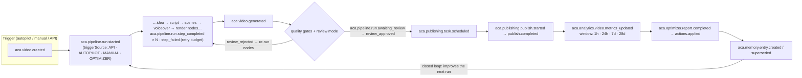

# Event Flow — v1.0-foundation

> Consolidated backbone + business flow view. Guarantees (at-least-once delivery,
> idempotent inbox, durable DLQ, replay cursors) are normative in
> `docs/Events-Guarantees.md` (ADR-024); this diagram is the visual index.
> Status: backbone ✅ built in `@aca/events` · business producers/consumers 🚧 land
> with their apps/modules.

## 1. Backbone mechanics (built — `@aca/events`)

```mermaid
sequenceDiagram
    autonumber
    participant W as Writer (API/Worker service)
    participant TX as PG transaction
    participant OB as outbox_events (PG)
    participant R as Outbox Relay
    participant RD as Redis broker
    participant C as Consumer
    participant IN as processed_events (PG inbox)
    participant DLQ as dead_letter_events (PG)

    W->>TX: begin; business writes + outbox.insert(event)
    TX-->>W: commit (atomic: state + event) ✅
    R->>OB: poll unpublished (cursor)
    R->>RD: publish envelope v1.1 (correlation/causation/producer/metadata)
    RD->>C: deliver (at-least-once)
    C->>IN: claim (id, consumer) — PK conflict = duplicate
    alt first delivery
        C->>C: handler business logic
        C->>IN: mark processed (same PG tx as effects)
        C->>R: ack
    else duplicate delivery
        IN-->>C: already processed → skip handler, ack ✅ (cursor still advances — monotonic)
    else poison message (retries exhausted)
        C->>DLQ: persist envelope + error (durable)
        DLQ-->>R: replay via cursor reset when operator resolves
    end
```

## 2. End-to-end business flow — idea → published video (designed; producers 🚧)



## 3. Trust boundaries

| Boundary | Guarantee | Owner |
|---|---|---|
| Writer state + outbox row | atomic (single PG tx) | `OutboxWriter` ✅ |
| Relay → Redis | at-least-once, durable cursor | relay ✅ |
| Consumer effects | exactly-once **effectively** (inbox PK dedup in the effects tx) | `IdempotentConsumer` ✅ |
| Poison messages | durable DLQ + replay tooling | DLQ ✅ |
| External side effects (publish to platform) | exactly-once impossible → idempotency keys + `externalRef` reconciliation | publisher port 🚧 |

Full per-event producer/consumer matrix: `docs/Event-Catalog.md` (58 events,
generated + CI-checked). Guarantee ladder G1–G7 and failure-mode matrix:
`docs/Events-Guarantees.md`. Recovery walkthroughs: `docs/Event-Flows.md`.
