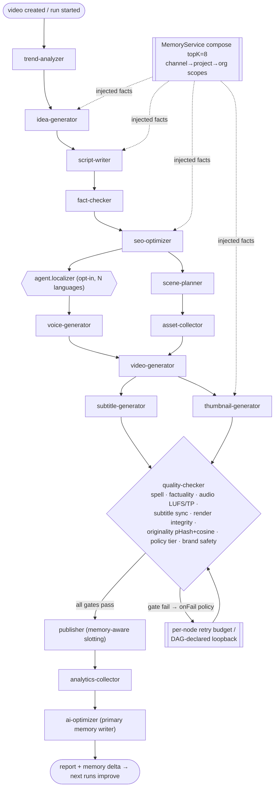
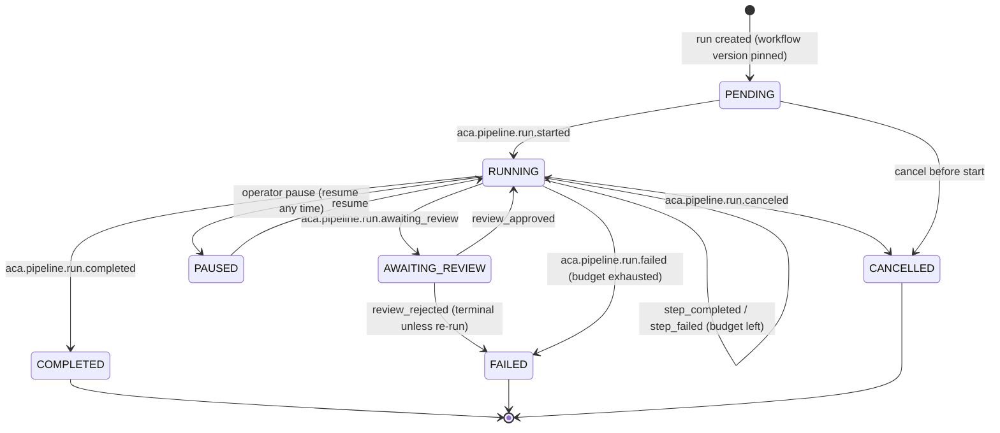
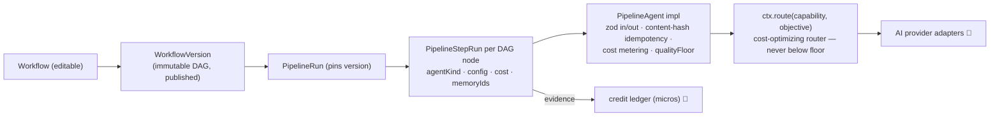

# Workflow & Pipeline — v1.0-foundation

> Source of truth: `docs/AI-Pipeline.md` (agents, gates, retries),
> `docs/Contracts.md` C7 (workflow definition + agent contract), ADR-023
> (executor concurrency: optimistic `state_version` + run-hash sharding).
> Status: schema + contracts ✅ · executor runtime 🚧 (lands with the Workflow
> Engine module build).

## 1. Default system pipeline (15 core agents + optional localizer)

*Review-mode placement:* `REVIEW_SCRIPT` pauses after `fact-checker`;
`REVIEW_MEDIA` pauses after `asset-collector`; `REVIEW_FINAL` pauses after
`quality-checker`; `FULL_AUTO` has no user gate — but policy-tier hits force
`REVIEW_FINAL` regardless. Workflows without a QC node get an automatic
publish-time safety floor (launcher-injected; cannot be removed).

## 2. PipelineRun state machine (schema `RunStatus`, events from catalog)

Concurrency rule (ADR-023): a run row carries `state_version`; every
transition is an optimistic CAS update — executors shard runs by hash, so a
run is owned by exactly one executor at a time.

## 3. Workflow engine anatomy (Contract C7)

**Key invariants:** runs pin an immutable workflow version (edits never mutate
live runs); node config overrides project `stylePreset` (config wins);
`gate.condition` pruning marks skipped dependents `SKIPPED` (excluded from
metering); agents never construct providers — routing only via `ctx.route`.
